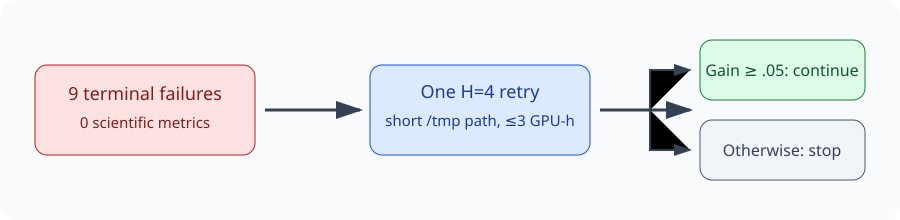

# A one-cell recovery asks whether looking farther helps action ranking

> **Superseded on 2026-07-17:** the completed three-seed J3 artifact audit
> found that the existing two-step teacher is already strong. The unsubmitted
> H4 recovery was replaced by the matched context/optimization diagnostic in
> `research/cycles/intent_phrase/2026-07-17-j3-gap-audit.md`.

## The one-sentence answer

No scientific result exists yet: nine terminal jobs yielded zero usable metrics, so we propose one infrastructure-safe four-step teacher retry before spending on a wider screen.

## First, the idea in everyday language

Imagine teaching someone to choose the next move in a puzzle. A coach can judge each move by picturing two future moves, or by looking four moves ahead. Looking farther might reveal a better move, but it also costs more and may make the lesson harder to copy. Our model is the student; its geometric action-ranking teacher is the coach. We will retry one four-step lesson safely and compare it with the already available two-step lesson.

## Why this question matters

The joint-embedding predictive architecture (JEPA) selects observed intent phrases but trails a matched token policy. Before combining objectives, we need to know whether teacher lookahead is the bottleneck. This toy result would guide mechanism work, not demonstrate generation or faithful-domain transfer.

## What we tested

The seven planned geometry runs all timed out before optimization, and two counterfactual runs failed before training. We therefore test only horizon four, two root candidates, seed 0, against the existing matched horizon-two seed. Both see shuffled action menus and environment-produced counterfactual outcomes; that training interaction is privileged and disclosed.

## What a fair comparison means here

Architecture, data, losses, examples, candidate menus, seed, and root-candidate count stay fixed. Only teacher horizon changes. A short `/tmp` path removes the known socket failure. The active Alex seed is not duplicated. Collapse, transition, shuffle, and ranking diagnostics must pass.

## What happened

| Evidence item | Process outcome | Scientific use |
|---|---:|---|
| Seven geometry jobs | 7 timeouts before optimization | None |
| Counterfactual seeds 1–2 | 2 configuration failures | None |
| Counterfactual seed 0 | Still active; no terminal summary | Not duplicated |
| Four-step recovery | Planned, at most 3 GPU-hours | Decides whether to continue horizon work |

There are no sample counts or uncertainty intervals because no terminal job produced metrics. The existing easy-domain comparison remains `.827 +/- .003` strict success for the matched token policy versus `.797 +/- .008` for the older reduced JEPA.

## The intuitive picture

The figure emphasizes that process repair comes before scientific interpretation, and that one result—not GPU availability—controls expansion.

## The technical details

The retry runs `paper_causal_gar_h4`, seed 0, on one Grünau GPU for at most 180 minutes, with `TMPDIR=/tmp`. Its exponential-moving-average target encoder scores true counterfactual outcomes by latent distance to a terminal state; no symbolic remaining-step, ancestor, or relevance label is used. Required artifacts are the run summary, metrics, and standard streams. Validity requires actual optimizer progress, finite teacher labels, at least 100 action-ranking audit anchors, non-collapsed state variance and effective rank, and interpretable transition and shuffled-action checks. Primary outcome is strict closed-loop success. Secondary outcomes are teacher-versus-oracle and student-versus-teacher top-one/pair accuracy, slack-two success, transition match, and recursive drift. A repeated pre-training failure is excluded as infrastructure-invalid.

## What we can conclude

Direct observation: all newly terminal summaries contain empty metrics. Inference: they say nothing about horizon quality. The socket trace supports a short-path recovery rather than model redesign.

## What we cannot conclude

We cannot claim JEPA beats language modeling, that four-step lookahead helps, that geometry transfers to faithful iGSM, or that privileged training interaction is deployable.

## What happens next

Continue horizon work only if strict success beats matched seed 0 by at least 0.05, or teacher quality improves materially without worse student alignment. Otherwise retain horizon two and move later to grounded-objective combinations. The easy-domain steering note makes the token-policy comparison a paper gate; the overnight note narrows recovery to one short-path job and protects the active Alex job.

## Words used in this report

- **JEPA:** A model trained to predict one internal representation from another without reconstructing text.
- **Teacher horizon:** How many future puzzle moves the training teacher considers.
- **Strict success:** Solving within the original action budget.
- **Privileged interaction:** Information available during training that a deployed model would not receive directly.

## Questions for you

- If horizon four fails, should the next priority be grounded-objective combinations or a sealed matched language-model table?
- Is closing strict-success performance or minimizing privileged training information the higher paper priority?
