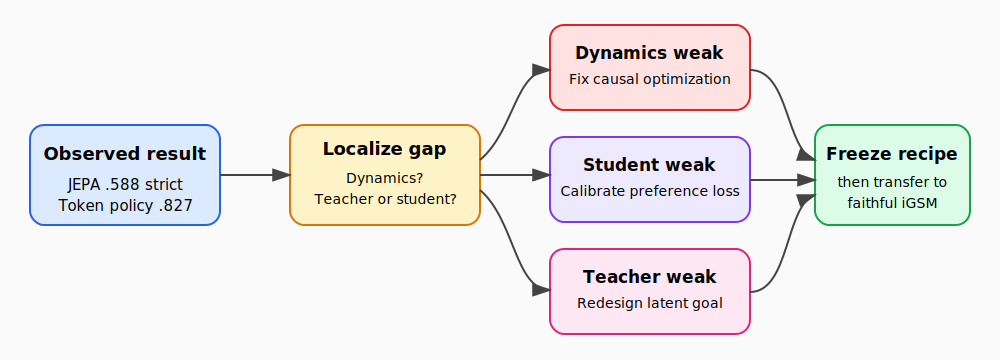

# Turning the observed intent-phrase study into an ICLR-quality paper

## The one-sentence answer

The intent-phrase JEPA has a strong controlled mechanism story, but its current causal model reaches only .588 strict success versus .827 for the matched token policy, so the next decisive work is to identify whether dynamics, teacher quality, or student preference calibration causes that gap before combining components or scaling.

## First, the idea in everyday language

Imagine a student solving a multi-step arithmetic word problem using a menu of short instructions. An instruction might say “derive the number of green books from the red cups and blue lamps,” but it does not reveal the numerical answer. After the student chooses that instruction, the environment performs the calculation and reveals the resulting reasoning step. Our model is asked to maintain an internal summary of everything established so far, predict how that summary will change for each possible instruction, and select the instruction that is most useful for eventually answering the question.

A conventional language model learns to predict words. This JEPA instead learns to predict the representation of the next reasoning state. It never has to reproduce the outcome sentence word by word. That makes the environment a useful scientific microscope: we can ask whether the internal state contains values, operations, resolved variables, remaining work, or the final answer; whether changing the action changes the predicted consequence correctly; and whether the model can recover after choosing an irrelevant computation.

The central result is both encouraging and uncomfortable. Once the JEPA receives a non-symbolic two-step latent-goal preference teacher, its action-selection success jumps dramatically. This says that its latent dynamics can support useful reasoning preferences. Yet the causal-transformer version still loses clearly to an information-matched token policy language model. We therefore do not have a finished recipe. We have localized the broad problem to action selection, but not yet separated three possible causes: the causal dynamics may be under-optimized, the latent-goal teacher may rank actions imperfectly, or the trained preference student may fail to copy a reasonably good teacher.

The right next move is not a huge grid of fashionable regularizers. It is a short diagnostic decision tree. Once the failure is localized, only the relevant repair should be tested. The stylized environment remains ideal for this diagnosis, while faithful iGSM must later show that the result survives a more realistic problem generator.

## Why this question matters

If a reconstruction-free model can predict counterfactual reasoning consequences and choose useful language actions, it offers a different route to reasoning than next-token likelihood alone. The scientific contribution would be an explanation of what latent prediction learns, where it fails, and which non-symbolic signal turns accurate dynamics into control. That is more valuable than reporting one synthetic accuracy number.

This decision also prevents expensive but ambiguous experiments. Combining LDAD, monotonicity, value regression, counterfactual outcomes, deeper rollout, and larger models at once might improve validation accuracy, but it would not reveal why. A top paper needs an auditable causal narrative, fair matched baselines, transfer beyond the toy setting, and representation evidence tied to behavior.

## What we tested

The current common-protocol matrix trains causal-transformer JEPAs on the stylized observed-intent environment. Every deployed method chooses from the same currently feasible, outcome-free intent phrases. Menus are shuffled to remove ordering shortcuts. Evaluation counts success within the optimal number of actions and with an allowance of two additional actions.

The cumulative JEPA adds one-step latent dynamics, observed-outcome embedding prediction, recursive predicted-outcome consistency, and finally two-step latent-goal preference distillation. Separate three-seed rows remove components or add faithful action-displacement decoding, scalar value regression, monotonicity, dense rollout, or residual prediction. Token and sentence policy models provide information-matched autoregressive controls. Symbolic preference and oracle policies remain labeled references.

## What a fair comparison means here

Fairness requires more than giving every method the same dataset. JEPA and the language-model policies must see exactly the same current action menu, without rendered numerical outcomes or future feasible actions. The problem instances, menu permutation, strict and slack budgets, seeds, and test exclusions must be fixed. Parameter count, training updates, and planning evaluations must be reported rather than hidden inside a model name.

Teacher quality and student quality also need separate accounting. A model can have accurate transitions while receiving a poor preference target, or receive a good target while failing to fit it. Symbolic graph distance, oracle terminal representations, and future feasible sequences are useful diagnostic ceilings but cannot be silently used by the proposed deployed system. The final test must remain sealed until a validation-selected recipe and analysis plan are frozen.

## What happened

The three-seed validation results currently available are:

| Model or intervention | Strict success | Success with two extra actions | Interpretation |
|---|---:|---:|---|
| Matched token intent policy | .827 +/- .003 | .978 +/- .003 | strongest non-oracle baseline |
| Causal one-step dynamics | .098 +/- .045 | .495 +/- .115 | dynamics alone do not select actions |
| + observed outcome and recursive consistency | .125 +/- .072 | .483 +/- .101 | little selection benefit |
| + two-step latent-goal preference | .588 +/- .013 | .845 +/- .043 | dominant causal-model gain |
| + dense rollout depth four | .510 +/- .106 | .812 +/- .062 | negative and unstable |
| + faithful action-displacement decoding | .632 +/- .040 | .868 +/- .020 | promising individual add-back |
| + terminal-distance monotonicity | .637 +/- .008 | .848 +/- .038 | promising individual add-back |
| residual rather than direct prediction | .358 +/- .137 | .682 +/- .095 | clearly worse |

The old reduced model reached .797/.963, but it belongs to a previous predictor and protocol and cannot be inserted into the new cumulative table as if it were a matched row. The repaired counterfactual-outcome experiment is still in flight. No final-test result has been opened for the new recipe.

## The intuitive picture

The figure shows the key discipline: one observed performance gap branches into three scientifically distinct explanations. Each explanation implies a different intervention. They converge only after the relevant failure is repaired, at which point a recipe can be frozen and transferred to faithful iGSM.

## The technical details

The state encoder maps the prompt and observed reasoning history into a causal latent sequence. At transition (t), the direct predictor receives the previous latent state and the observed intent-action embedding and predicts the EMA target representation of the resulting state. Because the target is causal, it contains only information available through that executed reasoning step. Variance-covariance regularization prevents degenerate state coordinates. Outcome prediction anchors the latent dynamics to the rendered consequence, while recursive consistency evaluates predictions after feeding predicted states back through the causal history model.

The non-symbolic preference teacher compares candidate actions using their model/environment-produced outcomes in latent goal geometry. The current reference uses horizon two and two alternative root actions. It does not use exact symbolic ancestor ranking as its proposed label. The student energy is trained to reproduce these preferences and is evaluated by exhaustive ranking over the current feasible intent menu. Diagnostics must separate teacher-versus-oracle, student-versus-teacher, and student-versus-oracle pair accuracy and top-one agreement. They must also stratify clean histories, histories after a distractor, graph depth, and preference margin.

The smallest proposed training diagnostic keeps every component fixed and varies only causal context window `{1,4,full}` at matched parameter count, plus a coarse learning-rate or update-budget cross-check. A one-step causal window is not a return to an MLP; it is a causal Transformer control that isolates whether long history makes optimization harder. If transition matching and rollout drift are already healthy while teacher accuracy is strong, this screen is unnecessary and preference-loss calibration becomes the next experiment instead.

Primary metrics are strict success, slack-two success, counterfactual transition matching, action-shuffle matching, teacher and student ranking accuracy, selected-action regret, and after-error recovery. Health metrics are state standard deviation, effective rank, objective-specific encoder gradient norm, recursive drift, and prediction scale. Three seeds are reserved for the selected model and final one-component removals; obvious failures stop after one exploratory seed. Faithful iGSM transfer uses stable problem-specific shuffled menus and retrains all matched baselines under the same protocol.

Exact configurations and artifacts are indexed from `projects/intent_phrase/ARTIFACTS.md`, historical waves from `research/intent_phrase/`, and the current matrix from Wave 12. Hierarchy is excluded because corrected continuous and discrete confirmations are negative.

## What we can conclude

Direct observation supports three conclusions. First, non-symbolic latent-goal preference supervision is the decisive ingredient in the causal build-up. Second, direct prediction is much healthier than the tested residual parameterization. Third, the current causal recipe remains substantially below the matched token policy, so it is not ready for a headline claim.

The supported inference is that action selection, not merely transition identity, remains the important bottleneck. LDAD and monotonicity deserve a controlled combination study only after that bottleneck is localized. Negative hierarchy results should be reported as a limitation rather than hidden or folded into the main recipe.

## What we cannot conclude

We cannot yet claim that JEPA outperforms language modeling, that its advantages transfer to faithful iGSM, or that its representations provide causal abstraction rather than decodable correlation. We cannot claim that combining individually positive add-backs will improve performance. We also cannot use the old .797 result as the final causal reference because its protocol differs.

The stylized task supplies observed feasible actions and environment execution, so it is not unrestricted language generation. A paper based only on this toy environment would have limited external validity. Finally, the pending counterfactual row and sealed final tests mean the model-selection evidence is incomplete.

## What happens next

First, finish and validate the repaired counterfactual row and regenerate the common matrix. Second, run the existing checkpoint audit that separates dynamics, teacher quality, and student calibration. Only the diagnosed branch receives a small training screen. If a stable causal recipe closes most of the token-policy gap, test supported component combinations and then freeze it.

The frozen model and information-matched baselines are then retrained on faithful iGSM with three seeds. Full probe, qualitative, and final-test campaigns occur only after this transfer gate. No 50M/100M scaling or broad regularizer factorial is justified before the small causal model passes the mechanism and baseline gates.

## Words used in this report

- **JEPA:** A model trained to predict one learned representation from another without reconstructing the original text.
- **Intent phrase:** An observed natural-language action describing which computation to perform without revealing its outcome.
- **Latent state:** The model's compressed numerical representation of the reasoning history.
- **Preference teacher:** A procedure that supplies relative action-quality targets for the learned student energy.
- **Strict success:** Solving within the minimum required number of environment actions.
- **Slack-two success:** Solving while allowing at most two actions beyond the minimum.
- **Faithful iGSM:** The less stylized benchmark implementation used to test whether the controlled recipe transfers.
- **Oracle:** A diagnostic system given privileged information unavailable to the proposed deployed model.

## Questions for you

- If faithful transfer remains below the token policy, should the paper prioritize a mechanistic negative result, or should we seek approval for a second observed-action reasoning domain before writing?
- For the final paper, is the primary goal highest strict success, robustness after mistakes, data efficiency, or a representation/mechanism explanation? This choice determines the main metric and scale budget.
