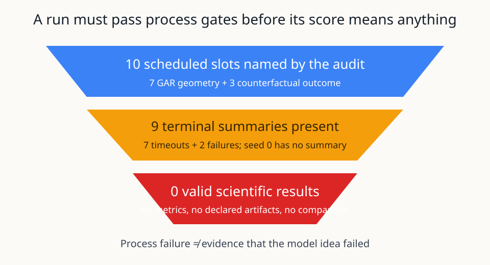

# When ten scheduled runs produce zero scientific comparisons

## The one-sentence answer

The newly listed jobs do not answer the geometry or counterfactual questions: nine terminal summaries contain zero usable model results, one scheduled seed has no terminal summary, and the compact evidence still favors the matched token language policy over JEPA on the easier domain.

## First, the idea in everyday language

Imagine testing two navigation strategies by sending cars around the same course. Before comparing arrival times, we first ask whether each car actually left the garage, followed the same course, and reached the timing line. A car whose garage door jammed did not set a slow lap; it set no lap at all. Treating the jam as a bad driving result would confuse the testing equipment with the strategy being tested.

This audit applies that distinction to neural-network experiments. A neural network is a computer program whose many adjustable numbers are tuned from examples. Here, the program sees a reasoning state and a menu of natural-language intent phrases, such as an action that would carry out the next algebraic step. It does not freely write the answer. It selects an observed phrase, the environment executes the action, and the model predicts how the hidden representation of the reasoning state should change. The broad hope is that useful reasoning transitions can be learned without reconstructing every word.

The active geometry experiment asks how far a training teacher should look ahead and how many alternative first actions it should inspect. If looking farther or considering more alternatives teaches better action ranking, closed-loop task success should improve. The counterfactual experiment asks whether predicting what would happen after actions not taken helps the same model choose better actions. Both are meaningful questions only after training starts, produces finite measurements, and passes checks for collapsed representations, unfair information, and shuffled action menus.

That did not happen in the newly terminal jobs. Seven geometry processes encountered an operating-system limit while moving training data between worker processes. Two counterfactual processes started from exact repository snapshots that did not contain the configuration they were commanded to use. A third counterfactual seed has a scheduling manifest but no terminal summary. Therefore this report has no new accuracy curve to celebrate or reject. Its useful result is narrower: it prevents infrastructure failures from being misreported as scientific evidence, answers the human steering question using the existing compact comparison, and preserves the original falsifiable geometry decision for a valid retry.

## Why this question matters

The distinction matters because the paper story depends on why a method wins or loses. If a joint-embedding predictive architecture (JEPA) genuinely selects better intent phrases than an information-matched language-model policy, that could be an interesting controlled result. If the apparent difference instead comes from broken jobs, privileged future information, different action menus, or mismatched test cases, it would not support the proposed mechanism.

The only human steering note asks whether there are easier and harder iGSM instantiations and whether JEPA already wins on the easier one. Yes, the project distinguishes a stylized easier environment from faithful iGSM transfer, but the second belief is not supported by compact memory: strict success is 0.827 ± 0.003 for the matched token intent policy and 0.797 ± 0.008 for the older reduced non-symbolic JEPA. The current causal JEPA reference is lower at 0.588 ± 0.013. This note changed the decision by making a sealed, matched easy-domain comparison an explicit paper gate and by blocking language that calls the current evidence a JEPA win.

## What we tested

This cycle audited ten scheduled slots explicitly associated with intent_phrase. Seven vary the geometric action-ranking teacher: horizon values 1, 4, 8, and 16 at two root candidates, plus root-candidate counts 1, 4, and 8 at horizon 2. Their shared seed is 0. The pre-existing horizon-2, candidate-2 reference is the comparison point, not a newly run cell.

Three more slots were intended to repair the observed counterfactual-outcome row at seeds 0, 1, and 2. Seeds 1 and 2 have terminal failure summaries. Seed 0 has a manifest but no terminal summary, so it is kept visible rather than silently excluded. The supplied project-level allocation snapshot reports three active GPUs and one pending job, but does not identify their run names; this report therefore does not guess which scheduled slot they represent.

No new sibling-project memory, sibling cycles, historical reports, backlog, or broad raw-log corpus was used. Raw stderr was opened only after the compact summaries marked runs failed, timed out, empty, or otherwise suspicious, and only to classify the process failures.

## What a fair comparison means here

A fair geometry comparison changes only teacher horizon or root-candidate coverage. Architecture, training data, shuffled action menus, validation examples, losses, seed, and evaluation budget must otherwise match. The teacher uses exponential-moving-average encoded true counterfactual outcomes and distance to a terminal state. That is privileged training interaction with the environment, and it must be disclosed; it is not a symbolic remaining-step or relevance label.

Before accuracy is compared, each run must complete, emit its declared artifacts, contain finite teacher labels for at least 100 audit anchors, and show interpretable transition, action-shuffle, state-variance, and effective-rank diagnostics. A run that never optimizes cannot pass those gates. Nor can a run launched from a repository snapshot missing its requested configuration. We exclude all such runs from scientific averages while retaining them in the process table.

The easy-domain JEPA and token-policy numbers are contextual, not a fresh reanalysis. They come from compact project memory and refer to different model generations, so they are sufficient to reject the claim that a JEPA win is already established, but not sufficient to freeze a final paper table. That table still needs machine-readable checkpoints, identical menus and examples, configuration hashes, exclusions, and sealed splits.

## What happened

The table reports process state before model quality. “Usable metrics” means at least one scientifically interpretable result was emitted; it does not mean a favorable score.

| Run group | Scheduled slots | Terminal summaries | Process outcome | Usable metrics | Scientific treatment |
|---|---:|---:|---|---:|---|
| Geometry horizon and candidate screen | 7 | 7 | Timeout, exit 124 | 0 | Exclude as infrastructure-invalid |
| Counterfactual outcome repair, seeds 1–2 | 2 | 2 | Failed, exit 1 | 0 | Exclude as snapshot/configuration-invalid |
| Counterfactual outcome repair, seed 0 | 1 | 0 | Not terminal in supplied artifacts | 0 | Keep visible; do not infer outcome |
| Total | 10 | 9 | No completed scientific run | 0 | No model comparison possible |

Every geometry summary has an empty metrics object and empty artifact list. The targeted stderr traces consistently show `AF_UNIX path too long` inside Python multiprocessing. This agrees with the current cycle record that the jobs stalled at data loading before the first optimizer step.

The counterfactual seed-1 and seed-2 summaries also have empty metrics and artifact lists. Their logs say Hydra could not find `experiment/paper_causal_a_cfout`. Both jobs used immutable snapshot commit `cb1371f107fcebad82ca5b784585850077a13a71`; the configuration exists in the current worktree but not in that snapshot. They ended before training and are process failures, not negative evidence about counterfactual learning.

## The intuitive picture

The funnel shows the essential lesson: scheduling a job is not the same as obtaining a measurement. The seven timeouts and two configuration failures stop above the scientific-result gate, while the missing seed remains unresolved. Nothing reaches the bottom as a valid model comparison.

## The technical details

The active model is an action-conditioned causal JEPA. An encoder maps the observed reasoning history to a latent state vector. A predictor receives that state and an observed natural-language action representation, then predicts the latent representation of the resulting state. A slowly updated exponential-moving-average target encoder supplies training targets. Action selection uses a geometric action-ranking teacher: for a candidate root action, it evaluates encoded true counterfactual outcomes over a bounded horizon and measures geometry relative to a terminal representation. A student preference mechanism is trained to imitate this teacher. Because the environment supplies feasible actions and rendered outcomes during training, these results are controlled observed-action evidence, not evidence of discovering actions in unrestricted text.

The predeclared primary endpoint is strict closed-loop success: the fraction of validation problems solved without spending extra action allowance. Slack-2 success permits two additional actions. Secondary endpoints separate teacher quality from student imitation: teacher-versus-oracle top-1 and pair accuracy, student-versus-teacher top-1 and pair accuracy, next-state transition match, and recursive rollout drift. Health gates include state variance and effective rank to detect collapse, finite labels, at least 100 teacher-audit anchors, and action-shuffle behavior. None can be computed from an empty metrics object.

The geometry jobs used exact commit `6bf74bd777b4c12839cf046e0b246da0d3b61f9c` according to their manifests and requested one GPU each. Their terminal summaries report timeout code 124. The failure trace arises in `multiprocessing.resource_sharer` while binding a Unix-domain socket whose filesystem path exceeds the operating-system maximum. This is causally upstream of optimization. The cycle already records the bounded remedy—set child `TMPDIR=/tmp` while leaving scientific commands unchanged—but valid retry results are not among the supplied terminal summaries.

The counterfactual jobs used exact commit `cb1371f107fcebad82ca5b784585850077a13a71` on external Slurm clusters. Seeds 1 and 2 independently fail configuration composition before model construction because the snapshot’s Hydra experiment catalog lacks `paper_causal_a_cfout`. Cross-backend agreement here diagnoses the snapshot content, not model behavior. Seed 0 is not classified because no terminal summary exists.

The machine-readable sources remain directly inspectable: a representative
[geometry summary](/vol/home-vol2/ml/laitenbf/TextJEPA/runs/autonomy/2026-07-16-gar-geometry-screen/gar-horizon-4-seed-0/run_summary.json),
its [launch manifest](/vol/home-vol2/ml/laitenbf/TextJEPA/runs/autonomy/2026-07-16-gar-geometry-screen/gar-horizon-4-seed-0/manifest.json),
and the counterfactual [seed-1 summary](/vol/home-vol2/ml/laitenbf/TextJEPA/runs/autonomy/2026-07-16-paper-causal-counterfactual-repair/counterfactual-outcome-seed-1/run_summary.json)
and [seed-2 summary](/vol/home-vol2/ml/laitenbf/TextJEPA/runs/autonomy/2026-07-16-paper-causal-counterfactual-repair/counterfactual-outcome-seed-2/run_summary.json).
The cycle ledger records all ten named slots so the absent seed-0 summary is
not hidden by the links above.

The original geometry decision threshold remains predeclared: advance a setting only if matched-seed strict success improves by at least 0.05, or if teacher quality materially improves without harming student alignment. If teacher quality improves while student alignment does not, tune the preference student. If neither improves, retain horizon 2 and candidate count 2 and move to the staged grounded-objective combination screen. There is no uncertainty interval to compute in this audit because the valid scientific sample size is zero.

## What we can conclude

Direct observation: nine terminal summaries contain no metrics and no declared artifacts. Seven correspond to a reproducible temporary-path failure; two correspond to a missing configuration in exact external snapshots. The tenth named slot lacks a terminal summary.

Supported inference: neither run family changes the evidence ledger, and neither can be averaged into a scientific table. The geometry question remains open. The counterfactual repair remains incomplete. Current compact evidence does not establish that JEPA beats the matched token intent policy on the easier stylized domain.

Decision: admit no new experimental round from this cycle. Preserve the valid-retry question, avoid duplicate writers while project work remains active or pending, and respect the supplied 0.9 global weekly GPU-hours—far below a faithful new training comparison.

## What we cannot conclude

We cannot say whether a longer teacher horizon, more root alternatives, or counterfactual-outcome prediction helps action selection. We cannot compare teacher quality, student alignment, collapse, recursive drift, or closed-loop success because no valid metric was produced. We cannot infer the state of any particular current job from the project-level allocation counts.

We also cannot claim that the older reduced JEPA and current causal JEPA form a sealed final comparison with the token policy. The compact numbers reject an already-established JEPA win, but a paper-grade conclusion requires identical instances and menus, machine-readable artifacts, configuration hashes, declared exclusions, and final-test discipline. Finally, success in the stylized environment would not by itself establish transfer to faithful iGSM, free-form language generation, or learned latent actions.

## What happens next

The smallest next scientific question is unchanged: at fixed information, architecture, data, and seed, does teacher horizon or root-candidate coverage improve strict success by at least 0.05, or improve teacher quality without degrading the student? Only valid retry summaries can answer it. If the teacher improves but the student does not, preference calibration becomes the next mechanism. If neither teacher nor control improves, the project returns to the predeclared combination screen for faithful action displacement, monotonicity, and value calibration.

No `research/intent_phrase/NEXT_PLAN.json` is created in this cycle. Current project work is unresolved, a new plan risks duplication, and the available global weekly budget cannot fund the faithful comparison. When those gates clear, any plan must use schema version 2, project `intent_phrase`, exact snapshots containing every requested configuration, unique run names, and manual execution only.

## Words used in this report

- **Action menu:** The set of natural-language intent phrases the model may choose at one reasoning step.
- **Closed-loop success:** Solving a whole problem while repeatedly using the model’s own selected actions.
- **Counterfactual:** A possible outcome of an action that was available but not actually taken.
- **Effective rank:** A summary of how many independent directions a representation meaningfully uses; very low rank can indicate collapse.
- **Hydra configuration:** A named collection of experiment settings composed by the repository’s configuration system.
- **Information-matched:** Compared systems receive the same decision-relevant observations and candidate actions.
- **JEPA:** Joint-embedding predictive architecture, a model trained to predict representations rather than reconstruct every input symbol.
- **Strict success:** The fraction of problems solved without extra action allowance.
- **Terminal summary:** A compact machine-readable record written when a job ends, including process and scientific state.

## Questions for you

- Should the next paper-facing gate prioritize a sealed easy-domain JEPA-versus-token-policy comparison, or should it wait until the valid geometry retry explains the current causal gap?
- If the easy-domain matched comparison continues to favor the token policy, do you prefer a narrower mechanistic paper claim or prioritizing faithful iGSM transfer before further stylized ablations?
- Once budget refreshes, should failed counterfactual seeds be retried alongside the geometry work, or only after geometry identifies whether teacher quality or student alignment is the bottleneck?
