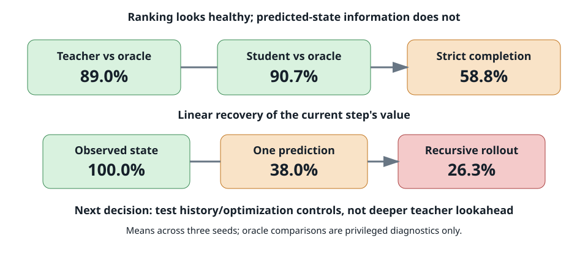

# The action teacher is strong, but predicted states lose useful task information

## The one-sentence answer

Across three model seeds, both the geometric teacher and its learned student rank the next action correctly about 90% of the time, yet strict problem completion is only 58.8% +/- 1.3%, while recoverable task-value information falls from 100% in observed states to 38.0% +/- 1.4% after one predicted transition and 26.3% +/- 0.4% after recursive rollout.

## First, the idea in everyday language

Imagine a student navigating a four-intersection route. At each intersection, a coach points toward the correct road, and the student learns to imitate the coach. If both choose the right road nine times out of ten, that sounds excellent. But the complete trip requires several correct choices in sequence. One wrong turn can prevent arrival, so roughly 90% local accuracy can become much lower whole-route success.

This project gives a neural network a menu of natural-language intent phrases such as an instruction to compute one needed quantity. The environment executes the chosen phrase and reveals its numerical consequence. A joint-embedding predictive architecture, or JEPA, represents the current reasoning history as numbers, predicts how that representation would change under each candidate action, and selects an action without reconstructing the outcome sentence word by word.

The current causal model improved dramatically after learning from a two-step geometric action-ranking teacher, but it still trails a matched token-policy language model. We audited three existing checkpoints to separate three explanations: a poor teacher, a student that cannot imitate a good teacher, or predicted states that lose useful information and accumulate errors. The evidence now points away from teacher depth as the first repair. Teacher and student rankings are already strong, representations are not collapsed, and the conspicuous weakness is what survives prediction and recursive rollout.

## Why this question matters

The difference determines what experiment is scientifically useful. If the teacher ranks actions poorly, looking farther ahead may help. If the teacher is good but the student is weak, the preference loss needs calibration. If both rank individual actions well but predicted consequences lose information, spending more compute on teacher lookahead treats the wrong mechanism.

This also protects the paper claim. The easier stylized domain does not currently show a JEPA victory: the matched token policy reaches 82.7% +/- 0.3% strict success, the older reduced JEPA reached 79.7% +/- 0.8% under a different protocol, and the clean causal J3 model reaches 58.8% +/- 1.3%. The present result is a mechanism diagnosis, not a performance win or evidence of unrestricted language generation.

## What we tested

We read the completed artifacts for `paper_causal_j3` seeds 0, 1, and 2. These checkpoints use the same two-layer causal predictor, direct next-state target, exponential-moving-average target encoder, variance-covariance regularization, observed-outcome prediction, recursive outcome consistency, and two-step geometric preference distillation. Only the random training seed changes.

For each seed, closed-loop planning evaluates 200 fixed validation problems using shuffled, currently feasible, outcome-free intent menus. The teacher audit evaluates 100 validation anchors. Representation probes evaluate 13,509 transitions. We report the mean and sample standard deviation across the three independently trained models. No failed GAR or counterfactual recovery job contributes a metric; those jobs never produced valid optimization results.

The geometric teacher is compared with exact symbolic useful-action ordering only as a privileged diagnostic. The model is not trained with that symbolic oracle. The deployed planner repeatedly re-encodes outcomes after the environment executes an action, but it uses predicted candidate states to score which current action to take.

## What a fair comparison means here

All three checkpoints use identical validation instances, action-menu shuffling, candidate information, action budgets, model architecture, objectives, and training duration. The token policy number is contextual because it is an information-matched baseline, but this audit does not reopen a final test or claim that all historical model generations are a sealed comparison.

Teacher, student, and behavior must remain separate. Teacher-versus-oracle accuracy asks whether privileged training-time geometry agrees with a symbolic diagnostic. Student-versus-teacher accuracy asks whether the learned energy copies its teacher. Closed-loop success asks whether repeated deployed choices solve the whole problem. A high number in one column cannot substitute for another.

Representation health is checked with state standard deviation and effective rank. Task-value probes are linear readouts: they measure whether a simple decoder can recover the numerical value produced at a step from the true encoded state, one predicted state, or a recursively predicted state. They are evidence about retained information, not direct proof that a particular transition error causes a planning failure. The existing artifacts lack the requested action-shuffle transition falsifier, selected-action regret, depth strata, and objective-specific gradient norms; those omissions remain explicit limitations.

## What happened

| Measurement | Mean +/- seed SD | What it says |
|---|---:|---|
| Strict full-problem success | 58.8% +/- 1.3% | repeated deployed choices remain weak |
| Success with two extra actions | 84.5% +/- 4.3% | many failures are recoverable with extra decisions |
| Teacher top-1 versus symbolic oracle | 89.0% +/- 3.6% | the two-step teacher is already strong |
| Teacher decisive-pair accuracy | 92.7% +/- 0.5% | covered action pairs are ordered reliably |
| Student top-1 versus symbolic oracle | 90.7% +/- 0.6% | the student is not obviously weaker than the teacher |
| Student top-1 versus teacher | 86.3% +/- 2.5% | some imitation disagreement remains |
| Task value from observed encoded state | 100.0% +/- 0.0% | current states retain the executed value |
| Task value from one predicted transition | 38.0% +/- 1.4% | much useful information is absent after prediction |
| Task value from recursive rollout | 26.3% +/- 0.4% | recursive prediction loses still more information |
| State standard deviation | 1.038 +/- 0.000 | no variance-collapse warning |
| State effective rank | 245.9 +/- 0.4 | nearly all of the 256-dimensional state space remains active |

Teacher top-1 falls from 91.4% +/- 2.5% on traces without distractors to 85.1% +/- 5.5% on traces containing distractors. That is a real weakness worth retaining in future stratified evaluation, but it is not evidence that horizon four is the best repair. Student-versus-oracle top-1 is already slightly higher than teacher-versus-oracle top-1, and strict success is much lower than either local ranking measurement.

The slack-two improvement is also informative. Allowing two additional decisions raises success from 58.8% to 84.5%. This is consistent with occasional local mistakes compounding under a tight budget rather than a model that never knows useful actions. It does not distinguish transition error from energy calibration by itself.

## The intuitive picture

The upper row shows why local action-ranking accuracy cannot be read as full-problem success. The lower row shows the most conspicuous mechanism-level degradation in the available artifacts. Together they redirect the next experiment from deeper teacher lookahead toward matched predictor-history and optimization controls.

## The technical details

The model encodes the prompt and executed reasoning history into a 256-dimensional state. Its causal Transformer predictor consumes a teacher-forced sequence of state/action pairs during training. At deployment, it appends each candidate action to the observed causal prefix, predicts the resulting state, and scores that state with a learned value head. The environment executes the lowest-cost candidate, after which the true rendered consequence is added to the history and the process repeats.

The two-step geometric teacher uses exponential-moving-average encoded true counterfactual outcomes and distance to a terminal state. It considers two alternative root actions during training. Environment execution and feasibility are privileged training interaction and must be disclosed, but the teacher does not use exact symbolic remaining-step, ancestor, or relevance labels. Symbolic useful-action order appears only in this audit as an oracle diagnostic.

Across seeds, teacher top-1 values are 0.85, 0.92, and 0.90. Student-versus-oracle top-1 values are 0.90, 0.91, and 0.91. Strict success values are 0.590, 0.600, and 0.575. The value-from-prediction probe is 0.395, 0.375, and 0.369; recursive-rollout value recovery is 0.268, 0.259, and 0.262. State effective rank is 245.5, 245.9, and 246.3, so collapse is not a plausible explanation for the behavioral gap.

Source artifacts are the three checkpoint-local [seed-0 teacher audit](/vol/home-vol2/ml/laitenbf/TextJEPA/runs/paper_causal_j3_s0/gar_teacher_audit.json), [seed-1 teacher audit](/vol/home-vol2/ml/laitenbf/TextJEPA/runs/paper_causal_j3_s1/gar_teacher_audit.json), and [seed-2 teacher audit](/vol/home-vol2/ml/laitenbf/TextJEPA/runs/paper_causal_j3_s2/gar_teacher_audit.json), alongside each directory's planning JSON, `probe_results.csv`, `metrics.csv`, resolved Hydra configuration, and checkpoint. The audit excludes the seven GAR timeouts and failed counterfactual repairs because they emitted no scientific metrics.

The selected intervention keeps parameter count and all J3 objectives fixed while changing only the causal attention window. A window of one is a causal Transformer Markov control; a sliding window of four tests whether short recent history is sufficient; the current unrestricted history remains the reference. Full-history learning rates of `1e-4` and `1e-3` bracket the current `3e-4` rate so an apparent history effect is not merely an optimization-scale effect. Only seed 0 is screened initially.

## What we can conclude

Direct observation: the two-step teacher and trained student both agree strongly with privileged useful-action ordering, encoded states are non-collapsed, strict success remains much lower than local ranking accuracy, and task-value decodability drops sharply in predicted states and recursive rollouts.

Supported inference: increasing teacher horizon is not the highest-value next experiment. Predictor fidelity, optimization, and the compounding relationship between local scores and full trajectories deserve the next matched test.

Decision: retire the pending one-cell horizon-four recovery before submission. Screen causal context and learning rate at one seed, with predeclared validity and scale gates. This uses the earlier recovery cycle's own rule: when teacher quality is healthy, work on the downstream bottleneck instead of increasing horizon.

## What we cannot conclude

The value probes do not prove that transition error causes every wrong action. A linear decoder can miss information that a nonlinear value head uses, and the teacher audit has only 100 anchors per seed. We lack action-shuffle transition results, selected-action regret, depth-stratified failure rates, and per-objective gradient measurements. Student-versus-teacher agreement of 86.3% leaves room for preference calibration even though student-versus-oracle top-1 is strong.

We also cannot claim JEPA beats language modeling, that the stylized mechanism transfers to faithful iGSM, or that environment-produced counterfactual supervision is available in unrestricted text. No final test was opened. The proposed context screen is a diagnostic pilot, not a paper-scale confirmation.

## What happens next

Run four seed-0 cells: context windows one and four at the current learning rate, plus full-history controls at `1e-4` and `1e-3`. Compare them with the existing full-history `3e-4` seed-0 checkpoint. Every cell must train from an exact snapshot, use identical shuffled menus and examples, and emit planning, teacher/student, transition, rollout, state-health, configuration, and compact-summary artifacts.

Advance a cell only if strict success rises by at least 0.05 over matched seed 0 while teacher quality and representation health remain intact, or if one-step and recursive task information improve materially without a behavioral regression. Then and only then run seeds 1 and 2 for the selected setting. If none passes, retain full-history J3 and move to preference/deployment calibration; do not widen the context or learning-rate sweep.

After this mechanism gate, repair the exact-snapshot counterfactual configuration and complete its three-seed row. Supported grounded objectives such as action-displacement decoding and monotonicity should be combined only after the causal reference is stable. Faithful iGSM transfer and the sealed final test remain later gates.

## Words used in this report

- **Action menu:** The natural-language intent phrases currently available to the model.
- **Causal context:** Earlier observed state/action pairs that a prediction may attend to without seeing the future.
- **Closed-loop success:** Solving the complete problem while repeatedly executing the model's own choices.
- **Effective rank:** An estimate of how many independent representation directions are active.
- **JEPA:** A joint-embedding predictive architecture that predicts learned representations rather than reconstructing text.
- **Oracle diagnostic:** A privileged analysis using symbolic ground truth that the proposed deployed model does not receive.
- **Recursive rollout:** Repeatedly using a predicted state as input to predict later states.
- **Strict success:** Solving within the minimum action budget, without recovery steps.
- **Teacher:** A training procedure that supplies relative action-quality targets.

## Questions for you

- If no context or learning-rate cell improves strict success, should the next priority be student/deployment calibration or completing the counterfactual objective row?
- For the paper, should we optimize primarily for strict success, recovery with extra actions, or reduction of privileged training interaction?
