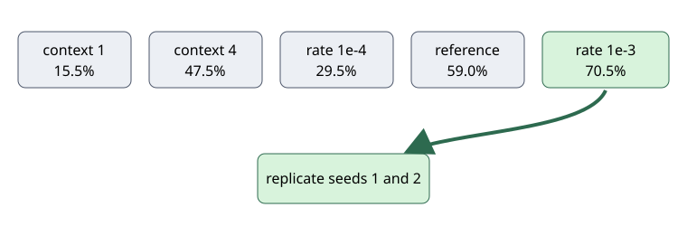

# A higher learning rate wins the first test and now needs replication

## The one-sentence answer

At seed 0, full-history J3 trained at `1e-3` reached 70.5% strict success, 11.5 points above the matched reference, so only two replication seeds are justified next.

## First, the idea in everyday language

Imagine teaching the same student with four pacing choices. Going too slowly wastes the lesson; remembering only the last page removes useful context. One faster pace worked best on the first student, but that could be luck. We should now try that exact pace on two more students, not invent more pacing choices. Here the “student” is a neural network choosing natural-language reasoning actions.

## Why this question matters

The model trails a matched token policy, so we need to know whether ordinary optimization—not a new architecture—explains part of the gap. Replication prevents one favorable random seed from becoming a paper claim.

## What we tested

We compared the existing full-history learning rate `3e-4` with context windows 1 and 4 and full-history rates `1e-4` and `1e-3`. Each valid cell used seed 0, identical training objectives, shuffled feasible action menus, 200 validation problems, and the same update budget.

## What a fair comparison means here

Only context or learning rate changed. Symbolic oracle labels were used for diagnosis, never deployed selection. Failed pre-training launches and throughput timeouts contributed no metric; completed replacements remain separately identifiable.

## What happened

| Setting | Strict success | Predicted-value probe | Result |
|---|---:|---:|---|
| Full history, `3e-4` reference | 59.0% | 39.5% | baseline |
| Context 1, `3e-4` | 15.5% | 35.2% | reject |
| Context 4, `3e-4` | 47.5% | 35.9% | reject |
| Full history, `1e-4` | 29.5% | 27.4% | reject |
| Full history, `1e-3` | 70.5% | 40.9% | confirm |

The higher rate cleared the predeclared five-point behavioral gate. Its state effective rank was 246.9 and standard deviation 1.038, so there is no collapse warning.

## The intuitive picture

Short context and the lower rate lost behavior; only `1e-3` advances. The arrow means “replicate,” not “declare victory.”

## The technical details

J3 is a joint-embedding predictive architecture (JEPA): it predicts a learned next-state representation for each candidate intent phrase and scores that predicted state. Full-history `1e-3` achieved 70.5% strict and 92.0% success with two recovery actions. Teacher top-1 against a privileged symbolic oracle was 86%, and student top-1 was 83%. One-step task-value decodability rose modestly from 39.5% to 40.9%, while recursive-rollout decodability fell from 26.8% to 24.6%. Thus optimization improved deployed choices without demonstrating repaired recursive dynamics. Two new seeds are the smallest faithful uncertainty check. Promotion requires a three-seed mean at least five points above the existing 58.8% mean, improvement on at least two matched seeds, teacher top-1 of at least 80%, and healthy rank and variance.

## What we can conclude

Seed 0 supports `1e-3` as the sole confirmation candidate. Shortening causal history and lowering the learning rate are contradicted as immediate repairs.

## What we cannot conclude

One seed cannot establish a stable gain, beat the 82.7% matched token policy, prove better rollout fidelity, or support faithful-iGSM transfer.

## What happens next

Run seeds 1 and 2 only at full-history `1e-3`. If the promotion rule fails, keep `3e-4` and move to preference/deployment calibration rather than widening this sweep.

## Words used in this report

- **Strict success:** solving within the minimum action budget.
- **Learning rate:** the size of each training update.
- **Effective rank:** how many representation directions remain active.
- **Privileged oracle:** symbolic information used only to diagnose behavior.

## Questions for you

- If replication succeeds but remains below the token policy, should the next priority be grounded-objective combination or faithful-domain transfer?
