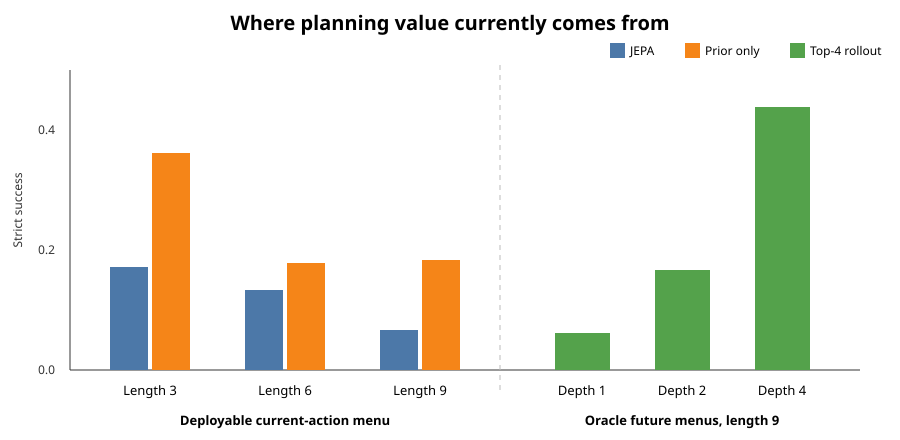

# The policy prior helps, JEPA reranking hurts, and hierarchy remains negative

## The one-sentence answer

Across three training seeds, directly following the supervised intent-phrase prior is consistently better than JEPA reranking on three- to nine-action problems, while the one-seed hierarchy screen loses to a simple feasible-action rule; apparent failure beyond nine actions is not yet interpretable because prompt size changed at the same boundary.

## First, the idea in everyday language

Imagine solving a worksheet by choosing the next useful instruction. One assistant has learned which instruction people usually choose next. A second assistant imagines the consequence of several candidate instructions and reranks them. The surprising result is that the first assistant is currently better: giving the second assistant more choices makes the final choice worse. When we secretly give the simulator the future legal choices, however, looking four steps ahead helps a lot. This says the idea of simulation is not dead, but its scoring and future-proposal interface are not yet deployable.

## Why this question matters

The project asks whether a joint-embedding predictive architecture (JEPA) can select natural-language intent phrases by predicting their effects in a latent state rather than reconstructing text. A useful paper result needs to identify what the latent model adds beyond a directly supervised policy. This cycle tests that addition and whether a separate high-level action space improves planning.

## What we tested

The data are synthetic arithmetic dependency graphs. Each available action is rendered as an intent phrase such as “derive the blue total from the red and green totals.” The environment executes the chosen phrase and returns the resulting sentence.

For the action-prior study, three independently trained checkpoints were evaluated on the same 60 held-out problems per length and seed. Four deployable one-step planners were compared: JEPA scoring all currently feasible actions, the supervised prior's top choice, and the prior's top two or top four choices reranked by JEPA. Separate depth-two and depth-four diagnostics used future feasible menus from the reference graph and are therefore oracle, candidate-privileged results.

For hierarchy, one checkpoint each used macro-action bottlenecks of 4, 8, or 16 dimensions. Each was evaluated with direct-code and learned-prior-noise cross-entropy-method (CEM) search using 1,200 samples and 20 refinement updates.

The first training attempts completed but crashed in long-length evaluation because a 65-position input exceeded a 64-position table. Evaluation-only recovery reused checkpoint hashes exactly and completed successfully after positional interpolation. The failed attempts remain invalid process runs; only recovery artifacts are interpreted.

## What a fair comparison means here

The action prior receives demonstrated next-action supervision, so it is a policy baseline, not an action-free JEPA. All one-step planners see the same currently feasible action menu. Top-two and top-four comparisons isolate whether JEPA scoring adds value after the same prior proposes candidates. Depth greater than one is not deployable here because the evaluator supplies future feasible actions from the hidden graph.

The hierarchy bottlenecks use separately trained one-seed checkpoints, so differences among 4, 8, and 16 dimensions are provisional. Direct-code and prior-noise CEM use matched search budgets. The current hierarchy artifacts do not contain a same-problem flat-planner comparison for the default distribution, so they cannot establish a hierarchy-versus-flat effect; the simple random and first-feasible policies are valid same-problem controls.

## What happened

Action success is the fraction of problems solved within the exact necessary number of actions (“strict”) or with two extra actions (“+2”). Values are mean ± population standard deviation across three training seeds; each seed evaluates 60 fixed problems per length.

| Necessary actions | JEPA strict | Prior strict | Top 2 + JEPA strict | JEPA +2 | Prior +2 |
|---:|---:|---:|---:|---:|---:|
| 3 | .172 ± .042 | **.361 ± .089** | .239 ± .016 | .511 ± .042 | **.744 ± .021** |
| 6 | .133 ± .041 | **.178 ± .044** | .139 ± .021 | .417 ± .014 | **.661 ± .042** |
| 9 | .067 ± .014 | **.183 ± .036** | .072 ± .008 | .744 ± .052 | **.872 ± .044** |
| 12 | .000 ± .000 | .000 ± .000 | .000 ± .000 | .000 ± .000 | .006 ± .008 |

At length nine, top-four JEPA reranking scores .061 strict, below top-two (.072) and prior-only (.183). The prior contains the necessary current action in its top four 98.8% ± 0.2% of the time at length nine, so proposal coverage is not the in-range bottleneck. At length twelve this recall falls to 66.3% ± 0.6%, but the evaluator simultaneously expands prompts from 6–12 to 24–36 variables.

The candidate-privileged depth diagnostic is strong enough to guide mechanism work. At length nine, top-four success rises from .061/.750 at depth one to .439/.994 at oracle depth four (strict/+2). At length twelve, oracle depth four reaches .067/.328 while shallower variants are essentially zero. These results show potential value in deep simulation but do not demonstrate a deployable planner.

| Macro bottleneck | CEM strict | CEM +2 | First-feasible strict | First-feasible +2 |
|---:|---:|---:|---:|---:|
| 4 | .100 | .333 | **.250** | **.583** |
| 8 | .050 | .417 | **.250** | **.583** |
| 16 | .133 | .350 | **.250** | **.583** |

Direct-code and learned-prior-noise CEM have identical success for every bottleneck and budget. All three strict planners lose to the first-feasible rule; bottleneck 8 only ties random at +2. Exact-length prior-noise hierarchy success is zero at lengths 9, 12, and 15.

## The intuitive picture

The left group shows that present JEPA scoring removes value from a strong one-step policy prior. The right group shows why simulation remains worth repairing: when future candidates are supplied correctly, deeper latent rollout can turn the same top-four interface into a much stronger planner.

## The technical details

The JEPA uses a causal Transformer state predictor, zero model dropout, and an exponential-moving-average target encoder kept in evaluation mode. The action prior is a detached candidate-scoring head trained by cross-entropy on the demonstrated next action among the currently feasible menu. Top-M evaluation selects M roots by prior logit and reranks them with predicted remaining-cost energy.

Lengths are exact query-ancestor counts. Each action-prior metric is based on 60 fixed problems per training seed, with evaluation seed 7321. Uncertainty reflects three training seeds, not independent evaluation resampling. Hierarchy rows use 60 problems and one training seed per bottleneck. CEM used a two-macro horizon, 1,200 samples, 20 iterations, and 20 elites. Checkpoint SHA-256 verification passed for all six recoveries; all declared artifacts exist, all exit codes are zero, and logs contain no numerical or runtime errors.

Raw artifacts are under `runs/autonomy/intent_phrase/2026-07-20-intent-action-prior-eval-recovery-v1/` and `runs/autonomy/intent_phrase/2026-07-20-intent-hierarchy-wide-cem-eval-recovery-v1/`. The evaluated code snapshots are `742d72e065d954abcf679e9c7a5f330387f41ee5` and `39eb93b6bbfed20b3b7f5e270e5630c92bcdfe0c`.

## What we can conclude

Direct observation: the supervised one-step prior beats JEPA-only and prior-plus-JEPA planners across all nonzero in-range cells. Increasing M monotonically gives JEPA more opportunity to override the prior and usually reduces success. Direct observation: depth-four oracle-future-menu rollout is much stronger than depth one at lengths 9 and 12. Direct observation: the tested hierarchy/CEM recipe does not beat the first-feasible control, and its prior-noise parameterization does not change success relative to direct-code CEM.

Supported inference: one-step action proposal is healthier than JEPA value/energy reranking. Deep prediction may be useful, but future proposal generation and predicted-state scoring must be learned without graph access before it can support a paper claim. The current hierarchy family should not be promoted.

## What we cannot conclude

We cannot call the prior a reconstruction-free JEPA gain because it uses explicit demonstrated-policy supervision. We cannot claim deployable depth-four planning because future menus are oracle information. We cannot attribute the length-twelve collapse to reasoning length: prompt variables jump at the same boundary. We cannot rank hierarchy bottlenecks reliably from one seed, nor claim hierarchy loses to a matched flat planner because that exact paired artifact was omitted. Positional interpolation permits evaluation beyond 64 inputs but does not prove learned positional extrapolation.

## What happens next

The next round reuses the three action-prior checkpoints and factorizes the generalization test. At exact length nine it varies prompt size across 6–12, 18–27, 24–36, and 36–54 variables. At a fixed 24–36-variable prompt it varies exact reasoning length from 9 through 12. JEPA and prior-only planners are paired on identical problems. If prompt size explains the collapse, future training should vary prompt scale; if length explains it, training needs longer trajectories or recursive-state repair; if both matter, the benchmark must report a two-dimensional surface rather than one misleading curve.

Only after this measurement gate should we train an all-problem action prior/support model that proposes future actions from predicted states and test deployable depth-two/four beam search.

## Words used in this report

- **Action prior:** A supervised model that scores which intent phrase should be chosen next.
- **CEM:** Cross-entropy method, an iterative optimizer that samples candidate latent actions and concentrates on low-cost samples.
- **Candidate-privileged:** An evaluation that supplies candidate actions unavailable to a deployed model.
- **JEPA:** Joint-embedding predictive architecture, which predicts representations rather than reconstructing observations.
- **Latent state:** A learned vector summarizing the reasoning progress so far.
- **Macro-action bottleneck:** The small vector used to represent several primitive intent actions together.
- **Strict success:** Solving with no actions beyond the known minimum.

## Questions for you

- After the factorized audit, should the paper prioritize robust long-length generalization or closing the in-distribution gap to the token policy first?
- Are you comfortable treating explicit action-policy supervision as a proposal mechanism, provided the paper isolates the additional value—or harm—of JEPA simulation?
