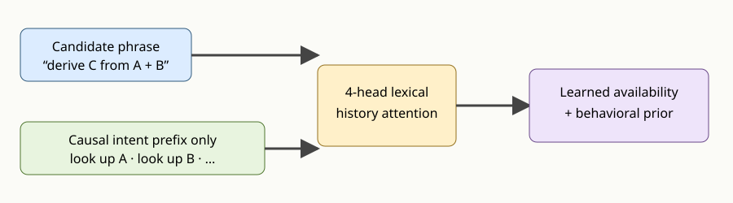

# Testing explicit intent history for non-oracle action availability

## The one-sentence answer

The full-catalogue planner still fails because moderate per-step feasibility errors compound across long solutions, so the next decisive experiment gives a learned candidate scorer explicit access to the causal intent history and compares it with an architecturally identical history-masked control.

## First, the idea in everyday language

Suppose an instruction says “compute C from A and B.” Whether that instruction is usable depends on whether A and B have already been computed. The failed model compressed the whole worksheet into one vector and asked a small network to infer this relationship. It chose a usable instruction only about 58% of the time on nine-step problems. Even if several early choices are correct, one later invalid choice ends the episode.

The new head takes a more direct but still deployable route. The candidate phrase can look back at the phrases the controller actually executed. During planning it sees the phrases in its own imagined partial trajectory. It never sees a hidden symbolic feasible-action list or the true future. An otherwise identical negative control receives an empty history, telling us whether any improvement comes from prerequisite tracking rather than merely adding parameters.

## Why this question matters

JEPA consequence simulation cannot be evaluated when the proposal interface routinely selects impossible actions. Solving proposal validity is therefore a prerequisite, not a competing headline. A successful learned history interface would let us ask the paper-relevant question: holding candidates and compute fixed, does deeper latent simulation improve over the supervised prior?

This also clarifies what “action prior” means. The prior learns which demonstrated intent is useful. The availability head learns which intents can be executed. Both use supervised behavior or feasibility labels during training. The JEPA remains responsible for predicting and scoring consequences, not for discovering the action vocabulary in this controlled experiment.

## What happened

Three catalogue-wide prior jobs at learning rates 3e-4, 1e-3, and 3e-3 completed correctly. The 3e-3 model had the best validation loss, prior top-one accuracy .386, and prior top-four accuracy .853. Nevertheless, length-nine invalid-action rate was .98--1.00 and strict success was effectively zero. Length-six invalid rate was .80--.98, with best strict success .067.

A state-level audit explains the discrepancy. The combined support-plus-prior score chose a feasible action on .82 of mixed validation states, .69 of exact length-six states, and .58 of exact length-nine states. These are per-decision rates; completing six or nine decisions without one failure is much harder. Availability-only scoring, prior down-weighting, and availability weights through ten did not repair the loop. The failure is therefore not a missing scalar coefficient.

## What a fair comparison means here

The aligned and masked-history models use the same source checkpoint, generated examples, catalogue, frozen state encoder, frozen causal predictor, JEPA value function, behavioral prior, attention layers, parameter count, optimizer, and evaluation episodes. Only a Boolean mask differs. Both candidate phrases and historical phrases use frozen width-256 lexical chunk embeddings, avoiding the width-16 action bottleneck for name matching. Only the new availability head and existing behavioral-prior head train.

The aligned condition sees earlier observed actions during training. At imagined depth it sees only actions already selected within that candidate trajectory. Current and future actions are excluded by a strict triangular mask. The history is ordinary controller information, but the feasibility target is supervised and must not be described as action-free learning.

## What we tested

| Cell | History | Learning rate | Purpose |
|---|---|---:|---|
| Aligned reference | causal executed/imagined prefix | 3e-3 | primary mechanism test |
| Aligned cross-check | causal executed/imagined prefix | 1e-3 | optimization robustness |
| Masked negative | none | 3e-3 | equal-capacity causal control |

Each head trains for five epochs on 40,000 fresh problems. Evaluation uses exact lengths six and nine, strict and plus-two budgets, top-four roots, per-root beam width four, depths one, two, and four, and support weights 1, 3, and 10. Prior-only and JEPA scorers receive the identical trajectory bank.

## The intuitive picture

The figure highlights the causal boundary. The candidate may discover that its named prerequisites occur in the prefix. It cannot inspect the environment’s hidden dependency state, query future feasible menus, or replace imagined actions with the true continuation.

## The technical details

The new support head uses four-head attention in the width-256 frozen chunk-embedding space. A candidate embedding is the query. Earlier intent embeddings, preceded by a learned null token, are keys and values. The attention context is concatenated with the frozen JEPA state and candidate embedding, normalized, and passed through an MLP to one availability logit. The null token keeps the first decision finite when no action has executed.

Training constructs historical intent embeddings by gathering catalogue phrases using the observed executed-action identifiers. This avoids the repository’s deliberately shuffled predictor-action control and reflects information available to a controller. The mask for decision `t` contains exactly positions less than `t`. For predicted and recursive state modes, the same causal prefix is paired with the corresponding predicted state. Inputs are detached so no gradient reaches the JEPA encoder, action encoder, or predictor.

At planning time, root scores use the truly executed controller history. A depth-two or depth-four branch appends only its own imagined intent phrases before scoring its next candidates. The old pairwise head remains the default for historical checkpoints. The history-masked control still executes the attention module against its null token, preserving capacity and computation.

Test-first implementation produced expected constructor and planner-interface failures. Tests now verify triangular masks, masking in the negative control, gradients in attention, imagined-prefix lengths at depth two, and finite scoring for an empty initial history. A real-checkpoint smoke then exposed and fixed an ambiguous zero-length reshape not caught by the first tests. The corrected smoke trains 0.80 million intended parameters with finite losses and completes depth-two non-oracle planning. The complete suite reports 124 passed tests.

## What we can conclude

We can conclude that the prior catalogue-wide correction alone was insufficient and that further scalar tuning of the same pairwise factorization is low value. We can also conclude that explicit action history is legitimate deployable information in this environment and can be supplied causally at imagined depths.

## What we cannot conclude

We cannot yet conclude that history attention learns the prerequisite rule, generalizes to length nine, or makes JEPA reranking useful. Those are the outcomes of the submitted pilot. We also cannot claim that observed intent histories are discovered abstractions: they are supplied action phrases in this controlled subproject. Success would validate a supervised proposal interface, not an action-free policy.

## What happens next

The primary gate is length-nine invalid episode rate below .25 for aligned history with the masked control remaining poor. If both improve equally, the larger lexical scorer is sufficient and history should be removed. If only aligned improves at length six, the next experiment is a length-balanced training curriculum. If neither improves, the proposal should become a token-level prerequisite parser or policy language model rather than another MLP sweep. Only after proposal validity passes will additional seeds, width scaling, GAR breadth, or hierarchy be scientifically useful.

## Words used in this report

- **Action catalogue:** All intent phrases stated by the problem prompt.
- **Availability:** Whether an action can be executed in the current state.
- **Behavioral prior:** A supervised model of which demonstrated action is useful next.
- **Causal prefix:** Only actions occurring before the current decision.
- **JEPA:** A model that predicts future latent representations rather than output tokens.
- **Negative control:** A condition expected not to contain the proposed causal mechanism.
- **Oracle menu:** A hidden symbolic list of future feasible actions; it is disabled here.

## Questions for you

- If history attention passes, should the final proposal mechanism remain explicitly supervised, or must we add a weaker self-supervised availability alternative for the paper?
- If it fails, should the next proposal model prioritize interpretability through an explicit token prerequisite parser or raw performance through a token policy language model?
