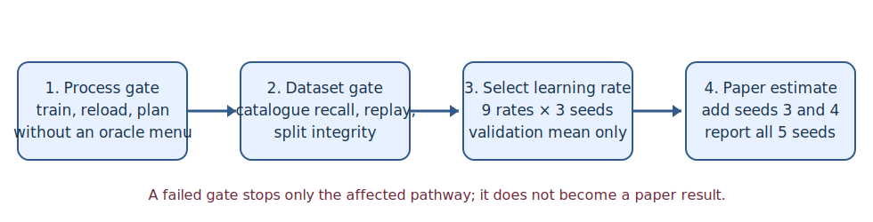

# A gated four-domain test of reasoning through predicted geometry

## The one-sentence answer

The requested comparison and its core software are specified and locally validated, but the scientifically responsible next action is a four-job process gate rather than immediately launching 2,268 conditional learning-rate runs.

## First, the idea in everyday language

Imagine choosing instructions while assembling an unfamiliar machine. A language model can guess the next instruction because it resembles its training examples. Our joint-embedding predictive architecture (JEPA) instead tries to imagine how the machine's hidden situation changes after an instruction, then asks whether that imagined situation is closer to the goal. If deeper imagining helps more than repeatedly running an ordinary language model, the geometry of predicted consequences is doing useful reasoning work.

The proposed paper compares those approaches in four worlds: arithmetic derivations, rule proofs, block rearrangement, and text-described household tasks. Success means completing the task by executing natural-language actions from a full catalogue, without being handed a hidden list of the actions legal at the current step.

A second central question looks inside the models.  If a JEPA really organizes
language around consequences, its hidden states should expose progress,
feasibility, goals, and action effects differently from a model trained to
generate the next word.  We therefore compare frozen hidden states rather than
adding task-solving heads to the JEPA.

## Why this question matters

The paper's central claim is not merely that another policy head solves a toy task. It is that an action-conditioned predictive geometry supports simulation: `predict consequence, compare with goal, repeat`. A separate proposal model may narrow a large catalogue, but the JEPA must add value by reranking predicted consequences. Four domains test whether that mechanism is broader than arithmetic syntax, while recurrent language-model controls test whether any gain is simply more test-time Transformer computation.

## What we tested

This cycle tested implementation validity, not final accuracy. The learned rows are a token language model, a next-sentence language model, a next-sentence model with latent mean-squared-error supervision, weight-shared recurrent versions of all three, and the geometry JEPA. Random choice is an optimizer-free reference. Widths are 128, 256, and 512.

The data interfaces now cover faithful iGSM arithmetic, ProofWriter rules, PlanBench Blocksworld, and compiled ALFWorld traces. Twenty-nine focused unit/integration tests passed. One exact recurrent-token gate command also trained on 256 examples for two epochs, saved and reloaded a checkpoint, then executed 32 closed-loop validation episodes. Its zero success is not evidence about model quality; the deliberately tiny run tests plumbing only.

## What a fair comparison means here

Every learned model--dataset--width cell receives the same nine learning rates: `5e-5, 7e-5, 1e-4, 3e-4, 5e-4, 7e-4, 1e-3, 3e-3, 5e-3`. Each rate runs on seeds 0, 1, and 2. Mean validation success chooses one rate, with the lower rate winning an exact tie. Seeds 3 and 4 then complete a five-seed estimate. Test data never select the rate.

Models see natural-language state, goal, observed action history, and an outcome-free action catalogue. They do not see future legal actions, symbolic distance, optimal continuation, or the terminal label. Symbolic executors provide environment transitions and teacher labels only. Candidate order is deterministically shuffled. Parameter counts, optimizer updates, tokens, floating-point operations, memory, and wall time must accompany accuracy so recurrent loops and JEPA simulation are not compared by name alone.

## What happened

| Gate | Current result | Meaning | Paper evidence? |
|---|---|---|---|
| Focused automated tests | 29 passed | Core recurrence, geometry loss, adapters, planning, and EMA contracts hold | No |
| Exact shell smoke test | Train, reload, and evaluation completed | Remote entrypoint and artifacts are coherent | No |
| Frozen-feature analysis smoke | Export, grouped probes, and reconstruction readout completed | Analysis pipeline is executable without encoder gradients | No |
| ProofWriter format | Official-format example compiled and executed | Rule adapter is ready for a dataset-scale gate | No |
| PlanBench format | Official PDDL examples compiled and solved | Blocksworld adapter is ready for a dataset-scale gate | No |
| ALFWorld deployment | Trace compiler exists; interactive collection/replay incomplete | ALFWorld learning-rate sweep is blocked | No |
| Paper learning-rate grid | Not started | Requires process and per-dataset gates | No |

No model comparison can yet be concluded from this cycle. The important outcome is that the proposed campaign is now an explicit conditional design rather than an untracked collection of runs.

## The intuitive picture

The arrows are admission gates. Notice that five reported seeds come only after a complete three-seed search over all nine rates; a broken data interface or failed process test cannot silently enter the final table.

## The technical details

The recurrent baselines use one weight-shared causal Transformer block. Training samples loop count from a bounded shifted Poisson distribution; evaluation fixes loops in `{1,2,4,8,16}`. All dropout is zero. Sentence models recur only in the history/reasoning backbone, leaving their phrase encoder and decoder fixed so extra test-time computation has a clear location.

The JEPA value is structurally constrained to `Q(s,a,g)=V(F(s,a),g)`, where `F` predicts the latent consequence of action `a` from state `s`, and `V` measures its relation to goal `g`. Pairwise ranking and direct advantage regression supervise differences of this same energy; no action-only reranking shortcut is added. Its causal predictor can be applied recursively with dense supervision against exponentially averaged target latents. The target encoder is forced into evaluation mode.

The common episode schema separates the full catalogue from the actions currently available. ProofWriter uses exact forward rule application, PlanBench uses exact STRIPS preconditions/effects and shortest-plan search, and faithful iGSM wraps the official generator. ALFWorld privileged admissible commands and expert plans are collection labels only; deployment requires a separately produced full catalogue with 100% expert-action recall.

For representation analysis, every model is sampled at the causal state just
before an action.  Numeric ridge and categorical logistic probes standardize
features using training data only and select regularization on problem-grouped
validation identities.  Held-out tests report mean absolute error, explained
variance, accuracy, and balanced accuracy.  Effective rank tests collapse;
linear centered-kernel alignment compares matched examples; clustering is
scored by adjusted Rand index and normalized mutual information.  A common
autoregressive decoder is trained on detached features to reconstruct either
the next intent or next consequence.  That decoder receives the same
nine-rate, three-seed selection and five-seed reporting protocol as other
trained readouts.  Two-dimensional projections are illustrations, not proof.

The complete main matrix contains 84 learned model--dataset--width cells, 2,268 selection trainings, 168 confirmation trainings, and 420 five-seed members. The representative iGSM ablations cross ranking and regression weights, advantage horizon and continuation breadth, counterfactual breadth, dense rollout depth, proposal breadth, beam width, simulation depth, causal falsifiers, and model depth. Loss-scale or gradient-path changes require a local learning-rate cross-check. The frozen protocol is linked from [the paper experiment contract](../../../../projects/intent_phrase/PAPER_EXPERIMENTS.md), and the decision record is [the cycle log](../../../cycles/intent_phrase/2026-07-21-geometry-paper-campaign.md).

## What we can conclude

We can conclude that the campaign's core architectural contracts are implemented and that focused local tests exercise the intended information boundary. The exact gate command works end to end for one recurrent baseline. The user-requested learning-rate and five-seed rules are now machine-readable and tested for completeness.

## What we cannot conclude

We cannot yet conclude that JEPA beats any baseline, that deeper simulation helps, or that the geometry value is calibrated. The local smoke score is intentionally undertrained and is not a pilot estimate. ALFWorld is not admitted until interactive catalogue collection and deterministic replay pass. ProofWriter and PlanBench still need dataset-scale split, catalogue-recall, executor, random-bound, and tiny-overfit gates. A broad sweep cannot repair invalid data or an oracle leak.

## What happens next

Run one process cell for geometry JEPA and each recurrent baseline pathway across Grünau, Alex, Lise, and Grete. All must produce a finite checkpoint and closed-loop metrics without querying future availability. If they pass, validate each dataset separately, then admit one complete 27-training cell at a time. The first scientific result is the frozen validation-selected five-seed cell, not the process gate.

## Words used in this report

- **Action catalogue:** The full set of outcome-free natural-language actions a controller may propose.
- **EMA:** Exponential moving average, a slowly updated target network used to provide stable latent targets.
- **iGSM:** A synthetic multi-step arithmetic reasoning environment.
- **JEPA:** Joint-embedding predictive architecture, which predicts representations of consequences rather than their exact text.
- **Learning-rate sweep:** Training otherwise matched models with several optimizer step sizes and selecting only from validation data.
- **Linear probe:** A deliberately simple readout used to test whether a labeled property is directly accessible from frozen features.
- **Centered-kernel alignment:** A similarity score between two representation spaces evaluated on the same examples.
- **Non-oracle:** Not receiving hidden future legal actions or solutions at deployment.
- **Poisson distribution:** A count distribution used here to vary recurrent loop count during training.
- **Seed:** A fixed source of pseudorandomness used to measure variation between training runs.
- **STRIPS:** A planning representation with explicit action preconditions and effects.

## Questions for you

- If one external dataset repeatedly fails its validity gate, should the other three proceed while it is repaired, or should the entire headline comparison wait?
- After the main table, should compute go first to the geometry-loss/horizon ablation or to expanding the depth-and-width scaling curve?
