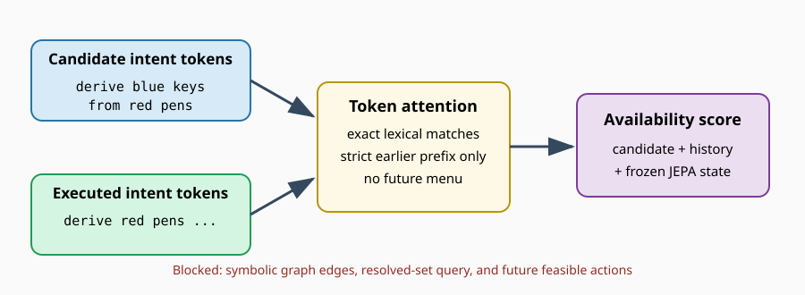

# Proposal evidence beats latent reranking, so preserve lexical prerequisites next

## The one-sentence answer

Across three fixed problem sets, mixing latent simulation into the learned proposal never beat proposal-only selection, so the next bounded test asks whether retaining individual intent tokens can reduce the still-dominant invalid-action failures.

## First, the idea in everyday language

Imagine choosing the next instruction while assembling furniture. One model says which instructions look currently usable; another imagines the finished state after each instruction. We tested whether combining those opinions helps. It did help relative to trusting imagination alone, but every mixture was worse than simply trusting the instruction-availability model.

The remaining availability model reads each complete instruction as one compressed vector. The next model instead compares the individual words in a candidate instruction with the words in instructions already completed. This should make exact prerequisite names easier to match without giving the model the hidden assembly diagram.

## Why this question matters

The joint-embedding predictive architecture (JEPA) cannot demonstrate useful planning if it repeatedly selects actions the environment cannot execute. A token-level prerequisite interface would make the action catalogue deployable enough to test simulation fairly. A failure would tell us to stop designing small custom heads and use a token policy language model instead.

## What we tested

The completed round used one frozen trained checkpoint, three independently generated evaluation problem sets, exact six- and nine-action solutions, strict and two-extra-action budgets, top-four learned proposals, and planning depths one, two, and four. It compared pure JEPA, proposal-only selection, and five standardized mixtures.

The next pilot trains two aligned token-history heads at learning rates 1e-3 and 3e-3, one otherwise identical history-masked control at 3e-3, and reevaluates both existing phrase-pooled checkpoints. Each trained head receives 40,000 fresh problems for five epochs. These are mechanism pilots, not independent training-seed estimates.

## What a fair comparison means here

All proposed systems see the prompt’s complete action catalogue and the intent phrases they have actually executed. None sees hidden graph edges, symbolic feasibility, future action menus, or outcomes for actions not executed. The aligned and masked token heads have identical parameters and computation. Feasibility and demonstrated-action labels are explicit supervision. Support coefficients are tuned separately because new heads need not share the old logit scale.

## What happened

Success means solving a nine-step problem within the stated action budget. Invalid rate means the fraction of episodes terminated by choosing an unavailable action.

| Final scorer | Depth | Strict success | Two-extra success | Strict invalid rate |
|---|---:|---:|---:|---:|
| Pure latent simulation | 1 | .000 | .011 | .983 |
| Hybrid, proposal weight 1 | 4 | .028 | .167 | .744 |
| Hybrid, proposal weight 2 | 4 | .083 | .228 | .644 |
| Hybrid, proposal weight 4 | 1 | .033 | .278 | .550 |
| Proposal only | 1 | **.083** | **.350** | **.506** |
| Symbolic first-feasible reference | 1 | .139 | .800 | .000 |

Each learned row averages three problem seeds with 60 episodes per seed. All three jobs completed and no run was excluded. The problem-seed spread for proposal-only two-extra success was .029 standard deviation. This uncertainty does not include independently retraining the model.

## The intuitive picture

The picture emphasizes the information boundary: the new head gets a less compressed view of information the controller already possesses, not privileged knowledge from the environment.

## The technical details

The failed hybrid standardized JEPA value energy and cumulative proposal cost within each candidate bank before weighting them. Proposal weights were 0, .25, .5, 1, 2, and 4, plus the proposal-only endpoint. No interior weight beat the endpoint.

The new token head receives frozen width-256 token embeddings. A one-layer zero-dropout Transformer contextualizes candidate tokens. Four-head cross-attention compares them with flattened tokens from the strict executed or imagined prefix without repeating the history per candidate. Pooled candidate, attended-history, and elementwise match features join the frozen JEPA state in a small multilayer perceptron. The negative control routes every history through only a learned null token.

Implementation tests cover strict causality, no-history invariance, an empty initial prefix, finite outputs, gradient isolation, and non-oracle depth-two planning. A checkpoint-initialized CPU smoke optimized 1.48 million intended parameters with finite loss. The source JEPA uses a causal Transformer predictor, zero dropout, and evaluation-mode frozen encoders.

Raw completed artifacts are under `runs/autonomy/intent_phrase/2026-07-20-intent-hybrid-proposal-jepa-rerank-v1/`. The decision protocol is in `research/cycles/intent_phrase/2026-07-21-token-prerequisite-support.md`.

## What we can conclude

Direct observation: larger proposal influence consistently repairs pure JEPA’s catastrophic invalid selection, but the proposal-only endpoint remains best. Inference: the current JEPA value/dynamics provide some depth-sensitive signal but no net deployable ordering gain under this candidate interface. The next experiment should therefore improve candidate validity rather than increase search depth.

## What we cannot conclude

We cannot separate value miscalibration from transition drift from this round alone. We cannot claim training-seed stability because all evaluations share one trained checkpoint. We cannot claim the token head will generalize outside stylized observed-intent iGSM, and its feasibility labels mean this is not action-free learning.

## What happens next

The token head advances only if its aligned version beats both pooled checkpoints and the masked token control, reduces length-nine invalid rate below .25, and improves two-extra success. Otherwise custom support-head work stops and the next proposal mechanism becomes a token policy language model. Only a passing pilot receives independent training seeds or deeper JEPA planning.

## Words used in this report

- **Action catalogue:** Every intent phrase stated in the problem prompt.
- **Causal prefix:** Only actions that occurred before the current decision.
- **Invalid action:** An action whose prerequisites are not yet resolved.
- **JEPA:** A model that predicts representations rather than reconstructing text.
- **Proposal:** A learned shortlist or ranking of possible next actions.
- **Symbolic:** Using hidden environment structure such as exact graph dependencies.

## Questions for you

- If token history fails, should the replacement token policy prioritize maximum closed-loop accuracy or an interpretable prerequisite parser?
- Is explicit feasibility supervision acceptable in the paper’s final controller, or should it remain an auxiliary diagnostic interface?

