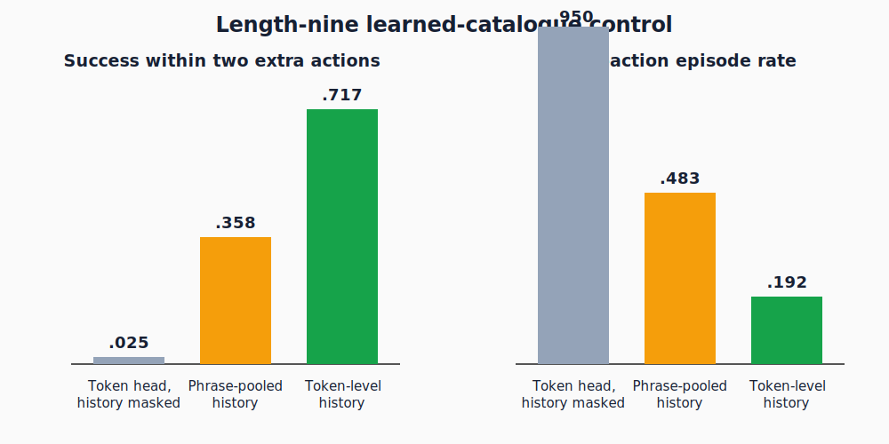

# Token-level intent history makes learned action catalogues executable

## The one-sentence answer

In a one-seed pilot, preserving the words in executed intent phrases raised length-nine success with two extra actions from a best observed `.358` to `.717` and reduced invalid-action episodes from about `.48` to `.19`, but this was a learned-prior result with JEPA reranking disabled.

## First, the idea in everyday language

Imagine assembling furniture from a box of instruction cards. A card may say “attach the left brace after fitting the rear panel.” To know whether that card is usable now, remembering only a blurred summary of earlier cards is risky: the exact words “rear panel” matter. We tested whether a controller should compare each candidate card directly with the words on cards already executed. Success means choosing instructions whose prerequisites have actually been completed, without consulting a hidden list of currently legal actions.

The experiment compares a phrase-pooled memory, a token-level memory that keeps individual words, and an equally large token model whose access to earlier instruction words is deliberately masked. All controllers see the problem prompt, the complete shuffled catalogue of outcome-free intent phrases, and the observed reasoning state. None receives a future feasible-action menu. The key question is whether exact lexical history—not merely added capacity—prevents the controller from attempting actions too early.

## Why this question matters

Our intended controller first proposes a few actions from the full catalogue and then lets a joint-embedding predictive architecture (JEPA) simulate and rerank them. If proposal generation frequently emits impossible actions, downstream simulation never gets a fair chance: an invalid first action terminates the episode. Repairing proposal support is therefore a prerequisite for measuring whether the world model adds planning value.

This controlled result does not establish general language planning. It tells us which non-oracle interface is viable for the stylized observed-intent environment and whether a later JEPA-versus-prior comparison will be interpretable.

## What we tested

The data are synthetic multi-step arithmetic problems. Each available action is an intent phrase describing a computation but not its numerical result. Training supplies binary supervision for whether every catalogue action is currently feasible and behavior-cloning supervision for which action the demonstration executes.

The token-history model lets candidate words attend causally to words in already executed or imagined intent phrases. The phrase-pooled model compresses each whole phrase before this comparison. The negative control has the same token-history architecture but masks all executed and imagined intent tokens. The JEPA encoders and dynamics are frozen; dropout is zero. Token models use one training seed, 40,000 examples, five epochs, and learning rates `1e-3` or `3e-3`. Evaluation uses 120 fixed episodes at exact necessary lengths six and nine.

## What a fair comparison means here

Every evaluated controller receives the same shuffled full action catalogue and the same observed history. No condition queries the environment's symbolic feasibility function or future action menu. Catalogue proposal size is four, beam width is four, and the episode seed is 7321. The negative control isolates whether lexical history, rather than head capacity, explains the gain.

There are two important fairness limits. First, phrase and token support weights `{1,3,10,30}` were all evaluated on the same 120 episodes; reporting the best observed value is exploratory selection, not a sealed-test estimate. Second, only one training seed exists. Wilson intervals below describe episode-sampling uncertainty, not training-seed uncertainty. No run was excluded.

## What happened

The most decision-relevant length-nine comparison is:

| Learned catalogue controller | Strict success | Success with two extra actions | Invalid actions, strict | Support accuracy, open loop | Interpretation |
|---|---:|---:|---:|---:|---|
| Token head with history masked | `.025` | `.025` | `.950` | `.724` | capacity alone fails |
| Phrase-pooled history, best observed | `.083` | `.358` | `.483` | `.952` | lexical compression remains brittle |
| Token-level history, `1e-3`, best observed | `.175` | `.717` | `.158` | `.992` | prerequisites are mostly recovered |
| First currently feasible reference | `.142` | `.792` | `0` | not applicable | symbolic interface reference |

Each success or invalid-action rate uses 120 episodes. Approximate 95% Wilson intervals are `[.117,.253]` for token strict success, `[.630,.790]` for token slack-two success, and `[.104,.234]` for token strict invalid rate. The corresponding phrase intervals are `[.046,.147]`, `[.278,.447]`, and `[.380,.556]`. These unpaired intervals are descriptive because per-episode outcomes were not stored.

At length six, the token model reaches `.233` strict and `.592` slack-two success, versus phrase maxima of `.192` and `.483`. The history-masked control reaches only `.075` and `.142`. Learning rate matters: token `1e-3` reaches `.717` at length-nine slack two, while `3e-3` peaks at `.633`, even though both exceed `.987` true-state support accuracy.

## The intuitive picture

The left chart shows that exact token history roughly doubles the best phrase-pooled slack-two success. The right chart shows why: invalid attempts fall sharply. The mirrored movement supports a prerequisite-tracking explanation rather than a mysterious general planning improvement.

## The technical details

The token support head embeds every lexical token in every candidate intent, applies a one-layer zero-dropout candidate encoder, and uses four-head attention from candidate tokens to the causal prefix of executed intent tokens. Its final multilayer perceptron combines the frozen JEPA state, candidate summary, history context, and token-level interaction features. Binary cross-entropy with positive weight two trains feasibility for every action at every observed prefix. Inputs from the base JEPA are detached, and only the reset support head plus the existing catalogue action prior train.

At evaluation, proposal score equals the catalogue prior log probability plus a coefficient times the log-sigmoid support score. The controller keeps the top four roots. This round sets `prior_only=true`, `lookahead=1`, `oracle_future_actions=false`, and `proposal_rerank_weight=0`. Thus predicted JEPA consequences do not choose among proposals. Support audits separately score true encoded states, one-step predicted states, and recursively predicted open-loop states. The selected token checkpoint obtains length-nine accuracies `.99246`, `.99245`, and `.99245`, so state drift does not degrade this particular classifier at the measured horizon.

All jobs ran from exact snapshot `2bdd5a01b5f987889147d39b8af7808e8b1642f8`. The resolved plan is [the intent-phrase run plan](../../../intent_phrase/NEXT_PLAN.json), the scientific audit is [the cycle record](../../../cycles/intent_phrase/2026-07-21-token-prerequisite-support.md), and raw artifacts are under `runs/autonomy/intent_phrase/2026-07-21-intent-token-prerequisite-support-v1/`.

## What we can conclude

Direct observation supports that token-level access to executed intent history is necessary for reliable learned feasibility in this setup. The equal-capacity masked control fails badly, so merely enlarging the head does not explain the result. Token history also materially improves closed-loop success and reduces invalid actions relative to phrase pooling.

The supported inference is that phrase pooling destroyed prerequisite identity information. The token support head should become the proposal interface for the next diagnostic.

## What we cannot conclude

We cannot claim that JEPA simulation improved planning, because it was switched off for action selection. We cannot claim a stable final recipe from one training seed, nor select a final support weight from these reused evaluation episodes. We also cannot claim that `.992` binary feasibility accuracy is sufficient: the `3e-3` checkpoint shows that calibration and top-four ranking can differ despite similar aggregate accuracy.

The learned prior remains below the symbolic first-feasible reference on length-nine slack-two success. This task is stylized, supplies supervised feasibility labels during training, and does not demonstrate free-form action generation or transfer to faithful iGSM.

## What happens next

Freeze the `1e-3` aligned token-support checkpoint and run an inference-only matched comparison of prior-only selection, one-step JEPA reranking, and deeper causal simulation. Keep catalogue order, top-M, beam width, support coefficient, problem episodes, and compute accounting fixed. Measure strict and slack success, invalid actions, selected-action regret, and recursive latent drift.

If reranking improves success without restoring invalid actions, simulation adds value and deserves seed confirmation. If one-step hurts but deeper rollout helps, tune depth rather than retrain support. If every JEPA condition hurts, separate value-head error from world-model drift before changing architecture or scaling.

## Words used in this report

- **Intent phrase:** A natural-language action describing a computation without revealing its outcome.
- **JEPA:** A model that predicts learned representations of future states instead of reconstructing their text.
- **Action catalogue:** The shuffled set of all outcome-free intent phrases stated for one problem.
- **Feasible action:** An action whose prerequisite computations have already been completed.
- **Strict success:** Solving within exactly the minimum required action budget.
- **Slack-two success:** Solving with permission to use at most two extra actions.
- **Prior-only:** Selecting from learned proposal scores without using JEPA consequence reranking.

## Questions for you

- Should the next diagnostic prioritize demonstrating incremental JEPA value over the now-strong proposal interface, or first spend two additional seeds confirming the token-support result?
- If deeper JEPA simulation improves success but costs substantially more inference, should the paper optimize strict accuracy or success per unit of planning compute?

