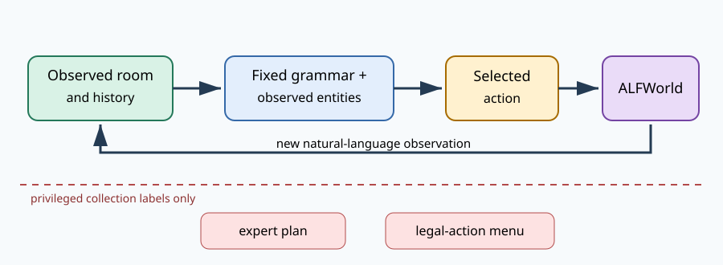

# ALFWorld passed environment admission; prior-free learnability is the next gate

## The one-sentence answer

The real ALFWorld engine collects and exactly replays a disjoint 16-episode non-oracle pilot, but the original training set and process runs used a now-discarded feasibility-supervision design; the next valid question is whether prior-free JEPA+GAR and matched LM baselines can overfit a corrected transition-only pilot.

## First, the idea in everyday language

Imagine teaching someone to cook by letting them read a room description, choose an instruction such as “take the apple from the counter,” and observe what changes. A fair test cannot whisper the list of legal moves before every choice. We therefore build possible instructions only from objects the learner has already seen, while using ALFWorld’s hidden expert and legal-move list only to prepare labels and verify correctness. The implementation must also reopen the same simulated room and reproduce every observation exactly; otherwise apparent reasoning gains could merely reflect inconsistent data.

## Why this question matters

ALFWorld is the paper campaign’s interactive, non-arithmetic domain. It tests whether consequence geometry transfers beyond synthetic equations. A broken collector, oracle action menu, or drifting replay would invalidate an entire learning-rate sweep. This report supports a narrow decision: run random/oracle real-engine bounds and a three-learning-rate tiny-set overfit gate, but do not start full ALFWorld model selection yet.

## What we tested

We installed the official text-only ALFWorld 0.5.0 engine from a pinned source revision and downloaded its official game files. One training, one seen-validation, and one unseen-test game were collected with the hand-coded expert. Every factual step received one recoverable alternative action with up to four teacher continuation observations. Collection used the privileged legal-action list only for labels. Interactive replay regenerated candidate actions from the initial room description and accumulated observation history.

Separately, the four model process gates asked only whether each implementation could train for two epochs, reload a checkpoint, and emit finite closed-loop metrics. Geometry JEPA and recurrent sentence prediction completed in the original recovery round. Recurrent token prediction and recurrent sentence-latent prediction remained pending externally, then completed in duplicate recovery jobs on free Grünau GPUs.

## What a fair comparison means here

At evaluation, every model sees natural-language history, the goal, and the same fixed-grammar catalogue grounded in observed entity names. It never receives ALFWorld’s current legal-action menu, an action prior, a feasibility prior, expert plan, future availability, or teacher continuation. The generated catalogue intentionally contains invalid cross-products. Those actions are learned only through recorded action-outcome transitions: there is no feasibility classification target. Candidate ordering is a stable hash that also covers objects discovered later, and all paper methods receive identical catalogues and evaluation budgets.

## What happened

| Check | Sample | Outcome | Interpretation |
|---|---:|---:|---|
| Official expert collection | 3 episodes, 36 steps | 100% completed | All train/seen/unseen smoke episodes were solvable |
| Factual deterministic replay | 3 episodes, 36 steps | 100% exact | Stored observations and terminal success reproduced |
| Recoverable alternatives | 36 alternatives | 36 recovered | One non-expert branch per factual step reached the goal |
| Dynamic catalogue replay | 1 unseen episode, 16 steps | 100% expert recall | No legal menu was used by the evaluator |
| Geometry JEPA process gate | 1 run | completed | Training, checkpoint reload, and metrics path work |
| Recurrent sentence model process gate | 1 run | completed | Training, checkpoint reload, and metrics path work |
| Recurrent token / sentence-latent gates | 2 recovery runs | completed | Training, checkpoint reload, and finite metrics paths work |
| Unseen ALFWorld schema recovery | 4 episodes, 67 steps | completed | Raw oracle menus compile to feasibility only within the non-oracle catalogue; exact replay remains 100% |
| Train admission set | 8 episodes, 150 steps | completed | Exact replay, goal success, and expert catalogue recall are all 100% |
| Seen-validation admission set | 4 episodes, 74 steps | completed | One bounded pathological game was recorded and skipped; retained episodes pass all validity checks |
| Split identity audit | 16 episodes | disjoint | No episode identity crosses train, seen-validation, or unseen-validation |
| Local seen-validation bounds | 4 episodes | oracle 100%, random 0% strict success | The environment is solvable and random action selection is not a viable shortcut |

These are engineering-validity observations, not estimates of model quality. The completed two-epoch models solved zero validation episodes, which is unsurprising at this scale and is not used to rank methods.

## The intuitive picture

The figure separates deployment information from privileged collection labels. The loop on the left is what a model may use; the dashed label-only path must never enter policy inference.

## The technical details

The catalogue generator parses numbered entities only after phrases such as “you see,” treats reset-time entities as navigable receptacles, and grounds a fixed grammar for navigation, opening, taking, moving, heating, cooling, cleaning, slicing, examining, inventory, and lamp use. It deliberately emits invalid object–receptacle cross-products. Collection runs the official hand-coded expert, checks that every expert action occurs in both the generated catalogue and privileged admissible set, branches from the exact factual prefix, and records both recoverable admissible alternatives and rejected catalogue actions as ordinary observed consequences. Privileged availability is used only to construct and audit the offline data; it is not a model target or inference input.

Fast Downward maps a private planner library for each engine and does not release the deleted mapping until process exit. Repeated environments therefore exhausted temporary storage despite normal close calls. Collection now resets one engine for all branches in an episode and executes each episode in a disposable worker. Interactive evaluation likewise owns each engine in a spawned subprocess and explicitly closes it. This was directly verified: five in-process engines accumulated fifteen deleted planner mappings before the repair, whereas the process-isolated validator completed exact replay without retaining them in the model process. The padded episode-level action axis also carries a per-step observed-candidate mask, so actions grounded from later-discovered objects receive no earlier support loss. Fifteen focused tests pass, including this future-entity regression, the zero-counterfactual regression, schema validation, non-oracle catalogue construction, and closed-loop planning.

## What we can conclude

We directly observe that the adapter can collect and replay official train, seen-validation, and unseen-test games without exposing the oracle menu during interactive evaluation. The retained 16-episode pilot has disjoint identities, 291 factual transitions, 291 recoverable admissible counterfactuals, exact replay, 100% goal completion, and 100% expert recall in the non-oracle catalogue. We also observe that all four core model pathways can execute. These observations validate the environment interface, but not the discarded feasibility-supervised models. The paper-facing protocol instead scores the complete non-oracle catalogue and trains invalid-action effects as transitions.

## What we cannot conclude

We cannot yet claim model learnability or paper-level ALFWorld performance. Tiny-set overfitting, action-shuffle degradation, and learned-policy closed-loop success remain untested. The pilot is an admission fixture, not a headline benchmark sample, and is too small to estimate recovery coverage. The external Alex and Grete duplicates remain scheduler-pending, but they are obsolete for the process decision.

## What happens next

First rebuild the eight-episode training fixture with, at every factual state, one recoverable admissible alternative and one rejected catalogue action represented solely by its observed textual consequence. Then run a matched tiny-set gate for prior-free JEPA+GAR, token LM, sentence LM, and sentence LM with latent MSE. The primary gate is substantial train strict success; validation is diagnostic and must not select the learning rate. Failure redirects work to objective, optimization, and planner diagnostics rather than to action-support or feasibility heads.

## Words used in this report

- **ALFWorld:** A text-based household simulator with goals such as moving or preparing objects.
- **JEPA:** Joint-embedding predictive architecture, a model that predicts consequences in a learned latent space.
- **Oracle menu:** The simulator’s privileged list of actions that are legal in the current hidden state.
- **Counterfactual:** A recorded alternative action and the consequence that would have followed it.
- **Process gate:** A small run checking that software trains, reloads, and evaluates before expensive experiments.

## Questions for you

- After these gates pass, should the next priority be the full ALFWorld dataset admission battery or the first complete iGSM learning-rate cell?
- Is one recoverable alternative per ALFWorld step sufficient for the first model pilot, or should collection spend roughly twice the time for two alternatives immediately?
