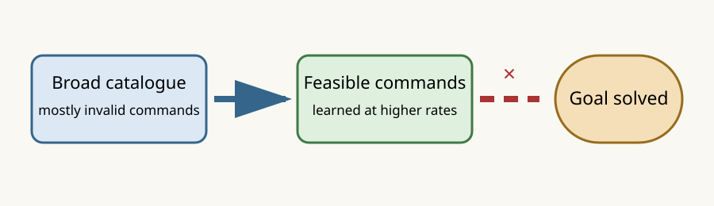

# ALFWorld feasibility is learned, but goal-directed action choice fails

## The one-sentence answer

A small geometry JEPA learns to avoid illegal ALFWorld commands but solves none of the eight episodes it trained on, so larger data and paper-scale sweeps are premature.

## First, the idea in everyday language

Imagine a household robot that must put an apple in a refrigerator. It first has to distinguish sensible commands such as “open refrigerator” from nonsense commands involving the wrong objects. It must then choose the particular sensible command that moves toward the requested goal. Our model learned the first skill almost perfectly, but not the second: it issued legal-looking commands for the full action budget without completing a task.

## Why this question matters

ALFWorld is the paper campaign’s natural-language interactive domain. Before collecting thousands of trajectories or tuning many models, a deliberately tiny model should be able to memorize eight fixed training trajectories. Failure here identifies a representation, supervision, or planning-interface problem much more cheaply than a large benchmark run.

## What we tested

The fixed pilot contains eight train episodes with 150 factual actions and one recoverable counterfactual per action. Four disjoint seen-validation episodes are diagnostic only. A 0.30-million-parameter causal geometry JEPA trained for 300 epochs at learning rates 3e-4, 1e-3, and 3e-3. Every other setting was matched: seed zero, dropout zero, EMA targets in evaluation mode, one counterfactual candidate, four-step teacher continuation, feasibility loss, geometry ranking, and direct advantage regression. Closed-loop planning used the non-oracle catalogue, proposal top-M 8, beam width 4, and depth 2.

## What a fair comparison means here

The learned policy never sees ALFWorld’s legal-action menu or expert plan during deployment. The oracle is explicitly privileged and is only an environment upper bound. Random and learned policies receive the same broad catalogue grounded in observed entities. The initial three training jobs are excluded because a fixed dataset accidentally inherited procedural epoch-offset sampling and failed at epoch one; repaired jobs repeated the same stored examples and completed normally.

## What happened

| Policy or learning rate | Train strict success | Train +4 success | Train invalid-action rate, strict | Meaning |
|---|---:|---:|---:|---|
| Privileged expert replay | 100% | 100% | 0% | Environment and catalogue are executable |
| Random | 0% | 0% | 82.7% | Broad catalogue is not an easy shortcut |
| JEPA, 3e-4 | 0% | 0% | 52.7% | Weak feasibility learning |
| JEPA, 1e-3 | 0% | 0% | 0.7% | Feasibility learned; goal choice fails |
| JEPA, 3e-3 | 0% | 0% | 0% | Feasibility learned; goal choice fails |

All three models also score 0/4 on seen validation at strict and +4. These are complete pilot counts, not multi-seed population estimates.

## The intuitive picture

The model successfully narrows the broad catalogue to commands the simulator accepts, but the experiment provides no evidence that its latent value ordering selects the goal-advancing command.

## The technical details

The two higher-rate runs finish with 99.29% elementwise feasibility accuracy and state effective ranks 40.99 and 44.47. Their closed-loop invalid-action rates are at most 0.67%, so zero success cannot be explained mainly by syntactically or physically invalid commands. However, feasibility accuracy is class-imbalanced and does not rank one goal-relevant action above other feasible actions. The recorded-action adapter currently chooses one deterministic geometry-ranking anchor per episode, so only eight of 150 train states directly supervise action-value ordering. The next audit therefore uses stored expert and feasibility labels only as explicitly candidate-privileged diagnostics: it measures expert recall after proposal pruning and compares prior-only, one-step, and two-step choices under factual histories.

Raw artifacts live under `runs/autonomy/intent_phrase/2026-07-22-intent-alfworld-overfit-gate-v1/` for bounds and `runs/autonomy/intent_phrase/2026-07-22-intent-alfworld-overfit-gate-recovery-v2/` for repaired models.

## What we can conclude

The validated pilot is solvable, random action choice fails, and the present training recipe does not even memorize its training episodes. Higher learning rates reliably change the failure mode from mostly invalid actions to valid but unproductive actions. This supports localizing the proposal/value interface before scaling.

## What we cannot conclude

We cannot yet say whether JEPA geometry itself is insufficient. The expert action may be pruned before simulation, or sparse ranking anchors may leave the value ordering untrained. Nor can this tiny single-seed gate estimate generalization, compare against language-model baselines, or support a paper headline.

## What happens next

Audit every factual train state. If the expert rarely enters top-M, improve proposal supervision or widen the candidate set. If the expert is proposed but JEPA reranking loses it, cycle or densify geometry-ranking anchors and test one-step before deeper rollout. Only a model that reaches at least 75% strict train success may admit action-shuffle controls and larger ALFWorld collection.

## Words used in this report

- **Feasibility:** Whether the simulator accepts a command in the current state.
- **JEPA:** A model that predicts consequences in a learned representation rather than reconstructing text.
- **Non-oracle catalogue:** Candidate commands generated from observed text without the simulator’s hidden legal-action list.
- **Teacher-forced diagnostic:** An analysis that supplies the true previous history to locate errors, not a deployment result.

## Questions for you

- If proposal recall is the bottleneck, should the paper prioritize a learned goal-conditioned action prior or preserve a feasibility-only prior with much wider JEPA search?
- Should the eventual ALFWorld headline require exact-budget success, or present the full success-versus-extra-actions curve alongside it?
