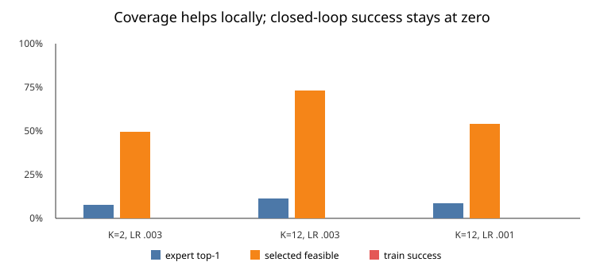

# Broader observed action coverage improves local ALFWorld geometry but still does not produce a working controller

## The one-sentence answer

Increasing exact observed alternatives from two to twelve per factual state improves several local diagnostics, but all three tested models still solve zero training and validation tasks, so ALFWorld paper-scale training remains gated.

## First, the idea in everyday language

Imagine learning household tasks from demonstrations. Seeing what happens after two alternative commands is better than seeing only the expert command, but the deployed agent must choose among hundreds of possible command strings. We tested whether observing twelve alternatives at each state was enough to bridge that gap. It was not.

The learner became better at describing several roads near the demonstrated
route, yet still chose too many impossible roads when asked to navigate the
whole map by itself.

## Why this question matters

The proposed JEPA must choose actions by imagining their latent consequences, without an action prior or privileged menu. If broader exact transition data makes that geometry useful, collection can scale. If it improves only memorized comparisons while the controller remains unusable, launching thousands of paper jobs would measure a broken interface.

## What we tested

The fixed fixture has eight ALFWorld training games, 115 factual transitions, and 1,380 exact counterfactual transitions: four admissible and eight rejected alternatives per state. We compared a K=2 information-matched subset at learning rate 0.003 with K=12 at learning rates 0.003 and 0.001. All use seed zero, the same 0.30-million-parameter causal JEPA, 20 epochs, zero dropout, an evaluation-mode exponential-moving-average target, and the full non-oracle catalogue.

## What a fair comparison means here

The factual trajectories and broad collected fixture are identical. K changes only how many observed alternatives contribute direct latent and ranking supervision. The second learning rate checks the changed loss scale. Stored-candidate diagnostics are explicitly candidate-privileged and are not treated as deployment results. Closed-loop evaluation sees the full shuffled catalogue and no future availability.

## What happened

| Coverage and learning rate | Counterfactual error ↓ | GAR top-1 on stored labels ↑ | Full-catalogue expert top-1 ↑ | Median expert rank ↓ | Selected action feasible ↑ | Train / validation success |
|---|---:|---:|---:|---:|---:|---:|
| K=2, 0.003 | .402 | 61.7% | 7.8% | 44 | 49.6% | 0/8, 0/4 |
| K=12, 0.003 | .326 | 58.3% | 11.3% | 18 | 73.0% | 0/8, 0/4 |
| K=12, 0.001 | .349 | 63.5% | 8.7% | 14 | 53.9% | 0/8, 0/4 |

The lower-learning-rate K=12 model has the best validation invalid-action rate, 55.4%, versus 67.6% for K=2. This is an improvement but not a usable policy. All observed counterfactual errors beat persistence (about 1.05), and factual within-episode next-state retrieval is 100%.

## The intuitive picture

The orange and blue bars move with broader coverage, while the red success bars remain absent. Better local fitting is not yet task completion.

## The technical details

The predictor receives the complete causal factual prefix and a candidate intent phrase. Its predicted next state is matched to the EMA encoder's latent of the observed candidate consequence. The same predicted-consequence geometry supplies the ranking and direct advantage-regression losses. K=12 uses all four admissible and eight rejected observed branches; K=2 takes the matched low-coverage subset. Evaluation uses simulation depth one and beam width four over a mean catalogue size of 485.

The exact snapshot is `a5a199e3a40011d6894a2fc09050aeabc00fe405`. Raw artifacts are under [`runs/autonomy/intent_phrase/2026-07-23-intent-alfworld-counterfactual-coverage-gate-v1`](../../../../runs/autonomy/intent_phrase/2026-07-23-intent-alfworld-counterfactual-coverage-gate-v1), and the resolved plan is [`2026-07-23-intent-alfworld-counterfactual-coverage-gate-v1`](../../../../.researchctl/plans/2026-07-23-intent-alfworld-counterfactual-coverage-gate-v1.resolved.json).

This is a one-seed memorization gate. It is intentionally too small for uncertainty estimates or a generalization claim.

## What we can conclude

Direct observation: broader exact coverage improves transition error, median expert rank, and some feasibility measurements, but does not yield any closed-loop success. Inference: lack of exact alternative-state supervision was a real problem, but coverage alone at this scale is not the complete solution.

## What we cannot conclude

We cannot conclude that deeper simulation fails because only depth one was evaluated here. We cannot claim generalization, compare final methods, or admit ALFWorld to the paper grid. We also cannot isolate whether remaining errors arise from rollout drift, goal geometry, or ranking among unseen actions.

## What happens next

Use the already-trained K=12 checkpoints to cross simulation depths `{1,2,4,8}` and beam widths `{1,4,8}`. This is cheaper and more diagnostic than training again. Any deeper-compute gain must appear under the same full non-oracle catalogue. Independently, advance ProofWriter and a clearly labeled three-block PlanBench compiler subset through source, schema, executor, reference-bound, tiny-overfit, and action-shuffle gates.

## Words used in this report

- **Counterfactual:** An alternative action from the same state and its observed consequence.
- **Catalogue:** The candidate action strings available without asking the environment which are feasible.
- **JEPA:** A model that predicts internal representations of consequences.
- **GAR:** Geometric advantage ranking; ordering actions using predicted-consequence distance to a goal.
- **EMA target:** A slowly updated encoder used to form stable training targets.
- **K:** The number of observed alternative actions supervised at each factual state.

## Questions for you

- If deeper compute remains at zero success, should the next ALFWorld gate target goal-distance calibration or unseen-action transition regularity?
- For PlanBench, should the final dataset emphasize the official 3-block subset for controlled scaling, or invest in a faster optimal planner for the full 4–8 block set?
