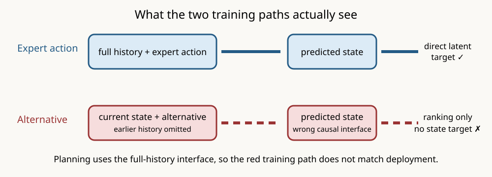

# The ALFWorld JEPA learned expert transitions but was trained on mismatched counterfactual histories

## The one-sentence answer

The joint-embedding predictive architecture (JEPA) memorized all 115 executed training transitions, but it was never directly trained to match counterfactual next-state latents and its geometric action-ranking paths omitted causal history, invalidating the present closed-loop result.

## First, the idea in everyday language

Imagine teaching a household robot from a diary. For actions the expert really
took, the robot reads the whole diary and accurately predicts the next page.
For alternative actions, however, the training code tears out the earlier
pages and asks the robot to judge a short fragment as if it happened at the
start. At deployment the robot again receives the full diary. The robot has
therefore learned the examples it was actually given, but those examples do
not match the decision it must make.

## Why this question matters

The previous test reported zero success on eight training games. If the JEPA
could not even learn its stored transitions, the architecture or optimizer
would be the likely problem. If it learned executed transitions but not
counterfactuals, the supervision interface must be repaired before judging the
architecture or collecting more data.

## What we tested

We audited the two completed no-prior JEPA checkpoints, trained at learning
rates `1e-3` and `3e-3` with seed zero. Both saw the same eight recorded
ALFWorld games: 115 expert transitions and two stored counterfactual outcomes
per state. We measured expert and alternative next-state latent prediction,
action ordering among the three seen candidates, expert rank over the complete
non-oracle catalogue under the true history, and the existing closed-loop
training-game result.

## What a fair comparison means here

This is a candidate-privileged debugging audit, not a deployment result. Stored
expert, counterfactual, and feasibility labels are used only to locate the
failure. Every prediction is evaluated against the same exponential-moving-
average target encoder used in training. The full-catalogue metric supplies the
true preceding history but never supplies the hidden legal-action menu.

The two learning rates are not independent seeds and provide no uncertainty
estimate. They are implementation-localization controls.

## What happened

| Diagnostic | Learning rate 1e-3 | Learning rate 3e-3 | Interpretation |
|---|---:|---:|---|
| Expert transition latent error | 0.327 | 0.246 | Far below persistence |
| Persistence error on expert transition | 1.102 | 1.103 | Naive no-change baseline |
| Correct expert-state retrieval | 100% | 100% | Executed transitions are memorized |
| Counterfactual latent error, full prefix | 1.002 | 0.925 | Only 2–7% better than persistence |
| Counterfactual persistence error | 1.019 | 0.995 | Alternatives are barely learned |
| Fit to configured GAR pair labels | 98.5% | 97.5% | The model fits its actual labels |
| Fit after using planner-consistent prefixes | 89.4% | 84.8% | Interface mismatch is material |
| Correct one-step geometric pair ordering | 44.7% | 50.7% | Approximately chance |
| Expert top-1 over full catalogue | 7.0% | 8.7% | Too low for a multi-step task |
| Closed-loop training-game success | 0/8 | 0/8 | Expected from the preceding ranks |

There are 115 factual states, 230 counterfactual transitions, and a mean
catalogue size of 485 actions. These are complete counts for the fixed pilot,
not estimates from sampling.

## The intuitive picture

The solid blue path is the JEPA task that succeeds. The broken red path is the
counterfactual training interface: it both changes the available history and
substitutes a ranking signal for direct consequence prediction.

## The technical details

For an executed action, the causal predictor receives the complete sequence of
teacher-forced states and actions and minimizes latent prediction error:
`F(s_0 ... s_t, a_0 ... a_t) -> target state s_(t+1)`.

For a GAR alternative, `_geo_rank` calls the causal predictor with only
`(s_t, alternative action)`. This resets transformer position and removes the
earlier causal sequence. The planner instead uses its `rollout` method with the
complete observed state/action history.

The configured horizon-four label has a second mismatch. It target-encodes the
candidate outcome and continuation directly after the prompt, without
prepending the factual outcomes before the anchor. The model consequently
achieves 97–98% pair accuracy on the configured labels, but those labels do
not represent the same historical state used by planning.

Finally, the ALFWorld adapter exposes alternatives through `ga_alt_*`, which
feeds GAR labels. The generic `counterfactual_outcome` objective consumes a
different `alt_step_tokens` path and is disabled in the paper configuration.
Even that generic objective predicts a frozen outcome-chunk embedding through
a projection head, not the complete counterfactual next-state latent required
by this action-conditioned world model.

The diagnostic implementation is
[`scripts/diagnose_alfworld_jepa_memorization.py`](../../../../scripts/diagnose_alfworld_jepa_memorization.py).
The source checkpoints and closed-loop artifacts are under
`runs/autonomy/intent_phrase/2026-07-22-intent-alfworld-no-prior-matched-overfit-v4/`.

## What we can conclude

Direct observations:

- Both checkpoints distinguish every expert predicted state from all other
  target states in the same episode.
- Stored counterfactual consequence prediction is close to a no-change
  baseline.
- GAR accurately fits its configured, history-mismatched labels.
- Planner-consistent full-catalogue expert rank is insufficient for completing
  a long action sequence.

Supported inference:

- The zero-success result does not show that JEPA cannot learn ALFWorld
  dynamics.
- The present ALFWorld GAR experiment is scientifically invalid as a test of
  the proposed full-history counterfactual planner.

## What we cannot conclude

We do not yet know whether corrected counterfactual state prediction plus
correct GAR targets will solve the games. We cannot attribute failure to model
width, learning rate, latent geometry, or catalogue size until the two prefix
mismatches are fixed. This audit has one seed and eight deliberately finite
training games; it says nothing about generalization.

## What happens next

The smallest valid rerun should make executed and alternative predictions use
identical full causal prefixes; construct every horizon label from the same
factual prefix; directly regress observed alternative predictions onto their
complete next-state latents; retain GAR ranking and advantage regression as
separate value objectives; and pass exact synthetic prefix-sensitivity tests.
Only then should the two learning rates be rerun on the same eight games.

If corrected counterfactual error falls well below persistence and seen
ranking becomes reliable but the full catalogue still fails, catalogue
coverage becomes the next decision. If the corrected model cannot fit the 230
observed alternatives, optimization or representation capacity becomes the
next decision.

## Words used in this report

- **Causal prefix:** All observations and actions preceding the decision.
- **Counterfactual:** An alternative action and its observed consequence at the same state.
- **GAR:** Geometric advantage ranking, which orders actions using distances in learned latent space.
- **JEPA:** Joint-embedding predictive architecture, which predicts representations rather than reconstructing text.
- **Latent:** A learned numerical representation of the interaction state.
- **Persistence baseline:** Predicting that the state does not change.
- **Teacher forcing:** Supplying the true preceding states during a diagnostic or training step.

## Questions for you

- Should the repair use full next-state latent regression as the primary
  counterfactual objective, with outcome-chunk prediction retained only as an
  ablation?
- After the repaired eight-game gate, should we prioritize broader
  counterfactual coverage or transfer immediately to a fresh/infinite
  procedural setting?
