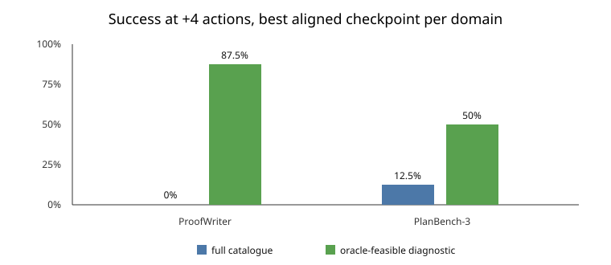

# Feasible-only evaluation reveals useful reasoning hidden by invalid-action selection

## The one-sentence answer

Yes: absence of a feasible-action menu explains much of the apparent
zero-solve failure, because unchanged checkpoints rise from essentially zero
full-catalogue validation success to as much as 87.5% on ProofWriter and 50%
on PlanBench when evaluated over the current feasible subset.

## First, the idea in everyday language

The model faces two questions at once: “Can this action be performed now?” and
“If performed, will it help reach the goal?” A full catalogue tests both.
A feasible-only menu answers the first question symbolically, leaving the
model to answer the second. Comparing them separates action feasibility from
consequence-based reasoning. It is like first asking a chess player to choose
among every imaginable piece movement, including illegal ones, then asking
again after a referee removes illegal moves. Better performance in the second
case does not prove the player can enforce chess rules, but it does reveal
whether useful strategy was hidden underneath mistakes about legality.

## Why this question matters

Zero solved episodes can misleadingly suggest that no reasoning was learned.
If most selections are simply impossible actions, however, that conclusion is
too strong. The decomposition determines whether to repair latent dynamics,
goal values, or feasibility generalization, and it establishes an honest
diagnostic for every paper baseline.

## What we tested

Tiny causal geometry JEPAs trained on 24 official-source training episodes and
were evaluated on eight held-out episodes per domain. Training included the
executor consequence of every grounded catalogue action, including invalid
actions that leave state unchanged. We evaluated each frozen checkpoint with:

1. the full grounded catalogue, which is the non-oracle deployment interface;
2. the current symbolic feasible subset of that exact catalogue, which is a
   candidate-privileged diagnostic.

Both interfaces use the same model, checkpoint, histories, goals, budgets,
and deterministic candidate-order randomization. The feasible set is
recomputed only from the current state; no future menu or optimal continuation
is exposed.

## What a fair comparison means here

All policies see the same textual history and goal, and all score the same
catalogue within a column. The feasible condition is not called deployable:
it is a privileged conditional test. It cannot be used to select a favorable
method while another baseline receives the full catalogue, and it cannot
replace the full-catalogue headline.

## What happened

| Domain and aligned checkpoint | Full strict | Full +4 | Feasible strict | Feasible +4 | Full invalid-action rate at +4 |
|---|---:|---:|---:|---:|---:|
| ProofWriter, LR 0.001 | 0.0% | 0.0% | 0.0% | **87.5%** | 87.5% |
| ProofWriter, LR 0.003 | 0.0% | 0.0% | 12.5% | **75.0%** | 90.3% |
| PlanBench-3, LR 0.001 | 0.0% | 0.0% | 0.0% | **25.0%** | 91.2% |
| PlanBench-3, LR 0.003 | 0.0% | 12.5% | **50.0%** | **50.0%** | 93.8% |

The repaired shuffled-action control is also useful. On PlanBench it scores
0% at every feasible-only budget, whereas the aligned LR-0.003 model scores
50%. Thus the feasible diagnostic is not solved merely by reducing the menu:
correct action–consequence grounding matters.

## The intuitive picture

The gap is largest on ProofWriter. Once impossible inferences are removed, the
model often finds a valid derivation if granted several extra actions. The
remaining strict-versus-+4 gap shows imperfect ordering or path efficiency.

## The technical details

The full catalogue is constructed independently of current symbolic
feasibility. At each step the new interface intersects that catalogue with
the executor's current feasible set while preserving deterministic,
seed-derived ordering. The intersection changes after each executed action.
It never adds an action, exposes a future menu, or supplies an advantage
value. ProofWriter feasibility comes from currently satisfiable rule
applications; PlanBench feasibility comes from PDDL preconditions; faithful
iGSM uses the current official executor. Invalid-action rate must therefore
be zero in the feasible diagnostic by construction. The scientific signal is
success and path efficiency after conditioning on that fact, plus comparison
with the aligned action-shuffle control.

## What we can conclude

Three conclusions are directly supported.

- Feasibility generalization is the dominant current deployment bottleneck.
  Full-catalogue invalid-action rates are roughly 88–94%.
- Useful goal-directed ordering exists beneath that bottleneck. Feasible-only
  success is far above random and, on PlanBench, disappears under action
  shuffling.
- Exact-budget reasoning is not solved. ProofWriter needs extra actions, and
  only one PlanBench setting reaches 50% strict success.

The result does not mean the symbolic menu should silently become the main
method. Doing that would move a substantive part of reasoning into the
environment. Instead, final tables should show both columns: full catalogue
as the headline and feasible-only as a labeled conditional diagnostic.

## Fairness and information boundaries

Every learned method and baseline will receive the same interface within each
column. The feasible-only column is labeled
`candidate_privileged_oracle_feasible_catalogue`. It filters only the
predeclared grounded catalogue and never injects an action absent from that
catalogue. The oracle reference remains expert replay and is not an
oracle-advantage action selector. GAR may use privileged continuation to form
training labels, but learned evaluation always uses predicted geometry.

## What we cannot conclude

These are one-seed, eight-episode localization gates, not paper estimates.
Confidence intervals would be wide. ProofWriter and three-block PlanBench are
controlled domains, and the result may not transfer to ALFWorld. The gate used
one-step simulation; deeper simulation must be evaluated separately. Finally,
the full-catalogue model may improve substantially with scale and broader
invalid-action coverage, so the present interface gap is not a permanent
architectural limit.

## What happens next

The dual evaluation should be applied to every final checkpoint. The iGSM
paper campaign can start independently, using full-catalogue validation
success for learning-rate selection and feasible-only results only for
localization. ProofWriter and PlanBench should receive larger training sets
before paper-scale sweeps.

## Words used in this report

- **Action catalogue:** All grounded action phrases a policy may score.
- **Feasible subset:** Actions the symbolic executor can apply in the current state.
- **Candidate-privileged:** Evaluation receives information not available to the headline method.
- **Strict success:** The goal is solved within the shortest known action budget.
- **+4 success:** The goal is solved with four extra actions allowed.
- **JEPA:** A model that predicts latent consequences rather than reconstructing all text.
- **GAR:** Ranking and regression losses applied to goal-conditioned predicted-consequence energies.

## Questions for you

- Should the main paper figure present the two interfaces side by side, or put
  feasible-only localization in a dedicated mechanism figure?
- For full-catalogue feasibility, should the next controlled intervention be
  broader invalid-action data, scale, or an auxiliary latent state-unchanged
  consistency loss that still uses no feasibility label?
