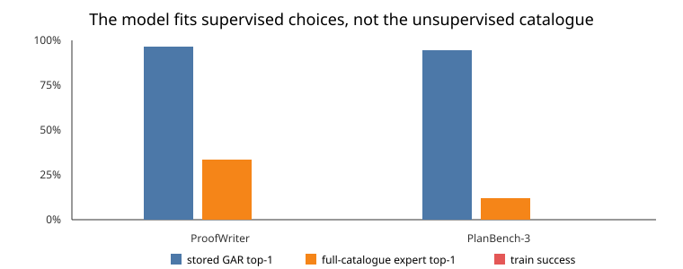

# ProofWriter and PlanBench executors pass, but missing invalid-action outcomes prevent model admission

## The one-sentence answer

The new datasets replay correctly and the JEPA nearly memorizes its stored ranking labels, but it solves none of the tiny training tasks because most infeasible catalogue actions have no observed consequence target; the nominal shuffle control was also unwired.

## First, the idea in everyday language

Imagine teaching a navigator using a map with many roads. We showed it what
happens on a few legal roads, then asked it to choose among every road,
including roads blocked by walls. It learned the shown examples, but nothing
taught it that blocked roads leave it in the same place. Those unseen roads
often looked attractive in its imagination. The right repair is to show the
consequence of each road, not secretly remove blocked roads from the map.

## Why this question matters

The paper claim is that predicted latent consequences support action choice.
Using a symbolic feasible-action menu at evaluation would weaken that claim by
solving feasibility outside JEPA. Conversely, requiring JEPA to score a full
catalogue is fair only when training can observe what invalid actions do. This
gate determines whether the new domains are ready for the expensive
model-by-width learning-rate campaign.

## What we tested

For each domain we compiled 24 training, 8 validation, and 8 test problems.
ProofWriter trains on OWA depth three and evaluates depth five. PlanBench uses
the explicitly labeled official three-block subset. A 0.3-million-parameter
causal JEPA trained for 30 epochs at learning rates 0.001 and 0.003. We also
requested an action-shuffled control at 0.001. Random and privileged expert
replay establish lower and upper bounds.

## What a fair comparison means here

All learned policies receive natural-language state history, goal, and the
same full grounded action catalogue. They do not receive the symbolic
currently-feasible set. The symbolic executor only applies the selected action
and verifies the goal. Stored-candidate diagnostics are privileged
localization tools and are reported separately from full-catalogue planning.
The shuffle control is excluded because its checkpoints were byte-identical to
the aligned checkpoints: the compiled-domain loader ignored the flag.

## What happened

| Gate | ProofWriter | PlanBench-3 |
|---|---:|---:|
| Schema, split disjointness, exact replay | pass | pass |
| Expert action in public catalogue | 100% | 100% |
| Random strict success | 0% | 0% |
| Privileged expert replay | 100% | 100% |
| Factual next-state retrieval on train | 95.8% | 100% |
| Configured stored GAR top-1 on train | 96.3% | 94.4% |
| Full-catalogue expert top-1 on train | 33.3% | 11.8% |
| Best tiny-train closed-loop success | 0/24 | 0/24 |

ProofWriter reduces factual latent error from a persistence value of 0.997 to
0.534. PlanBench reduces it from 1.120 to 0.281. Counterfactual latent error
also beats persistence in both domains. The model therefore learns observed
dynamics; failure appears when it scores catalogue actions that were never
assigned an outcome.

## The intuitive picture

The large blue-to-orange drop is the key localization. Training-label fit is
not deployment fit when most catalogue branches are unsupervised.

## The technical details

ProofWriter’s mean catalogue has 6.5 grounded rule applications per training
state. PlanBench’s has exactly 18 grounded actions. The initial compilers
recorded only currently applicable alternatives: 83 ProofWriter and 185
PlanBench counterfactuals across the training fixtures. Inapplicable actions
return a deterministic executor message and leave symbolic state unchanged,
but these outcomes were absent from training.

The corrected compiler can now assign a consequence to every action except the
executed expert. On the same fixtures this yields 399 ProofWriter alternatives
(316 invalid) and 2,312 PlanBench alternatives (2,127 invalid). The repaired
shuffle deterministically permutes action phrases within each prefix’s public
catalogue while leaving outcomes, histories, candidates, and teacher rollouts
fixed. It permutes both factual and counterfactual action paths and never
introduces a future-discovered string.

Completed recovery snapshots use commit
`23cc43f8845b430ace68616f713c15eb884adfbe`. Raw results are under
[`ProofWriter admission`](../../../../runs/autonomy/intent_phrase/2026-07-23-intent-proofwriter-admission-tmpfix-recovery-v2)
and [`PlanBench admission`](../../../../runs/autonomy/intent_phrase/2026-07-23-intent-planbench3-admission-tmpfix-recovery-v2).
These are one-seed memorization gates, not paper results.

## What we can conclude

Directly observed: both data interfaces and executors are valid; random and
oracle bounds separate; stored transition and GAR fitting work; full-catalogue
control does not. The existing evidence supports missing catalogue
consequence coverage as the next bottleneck.

## What we cannot conclude

We cannot yet claim that exhaustive invalid-action outcomes will produce a
working controller. We cannot use the old shuffle results. The three-block
subset does not admit full 4–8-block PlanBench. None of these one-seed results
belongs in the final comparison table.

## What happens next

Train only six aligned cells—two learning rates on each domain—plus one
repaired shuffled control per domain, all on exhaustive catalogue
consequences. Admit a domain only if stored transition fit remains healthy,
teacher-forced full-catalogue rank improves, invalid actions fall, tiny
training success becomes nonzero, and the aligned model beats its shuffled
control. If this fails, inspect goal-energy calibration rather than adding a
symbolic feasible-action filter.

## Words used in this report

- **Catalogue:** Every grounded action string the policy is allowed to score.
- **Feasible action:** An action the symbolic environment can apply in the current state.
- **Executor:** The environment code that applies an action and returns its consequence.
- **JEPA:** A model trained to predict internal representations of consequences.
- **GAR:** A loss that ranks actions using predicted consequence-to-goal geometry.
- **Persistence:** Predicting that the state does not change.
- **Oracle replay:** A privileged upper bound that follows the stored expert actions.

## Questions for you

- Should full 4–8-block PlanBench remain blocked until the exact planner is accelerated, or should the paper use a controlled three-block scaling study?
- If exhaustive consequences fix feasibility but not goal-directed choice, should the next gate prioritize advantage calibration or deeper rollout stability?
