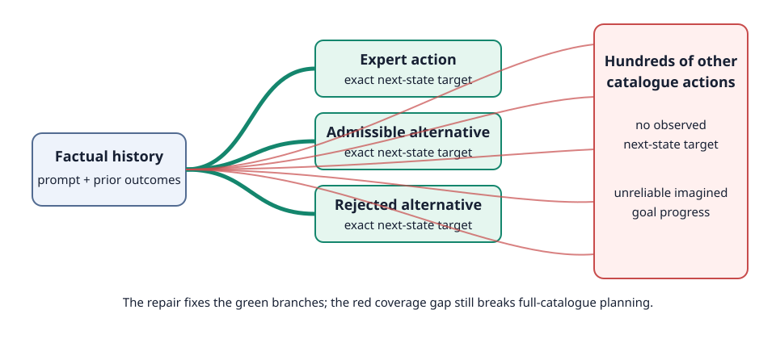

# Correct causal histories make counterfactual latent prediction learnable, but catalogue-wide action selection remains unsolved

## The one-sentence answer

On the eight-episode ALFWorld memorization gate, the repaired Joint-Embedding Predictive Architecture (JEPA) reduced observed-counterfactual error by 60–68% relative to predicting no change, but still solved 0/8 training episodes because two observed alternatives per state do not constrain a catalogue containing hundreds of actions.

## First, the idea in everyday language

Imagine teaching someone how a room changes after an instruction. To predict “open the fridge,” the learner must know the entire story so far: where it is, what it has picked up, and which doors are already open. The old implementation sometimes asked the learner to imagine the instruction after forgetting that story. It also graded longer imagined futures as if the earlier real events had never happened.

We repaired both history paths. We then added a direct lesson for alternative actions: after showing the same factual history and a different observed action, make the predicted next internal state match the next internal state encoded from the actual alternative observation.

This lesson now works on the alternatives that the model sees. The remaining failure is different. At each state the training fixture supplies only two alternatives, while evaluation asks the model to rank a mean of 485 catalogue actions. Predictions for the hundreds of unseen state-action pairs remain unconstrained and frequently make impossible actions look attractive.

## Why this question matters

The paper’s proposed mechanism is latent simulation: predict the consequence of an action, compare that predicted state with the goal, and improve decisions by simulating farther. If the counterfactual world model cannot learn even a tiny training set, larger experiments are pointless. If it can learn observed alternatives but fails only when scoring unobserved actions, the next intervention should improve grounded transition coverage rather than add an unrelated policy or feasibility head.

This gate therefore decides whether to scale the repaired model immediately or first repair the action-coverage contract.

## What we tested

We used eight fixed ALFWorld training games containing 115 factual states. Every state has:

- the complete factual text history;
- the expert action and observed next text;
- one observed admissible alternative;
- one observed rejected-action alternative;
- a non-oracle catalogue derived from the text seen so far.

The mean full catalogue contains 485 actions, with a median of 303. We trained the same 0.30-million-parameter causal JEPA for 20 epochs under three completed conditions:

| Condition | Learning rate | Direct alternative-state loss |
|---|---:|---:|
| Matched negative control | 0.001 | 0 |
| Repaired model | 0.001 | 1 |
| Repaired model | 0.003 | 1 |

A fourth matched negative control at learning rate 0.003 failed because its TensorBoard writer encountered a stale network-file-system handle. It is retained as an engineering failure and contributes no scientific metric.

## What a fair comparison means here

All completed models use the same games, action catalogue, architecture, causal masks, factual next-state loss, geometric advantage-ranking labels, seed, batch size, and training duration. The only controlled mechanism difference is whether the observed alternatives receive direct full-state latent prediction loss; learning rate is separately cross-checked.

The fitted ranking diagnostic is candidate-privileged: it scores only the expert and the two stored alternatives used to construct the training label. It is not comparable to deployment over the full catalogue. Closed-loop evaluation never receives the oracle admissible-action menu. These two interfaces are reported separately so success on an easier candidate set cannot be mistaken for deployable reasoning.

## What happened

| Model | Alternative error | Persistence error | Error reduction | Stored-candidate top-1 | Full-catalogue expert top-1 | Chosen action feasible | Train success |
|---|---:|---:|---:|---:|---:|---:|---:|
| No direct alternative loss, learning rate 0.001 | 1.014 | 1.039 | 2.4% | 77.4% | 11.3% | 43.5% | 0/8 |
| Direct alternative loss, learning rate 0.001 | 0.400 | 1.005 | 60.2% | 86.1% | 11.3% | 47.8% | 0/8 |
| Direct alternative loss, learning rate 0.003 | 0.318 | 1.003 | 68.3% | 80.0% | 12.2% | 59.1% | 0/8 |
| No direct alternative loss, learning rate 0.003 | — | — | — | — | — | — | failed: stale file handle |

“Alternative error” is mean layer-normalized latent L1 distance over 230 observed counterfactual transitions. Lower is better. “Persistence” predicts that the state does not change. The repaired models clearly beat that trivial baseline at both learning rates. The control does not.

The factual transition path remains healthy: within-episode next-state retrieval is 99.1% at learning rate 0.001 and 100% at learning rate 0.003. The repaired geometric-advantage labels are also nearly memorized pairwise (97.6–99.1%). Nevertheless, the full-catalogue expert is top-ranked only 11–12%, most closed-loop choices are invalid, and no training or validation episode is solved.

## The intuitive picture

The repaired learner now follows the factual history into each observed alternative branch. The red fan on the right is the remaining problem: evaluation includes hundreds of state-action pairs that were never assigned an observed next-state target.

## The technical details

The causal state encoder processes the prompt followed by the factual outcome prefix. For an alternative action at anchor \(t\), the predictor now receives that full prefix plus the alternative action. Its target is produced by the exponential-moving-average encoder from the same factual prefix followed by the observed alternative outcome. The target encoder is kept in evaluation mode and the target path is stopped from receiving gradients.

The new counterfactual-state objective is masked mean-squared error between these predicted and target state latents. The longer-horizon geometric target now also prepends every factual outcome strictly before the action anchor. Dropout is zero.

The model was trained with geometric root width 2 and horizon 4. Each state contributes one admissible and one rejected observed alternative. Dense anchors make all 115 eligible factual states training examples. The full-catalogue diagnostic ranks a mean of 485.16 strings per state, so the observed alternative fraction is roughly 0.4% of the average catalogue.

Run family and exact snapshot:

- resolved plan: [`2026-07-23-intent-alfworld-causal-prefix-repair-gate-v1`](../../../../.researchctl/plans/2026-07-23-intent-alfworld-causal-prefix-repair-gate-v1.resolved.json)
- code snapshot: `a714b43dd2bbe38e8f8664e779c57ccaa99e16c9`
- raw artifacts: [`runs/autonomy/intent_phrase/2026-07-23-intent-alfworld-causal-prefix-repair-gate-v1`](../../../../runs/autonomy/intent_phrase/2026-07-23-intent-alfworld-causal-prefix-repair-gate-v1)

This is a one-seed, deliberately tiny memorization diagnostic. It supplies no uncertainty estimate for generalization.

## What we can conclude

Direct observations:

- Both causal-prefix bugs are repaired in the exercised training and diagnostic paths.
- Direct observed-counterfactual latent supervision produces a large, repeatable reduction in transition error at two learning rates.
- The old near-persistence counterfactual result was not evidence that JEPA cannot learn the alternative dynamics.
- Good stored-candidate ranking does not transfer to full-catalogue ranking under the current coverage.

Supported inference:

- The immediate world-model optimization bug has been found and fixed.
- The next bottleneck is state-action coverage and out-of-support simulation, not factual-transition memorization.
- It is not yet scientifically safe to launch the full paper-scale ALFWorld training suite.

## What we cannot conclude

- We cannot claim ALFWorld generalization from eight memorized games.
- We cannot claim that observed counterfactual coverage alone will solve planning.
- We cannot attribute full-catalogue failure solely to invalid actions; admissible actions outside the stored pair are also mostly unsupervised.
- We cannot compare JEPA with language-model baselines until a common, functioning full-catalogue protocol passes.
- The failed learning-rate-0.003 control is an infrastructure exclusion, not evidence against that condition.

## What happens next

The smallest next question is whether broader observed action coverage improves held-out full-catalogue ranking.

Collect more exact branches for the same eight games, separating admissible and rejected actions. Then compare the repaired model at matched optimization under low and broader coverage. Before any paper-scale job is admitted, the broader condition must:

1. remain below persistence on held-out observed counterfactual transitions;
2. improve full-catalogue expert rank and selected-action feasibility, not only stored-candidate fit;
3. preserve factual transition retrieval and representation health;
4. show a closed-loop improvement large enough to justify scaling.

If full-catalogue metrics do not improve despite materially broader exact coverage, the no-prior catalogue interface or geometry-only scoring rule needs redesign.

## Words used in this report

- **ALFWorld:** A text-based household task environment in which an agent follows language instructions.
- **Counterfactual:** An alternative action taken from the same factual state, together with its observed consequence.
- **Causal prefix:** Everything observed before the action being predicted.
- **JEPA:** Joint-Embedding Predictive Architecture; a model trained to predict internal representations rather than reconstruct every output token.
- **Latent state:** The model’s internal numeric representation of the history.
- **Persistence baseline:** The trivial prediction that the next state equals the current state.
- **Catalogue:** The non-oracle set of action strings constructed from entities and commands observed in text.
- **Geometric advantage ranking:** Training that orders actions by distances between predicted latent states and a latent goal target.
- **Oracle:** Information supplied by the environment that a deployed model would not normally receive.

## Questions for you

- Should the next coverage pilot prioritize a fast moderate branch count, or spend more elapsed time collecting a much broader invalid-action sample?
- If broader exact coverage still fails, should we preserve the strict geometry-only claim and reconsider the catalogue, or allow an explicitly labeled action-validity auxiliary objective?
