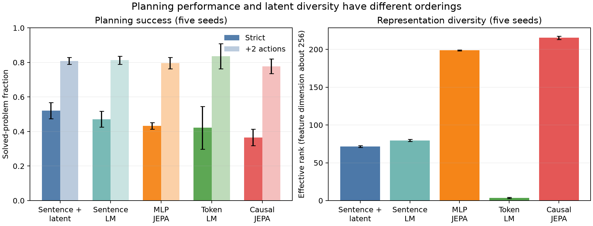

# Can latent prediction support planning with language actions?

## The one-sentence answer

In a controlled arithmetic-language world, latent-prediction models can plan competitively and their action-ranking loss is essential, but they do not yet beat all generative baselines and the current representation analysis is quantitative rather than a finished qualitative story.

## First, the idea in everyday language

Imagine solving a puzzle by choosing instruction cards. One card might say “combine the red apples with the blue keys.” A conventional language model learns which card text is likely to come next. Our Joint-Embedding Predictive Architecture (JEPA) instead imagines how its internal picture of the puzzle would change after each card, then prefers actions whose imagined state looks closer to the solved state. The project asks whether this internal “mental simulation” is useful for reasoning, and whether its internal geometry organizes reasoning states differently from language models trained to generate text.

## Why this question matters

Autoregressive generation is not the only possible basis for language reasoning. If a model can predict consequences directly in a learned latent space, it may support explicit planning, deeper test-time simulation, and compact value functions without reconstructing every word. This toy environment cannot establish general language reasoning, but it lets us test the mechanism carefully: all actions have known consequences, counterfactuals are available, and success is unambiguous.

## What we tested

The current paper-level experiments use stylized iGSM arithmetic dependency puzzles. Training examples are generated afresh, with solution traces containing 3–9 necessary actions. At each step, every compared model sees the same prompt, action/outcome history, and current symbolic feasible-action menu; it scores those language action phrases and the environment executes the winner.

The five main systems are an MLP-predictor JEPA, a causal-transformer-predictor JEPA, a token language model, a sentence language model, and a sentence language model with an additional next-sentence latent loss. Each main result below uses five seeds and 300,000 training examples. Width and data are broadly matched, but parameter counts are not exact: the JEPAs have about 17.7 million parameters, the token model 7.4 million, and the sentence models about 4.8 million.

## What a fair comparison means here

All headline systems select from the same symbolic feasible-action menu. This is candidate-privileged relative to an unrestricted language agent, but information-matched across the five systems. “Strict” success permits exactly the minimum number of actions; “+2” permits two mistakes or detours. Learning rates were selected per model family, but the full predeclared dense sweep and five-seed confirmation are not yet complete for every recurrent variant.

The ordinary validation set contains fresh puzzles but the same 3–9-step length support as training. The first exact-length OOD diagnostic held the graph at 12 variables; this made longer problems easier by removing distractors, so it is excluded from any length-generalization claim. A corrected evaluation keeps three irrelevant variables at every length. Its one-seed sentence-model curves are complete; JEPA and token-model curves remain pending.

## What happened

| Model | Strict success | Success with +2 actions | Effective latent rank | Operation probe, balanced accuracy |
|---|---:|---:|---:|---:|
| Sentence LM + latent loss | **.521 ± .047** | .809 ± .020 | 71.4 ± 1.2 | **.808 ± .009** |
| Sentence LM | .471 ± .046 | .813 ± .023 | 79.6 ± 1.3 | .777 ± .013 |
| MLP JEPA | .433 ± .019 | .796 ± .033 | 198.7 ± 0.5 | .406 ± .008 |
| Token LM | .422 ± .124 | **.836 ± .073** | 3.5 ± 0.8 | .533 ± .048 |
| Causal-transformer JEPA | .366 ± .047 | .778 ± .043 | **215.3 ± 2.2** | .403 ± .007 |

Values are mean ± sample standard deviation over five seeds. Each planning score uses 200 validation episodes per seed. The representation analyses use roughly 4,600 held-out step states per seed.

The main JEPA ablations sharpen the mechanism:

- MSE-only latent prediction reaches `.183/.628` strict/+2 over five seeds, far below the full MLP JEPA (`.433/.796`).
- Removing geometric advantage ranking reaches only `.077/.415` over the two currently retrieved seeds.
- One, two, and four ranked counterfactual alternatives give strict means of `.403`, `.433`, and `.439`; more alternatives help modestly, not dramatically.
- Changing the direct advantage-MSE weight from `.25` to `.10` gives `.443/.802`, suggesting a fairly flat local optimum rather than a uniquely tuned coefficient.
- A one-seed, explicitly privileged greedy-continuation teacher improves MLP-JEPA to `.650/.900`; beam width 4 and 8 are identical. The horizon-4 result is not yet available locally.

Recurrent baselines improve with test-time loops and then overthink. For example, the original looped sentence LM rises from `.270` strict at one loop to `.425` at four, then falls to `.345` at sixteen. A local learning-rate cross-check reaches `.475` at four loops. The current FLOP tracing is not trustworthy because reported compute is nearly flat across loop counts, so no compute-scaling claim is ready.

The corrected one-seed length curves show real degradation beyond the training boundary. From exact length 9 to lengths 10 and 11, strict success falls from `.27` to `.10/.11` for the sentence LM and from `.21` to `.16/.12` for the sentence-latent model. With two extra actions, the corresponding curves fall from `.77` to `.67/.63` and from `.74` to `.64/.60`. All cells reach 1.0 with four extra actions because only three irrelevant variables exist, making +4 an uninformative ceiling in this protocol.

## The intuitive picture

The left panel shows that the sentence models currently lead strict planning while all learned methods become similar with two extra actions. The right panel shows a different ordering: JEPA representations occupy many more independent directions, while the token model is extremely low-rank. High rank therefore demonstrates non-collapse, but does not by itself guarantee better planning.

## The technical details

The JEPA encodes the prompt and observed reasoning history into 256-dimensional states. An action encoder maps each intent phrase into a small action code. The predictor estimates the next latent state, while an exponential-moving-average target encoder supplies stopped-gradient targets in evaluation mode; dropout is zero. The paper-facing MLP recipe combines factual and counterfactual latent-state prediction with geometric advantage ranking and a direct advantage regression term. Planning scores every currently feasible action phrase using the learned value/geometry and executes one action at a time.

Linear probes are fitted on frozen representations. Ridge regression predicts remaining steps, resolved count, trajectory length, and numerical outcome. Logistic regression predicts operation type and whether an executed step is necessary. Effective rank measures how many covariance directions carry substantial variation. Clustering is measured in the full feature space using adjusted Rand index and normalized mutual information, avoiding conclusions based only on a two-dimensional projection.

The raw main runs are under [`runs/autonomy/intent_phrase`](../../../../runs/autonomy/intent_phrase). The five-seed JEPA family is in [`2026-07-31-intent-paper300k-jepa-and-ablation-recovery-v2`](../../../../runs/autonomy/intent_phrase/2026-07-31-intent-paper300k-jepa-and-ablation-recovery-v2), the sentence baselines in [`2026-07-31-intent-paper300k-main-five-seed-v1`](../../../../runs/autonomy/intent_phrase/2026-07-31-intent-paper300k-main-five-seed-v1), and the repaired token baseline in [`2026-08-03-intent-token-repair-and-ablation-confirm-v1`](../../../../runs/autonomy/intent_phrase/2026-08-03-intent-token-repair-and-ablation-confirm-v1).

## What we can conclude

Direct observations:

- A JEPA can perform nontrivial closed-loop planning from language intent phrases.
- Geometric advantage ranking is much more important than latent MSE alone.
- More ranked counterfactuals provide a modest benefit.
- JEPA states are high-rank and encode progress: remaining-step probe R² is `.346` for MLP JEPA and `.332` for causal JEPA; resolved-count R² is `.895` and `.846`.
- Generative sentence-model states encode operation identity much more linearly than current JEPA states.
- Test-time recurrence helps up to an intermediate depth, after which performance declines.

Supported inference: JEPA geometry is usable for planning, but the present evidence supports “competitive alternative representation” rather than “better reasoner than language models.” GAR is the clearest architectural contribution so far.

## What we cannot conclude

- We cannot compare length generalization across methods until the distractor-matched JEPA/token curves and multi-seed confirmations are complete. The two sentence models already show a clear one-seed OOD decline.
- We cannot claim parameter- or FLOP-matched superiority from the current main table.
- We cannot claim the causal predictor is better than the MLP predictor; it currently performs worse.
- We have no validated t-SNE or UMAP comparison yet. PCA coordinate files exist for several JEPA and token runs, but no paper-quality cross-model visualization has been audited.
- The existing “necessary action” probe is at chance balanced accuracy (`.500`) for every family; its `.878` raw accuracy is merely class imbalance.
- Resolved count and step index coincide in these traces, so their strong probes may encode elapsed position rather than abstract reasoning progress.
- Numerical outcomes are weakly decodable: R² is about `.09` for MLP JEPA, `.05` for causal JEPA, and approximately zero for the language models.
- No current probe tests the requested paraphrase-versus-negation geometry, and frozen-feature sentence reconstruction has not yet produced reportable evidence.

## What happens next

First finish the distractor-matched length curves at 3, 5, 7, 9, 10, and 11 steps, then scale them to five seeds only if the one-seed curves remain nontrivial. Retrieve the horizon-4 greedy GAR run and compare it with horizon 1 and 2 under the same continuation teacher. Separately, build a representation-analysis set with controlled paraphrases, negations, operation identity, causal role, and matched lexical overlap. Report full-space retrieval/probe metrics alongside reproducible PCA, t-SNE, and UMAP views; visual plots alone are not an admission gate.

## Words used in this report

- **JEPA:** Joint-Embedding Predictive Architecture; a model that predicts internal representations rather than every output word.
- **Latent state:** A vector of internal numbers used to summarize a reasoning history.
- **GAR:** Geometric advantage ranking; a loss that teaches which action moves a predicted latent state closer to a goal.
- **MSE:** Mean squared error; a direct numerical prediction loss.
- **iGSM:** A synthetic arithmetic reasoning generator based on dependency graphs.
- **OOD:** Out of distribution; evaluation beyond the training range.
- **Effective rank:** The approximate number of independently varying directions in a representation.
- **Probe:** A small model trained on frozen features to test what information is easily recoverable.

## Questions for you

- Should the next qualitative-analysis priority be controlled paraphrase/negation geometry, or frozen-feature sentence reconstruction?
- For the headline, should we prioritize the cleanest geometry-mechanism claim, or spend more compute obtaining strict parameter/FLOP matching against every baseline?
