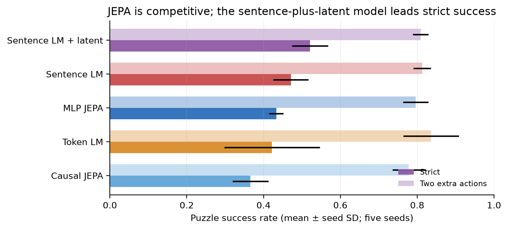
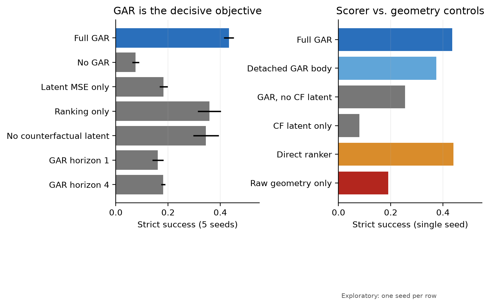
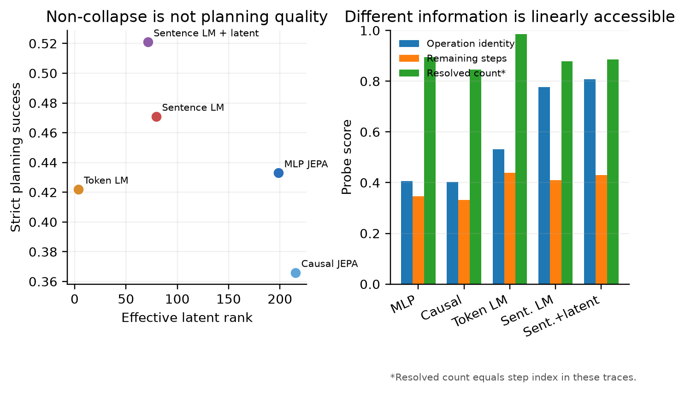
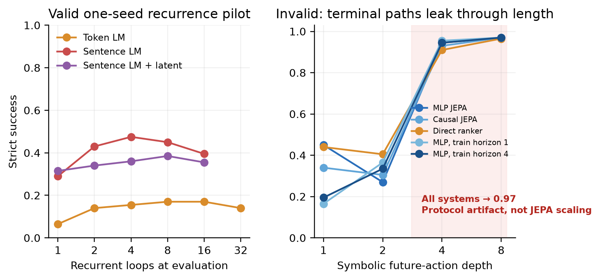
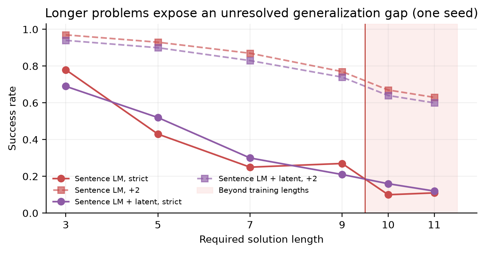

# Intent-phrase JEPA for planning: current evidence and failure-aware roadmap

## The one-sentence answer

Joint-Embedding Predictive Architecture (JEPA) models can solve language-action puzzles competitively and geometric advantage ranking (GAR) is essential, but the strongest sentence-plus-latent baseline remains better in strict success, a direct ranker currently matches JEPA in one-seed testing, and the first apparent deep-planning curve is invalid because the symbolic candidate generator leaks terminal paths.

## First, the idea in everyday language

Imagine a puzzle as a locked room and each intent phrase as an action card. A conventional language model asks, “Which card text would usually come next?” A JEPA instead tries to imagine how the room’s internal state would change after each card, then chooses the imagined successor that looks most promising. GAR teaches the model to order good and bad action consequences. The scientific question is not whether this toy solver beats every language model; it is whether predicting consequences in a learned geometric space supplies a useful and analyzable basis for planning, especially when more computation is available at test time.

## Why this question matters

If latent consequence prediction works, language reasoning need not rely only on generating tokens. A predictor could simulate several actions cheaply, a value function could rank those imagined states, and representation diagnostics could reveal what the solver preserves or discards. Stylized iGSM arithmetic graphs are not realistic language understanding, but they provide exact actions, counterfactuals, and success labels, making them useful for testing this mechanism without ambiguity.

## What we tested

Headline systems train on 300,000 freshly generated stylized-iGSM examples with solution lengths 3--9. At each real environment step, all headline models see the same prompt, observed history, and symbolic menu of currently feasible intent phrases. Five seeds were run for an MLP-predictor JEPA, causal-transformer JEPA, token language model, sentence language model, and sentence language model with an auxiliary latent loss. GAR ablations also use five seeds. Mechanism-routing controls, recurrent-loop curves, direct-ranker controls, and corrected length-generalization curves are presently one-seed diagnostics.

The latest test-time-compute pilot reused fixed checkpoints and varied only latent lookahead. Depth one used the ordinary current feasible menu. Depths above one used a reference-graph future feasible-action tree and were explicitly candidate-privileged.

## What a fair comparison means here

Headline comparisons are information-matched because every model chooses from the same current feasible menu. They are not unrestricted language agents. Strict success allows only the minimum action count; “+2” allows two detours. Error bars are sample standard deviations over five training seeds, with 200 fresh validation episodes per seed. Single-seed mechanism results are exploratory and are not interchangeable with the five-seed table.

Deeper planning requires additional safeguards. Candidate sequences must not reveal whether or when the goal becomes solved; candidate order, count, length, and terminal handling must be score-independent. The latest deep pilot fails this gate: the enumerator returns terminal sequences early, while the planning energy includes sequence length. This makes short exposed terminal paths artificially attractive.

## What happened

| Model | Strict success | Success with +2 actions | Seeds | Interpretation |
|---|---:|---:|---:|---|
| Sentence LM + latent loss | **.521 ± .047** | .809 ± .020 | 5 | Current strict leader |
| Sentence LM | .471 ± .046 | .813 ± .023 | 5 | Strong generative baseline |
| MLP JEPA | .433 ± .019 | .796 ± .033 | 5 | Competitive, unusually stable |
| Token LM | .422 ± .124 | **.836 ± .073** | 5 | Similar mean, much higher variance |
| Causal JEPA | .366 ± .047 | .778 ± .043 | 5 | Causal predictor does not yet help |

GAR supplies the clearest mechanism result. Removing GAR reduces strict success from `.433` to `.076`; latent-MSE-only reaches `.183`; ranking-only reaches `.358`; and removing counterfactual latent prediction reaches `.345`. GAR horizon two is much better than horizons one (`.161`) or four (`.181`) under the current random-continuation target. One versus four counterfactual alternatives changes strict success only modestly (`.403` to `.439`).

The one-seed factorization controls are deliberately less conclusive. A direct ranker reaches `.440`, approximately the full JEPA result on that seed. Detaching GAR gradients from the JEPA body reaches `.375`, while raw distance-only geometry reaches `.190`. Thus the learned scoring surface is currently more important than raw metric distance, and predictive factorization has not yet demonstrated an advantage over direct discrimination on in-distribution iGSM.

## The intuitive picture

**Figure 1.** Sentence prediction plus a latent loss currently leads strict success. MLP JEPA is competitive and stable, but the correct claim is viability rather than superiority.

**Figure 2.** GAR is essential. The right panel also shows the unresolved reviewer concern: a direct action ranker matches full JEPA in one-seed in-distribution evaluation, while raw geometry alone is weak.

**Figure 3.** JEPA is demonstrably non-collapsed, but rank does not predict planning quality. Sentence models expose operation identity more linearly; JEPA strongly exposes resolved count, although resolved count is confounded with elapsed step index.

**Figure 4.** Recurrent language models show genuine non-monotonic test-time improvement. The apparent 0.97 success at deep symbolic lookahead is not JEPA scaling: every architecture converges because the candidate interface exposes short terminal paths.

**Figure 5.** Longer, distractor-matched problems remain difficult. This is only a one-seed result for the two sentence families; JEPA and token curves are still required.

## The technical details

The JEPA maps the prompt and observed action/outcome history to 256-dimensional states, encodes each intent phrase as an action code, and predicts a successor state. An exponential-moving-average target encoder supplies stopped-gradient targets in evaluation mode; dropout is zero. The full MLP recipe combines factual latent prediction, counterfactual successor prediction, pairwise geometric advantage ranking, and direct advantage regression. The ordinary planner scores every currently feasible action and replans after the true environment outcome is observed.

Five-seed representation analyses use about 4,600 held-out step states per seed. Effective rank is computed from feature covariance. Frozen ridge and logistic probes measure remaining steps, resolved count, numerical outcome, operation identity, and necessary-action identity. The necessary-action probe is invalid as positive evidence: balanced accuracy is exactly `.500`, despite high raw accuracy from class imbalance. Numerical outcome decoding is weak across all systems. Full MLP JEPA has effective rank `198.7`, remaining-step R² `.346`, and resolved-count R² `.895`; sentence-plus-latent states have effective rank `71.4` and operation balanced accuracy `.808`.

The GAR decision audit uses 500 episodes and includes forced-error branches. For the full JEPA, the deployed predicted transition-value score attains competitive top-1 optimal-action recall `.786` and pairwise accuracy `.826`, whereas raw predicted geometry attains `.549` and `.603`. This supports a local action-ordering interpretation, not a claim that global Euclidean geometry alone performs planning.

Every report figure is regenerated by [`make_figures.py`](make_figures.py) from controller-retrieved artifacts; extracted values are preserved in [`report_data.json`](report_data.json). The fixed-checkpoint scaling round is [`2026-08-04-intent-fixed-checkpoint-ttc-pilot-v1`](../../../../runs/autonomy/intent_phrase/2026-08-04-intent-fixed-checkpoint-ttc-pilot-v1). The LaTeX source and compiled PDF are [`REPORT.tex`](REPORT.tex) and [`REPORT.pdf`](REPORT.pdf).

## What we can conclude

Direct observations:

- JEPA supports nontrivial closed-loop selection among language intent phrases.
- Full MLP JEPA is competitive with token and sentence models but does not lead strict success.
- GAR is necessary; latent prediction by itself is insufficient.
- Counterfactual latent prediction and GAR contribute complementary gains.
- The action scorer orders local feasible alternatives far better than raw goal-distance geometry.
- JEPA representations are high-rank and contain decodable progress information, while sentence-model representations expose operation identity more clearly.
- Recurrent generative baselines gain from additional loops and then overthink.

Supported inference: the strongest current paper is a mechanism study of latent consequence prediction plus local counterfactual action ordering—not a JEPA-versus-language-model leaderboard.

## What we cannot conclude

- The current deep symbolic-lookahead result cannot support test-time-scaling claims because terminal sequence length leaks the solution.
- Direct ranking currently matches full JEPA on one in-distribution seed, so predictive factorization has not yet shown unique value.
- Raw geometric distance is not sufficient for strong planning.
- Parameter- and FLOP-matched superiority is unestablished; recurrent FLOP accounting is still suspicious.
- Length OOD evidence is incomplete and one-seed for only two model families.
- Existing PCA files do not establish paraphrase, negation, or consequence-based clustering; controlled minimal pairs remain untested.
- Stylized iGSM alone cannot establish broad language reasoning. Earlier full-catalogue experiments mostly diagnosed invalid-action selection; small feasible-only ProofWriter/PlanBench results are candidate-privileged admission evidence, not headline results.

Failed process runs remain visible. The first RQ3-control submission failed before training because of Hydra argument parsing and was replaced by the completed v2 round. Several historical jobs encountered the known Matplotlib/`pyexpat` error after metrics had been written; corrected reruns are preferred, and rows are included only when the declared checkpoint and metric artifacts are complete.

## What happens next

1. **Repair the scaling protocol.** Enumerate fixed-length future action sequences without early terminal return; use an absorbing padding action after a solve; remove any score-independent path-length preference; randomize candidate order; and require shuffled-score, untrained-score, direct-ranker, and symbolic-simulator controls to remain near their depth-one baselines.
2. **Repeat the smallest fixed-checkpoint gate.** Use one MLP JEPA, one direct ranker, depths `{1,2,4}`, and 1,000 paired episodes. Only after passing leakage and monotonic-compute checks should the selected curve receive five seeds and length-OOD evaluation.
3. **Complete GAR mechanism evidence.** Run five seeds for the direct ranker and detached-geometry control; correlate local ranking accuracy, margin, regret, drift, latent MSE, effective rank, and strict success across seeds/checkpoints.
4. **Test predictive factorization where it should matter.** Compare JEPA and direct ranking on data efficiency, longer compositions, action paraphrases, negations, entity renaming, and novel goals.
5. **Finish fair test-time-compute baselines.** Correct recurrent FLOP accounting, then compare JEPA latent rollouts with Poisson-trained looped token/sentence models using identical paired puzzles and success-versus-FLOPs curves.
6. **Add domain breadth only after the mechanism gate.** A small BlocksWorld, graph-navigation, or logic-dependency domain is more valuable than exhaustive parameter matching on the toy dataset.

## Words used in this report

- **JEPA:** Joint-Embedding Predictive Architecture; a model that predicts internal representations rather than reconstructing every output token.
- **GAR:** Geometric advantage ranking; supervision that orders good and bad actions using their predicted consequences.
- **Latent state:** A vector used internally to summarize the current reasoning state.
- **Direct ranker:** A model that scores an action directly without requiring its predicted successor to be the decision bottleneck.
- **Candidate-privileged:** An evaluation where symbolic or oracle machinery supplies candidate information unavailable to an unrestricted agent.
- **Strict success:** Solving with no excess actions beyond the minimum solution.
- **OOD:** Out of distribution; evaluation beyond the lengths seen during training.
- **Probe:** A small model trained on frozen features to test what information is easily accessible.

## Questions for you

- Should the next compute priority be the leakage-free test-time-scaling gate, or five-seed direct-ranker/gradient-routing controls?
- For the paper narrative, should symbolic-menu planning remain the controlled main setting, with shared generative proposals as a secondary deployability experiment?
