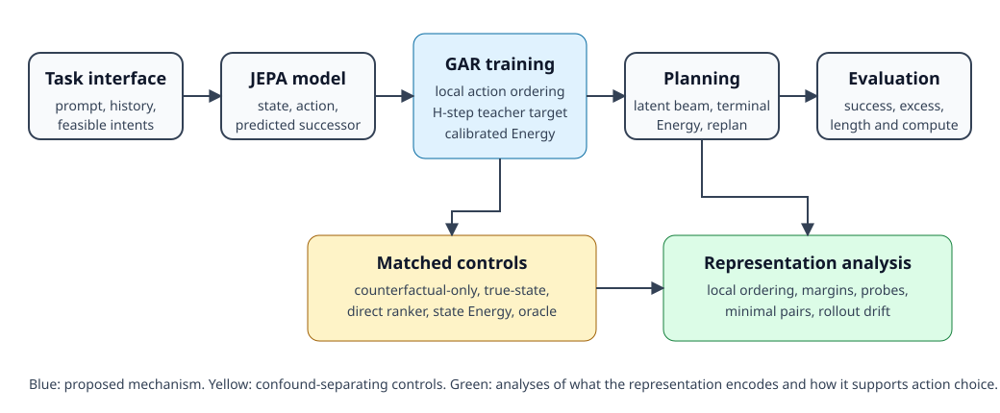

# A living specification for intent-phrase JEPA planning

## The one-sentence answer

The project now has a linked eleven-part method handbook that separates the task interface, JEPA predictor, GAR loss, multi-step teacher, Energy head, beam planner, evaluation protocol, controls, and representation analyses.

## First, the idea in everyday language

Imagine collaborating on a board game while the rules, scoring system, and search procedure are scattered across old notebooks. One notebook says how pieces move, another says how promising moves are scored, and a third uses “depth” to mean something different. Even if every notebook is individually correct, it is easy to run the wrong experiment.

The new handbook is one map of that game. It says what the agent sees, what each learned component computes, where privileged information enters, what “multi-step” modifies, and how a score is used during planning.

## Why this question matters

The paper's central claim concerns predictive representations and planning geometry. That claim cannot be evaluated cleanly if “GAR,” “advantage,” “Energy,” “teacher horizon,” and “beam depth” change meaning between conversations or runners. A shared specification lets us identify real scientific disagreements before spending compute.

## What we tested

This change is documentation and specification work rather than a new model comparison. We checked the handbook against the current data pipeline, model, objectives, training configuration, planner, runner, and tests at commit `aa3a564`.

The handbook records both intended behavior and implementation caveats, including:

- H=1 uses a true EMA-encoded one-step endpoint while H>1 uses EMA-predictor endpoints;
- H>1 continuation search uses symbolic feasible menus;
- the current Energy-horizon result uses an MLP predictor;
- terminal transition Energy is the intended beam score;
- cumulative transition Energy is a negative control;
- slack evaluations can be derived from one longer rollout.

## What a fair comparison means here

Every experiment should state the candidate interface, score privilege, predictor family, teacher horizon, planner depth, beam width, loss weights, training examples, seeds, and evaluation problems. Oracle, symbolic, candidate-privileged, and exact-transition information must be labeled directly.

## What happened

| Documentation unit | Question answered |
|---|---|
| Task and interfaces | What does the agent see and which menus are privileged? |
| Model and latent states | Which encoder, predictor, and Energy head computes what? |
| GAR | What is ranked, what is regressed, and where do gradients flow? |
| Multi-step teacher | What does H=N mean and how is the continuation chosen? |
| Planning | How are beams expanded, scored, pruned, and executed? |
| Training | Which objectives and weights are active? |
| Evaluation | What do strict, slack, depth, and OOD metrics mean? |
| Controls | Which alternative explanations does each ablation remove? |
| Analysis | Which geometric claims are measured directly? |
| Glossary | What is the sign and notation convention? |
| Open questions | Which design decisions remain unresolved? |

## The intuitive picture



The figure shows the primary method from left to right. Controls sit beneath training and planning because they separate predictive geometry from additional supervision or privileged information. Representation analysis measures whether the proposed mechanism is actually present.

## The technical details

The handbook lives at [`projects/intent_phrase/method/`](../../../../projects/intent_phrase/method/README.md) and is linked from the stable project README. Mathematical explanations use terminal-readable plain text and Unicode rather than LaTeX delimiters. The repository instructions now preserve this convention for future chat and Markdown explanations.

The most important clarified definition is:

```text
H=N teacher Energy target:
    fix candidate action a_0
    choose a geometry-best continuation for N-1 more steps
    imagine the endpoint with the EMA JEPA predictor
    measure endpoint distance or progress relative to the EMA goal
    attach that target to the first transition
```

“Geometry-best” is deliberately narrower than exact optimal. The teacher uses a root-balanced beam scored by EMA latent goal distance and uses symbolic feasible-action menus. It does not use exact remaining-step quality.

The teacher horizon and online planning depth are independent. The teacher
horizon determines the label learned for the first action. Online planning
depth determines how many predicted transitions are expanded before the
planner selects the first action of its best beam. The current default compares
only the Energy of the terminal predicted transition. It does not add the
Energy of every transition in the beam, because an H-step Energy already
contains information about a later continuation and summing such values can
count overlapping futures repeatedly. The handbook also separates geometric
ranking from the absolute calibration loss. Ranking teaches which feasible
action is better within one state. The MSE term teaches the numerical Energy
target. Counterfactual candidates receive both supervision routes in the
current design. Each method document states which modules receive gradients
and whether the target comes from a true encoded state, an imagined state, or
an oracle environment quantity.

## What we can conclude

The project now has a concrete source for checking method semantics. The handbook exposes several real experimental caveats that were previously easy to miss, especially the separation of teacher horizon H and planner depth D and the different endpoint construction at H=1 versus H>1.

## What we cannot conclude

Documentation does not validate the method empirically. Several definitions remain open choices, including whether the final paper should use geometric progress or absolute distance, whether the causal predictor reproduces the MLP result, and whether a width-four teacher beam approximates exhaustive geometry search.

## What happens next

We should review the handbook one document at a time. When we change a definition, the open-questions file records the old and new choices, affected code, and which results require reevaluation. The currently running terminal-Energy round tests the newly documented beam-composition rule.

## Words used in this report

- **Energy:** A lower-is-better learned scalar used to compare actions or imagined endpoints.
- **GAR:** Geometric Advantage Ranking, a pairwise loss over candidate action quality.
- **Teacher horizon:** Number of actions considered while producing a training target for the first action.
- **Planner depth:** Number of actions imagined in a test-time candidate beam.
- **Candidate-privileged:** Uses reference information to enumerate future candidate actions.
- **EMA:** A slowly updated, frozen target copy of a learned module.

## Questions for you

- Should we review GAR, the multi-step teacher, or planning first?
- Do you want the intended paper method documented separately from the current implementation whenever they differ, or should every document remain implementation-first?
