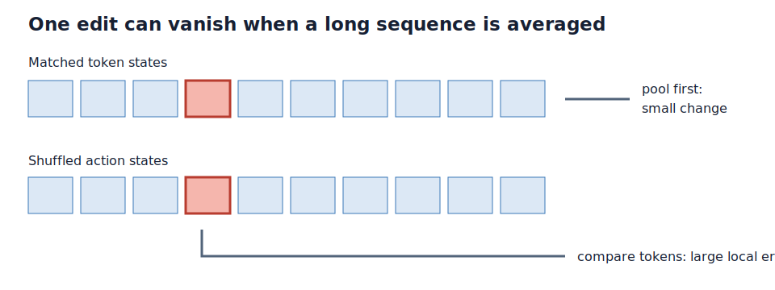

# Fresh edit examples do not explain the missing action signal

## The one-sentence answer

Fresh corruptions do not improve mixed editing, mask training remains specialized, and a new diagnostic shows that the old pooled action-use metric hides strong token-level action effects, so the five completed models require re-audit before selecting a recipe.

## First, the idea in everyday language

Imagine grading a copy editor by averaging every word in a 175-word page into one number. The editor changes one word correctly, but the page average barely moves. If we swap the requested correction, that average may still look almost identical, leading us to call the editor disobedient even though the changed word is completely different. Our previous test did exactly this in learned-vector space. We also checked a separate possibility: perhaps the editor was memorizing the same damaged pages instead of seeing fresh damage each epoch.

## Why this question matters

We must know whether failure comes from data, model capacity, or measurement before spending on larger models and datasets. A hierarchy or planner built on an action-blind primitive model would be invalid, but so would rejecting a useful primitive model because its metric averages away the edit. This round isolates fresh-data exposure and corruption family; the follow-up repairs the metric.

## What we tested

Five seed-0 models used 2,000 official-iGSM solution texts with synthetic inverse-edit supervision for three epochs. Four exponential-moving-average models compared fixed mixed corruptions, fresh mixed corruptions, fresh mask corruption, and fresh mask-to-replacement-to-mixed curriculum. A fifth curriculum model used Latent Difference Action Decoding (LDAD) weight 20, VICReg weight 0.02, and learning rate `1e-4`. Every checkpoint was evaluated on 256 mask, replacement, removal, and mixed examples.

## What a fair comparison means here

All five jobs used commit `9125c6734c105e6d9ac9efe21d838426e503020c`, the same model size, seed, problem set, optimizer family, zero dropout, and exact cross-regime audit. Only the declared data schedule or lower-rate LDAD condition changed. The data remains candidate-privileged oracle denoising: gold solution text defines corruptions and repairs. This is one seed, so small differences are not confirmation.

## What happened

The original pooled ratio measures error with shuffled actions divided by error with matched actions. Higher means more action use; `1.05` was the old gate.

| Training condition | Mixed one-step ↓ | Mixed recursive ↓ | Pooled shuffled ratio ↑ | Mask shuffled ratio ↑ |
|---|---:|---:|---:|---:|
| Fixed mixed EMA | 0.1479 | 0.3595 | 1.0117 | 1.0144 |
| Fresh mixed EMA | 0.1475 | 0.3524 | 1.0123 | 1.0107 |
| Fresh mask EMA | 0.2252 | 0.5584 | 1.0090 | **1.1579** |
| Fresh curriculum EMA | 0.1488 | 0.3485 | 1.0133 | 1.0142 |
| Lower-rate curriculum LDAD 20 | **0.0402** | **0.0501** | 1.0116 | 0.9862 |

Fixed and fresh mixed training are effectively tied. Mask training remains strongly sensitive on mask edits but transfers poorly to mixed and removal edits. Lower-rate LDAD changes representation scale and raw error dramatically, yet the pooled ratio remains low and its peak pre-clipping gradient reaches 951.

## The intuitive picture

The figure shows why the causal conclusion is unresolved: averaging a long sequence before comparing predictions can reduce a large local action effect to a tiny global movement.

## The technical details

The token-aligned predictor constructs an exact latent scaffold for insert, delete, or replace, then contextualizes it with a zero-dropout bidirectional spatial Transformer. Training already applies normalized smooth-L1 loss at each valid token, but the audit pooled every predicted and target token before its shuffled-action comparison. We added a matched token-level falsifier that deranges the same structured action tuple and compares every valid predicted token directly with its exponential-moving-average target. On an eight-example smoke audit of fresh mixed EMA, the pooled ratio is `1.012` while the token-aligned ratio is `3.018` over roughly 17,700 scored tokens. The implementation preserves the old metric for historical comparison and adds the new metric separately. All five jobs completed with exit code zero and finite logged metrics.

## What we can conclude

Direct observation supports rejecting fresh exposure as the main explanation: fixed and fresh mixed results are nearly identical. Mask action sensitivity is distribution-specific. Direct implementation evidence shows the pooled metric is structurally mismatched to token-aligned prediction. The eight-example token ratio demonstrates that strong action effects can coexist with a near-one pooled ratio.

## What we cannot conclude

The eight-example token diagnostic is not the final five-model comparison. We cannot yet select curriculum, mixed, or LDAD; determine whether LDAD's small raw errors reflect useful geometry; justify larger data or model scale; or claim planning readiness. The token metric must be run on all models and corruption families, with operation-stratified errors inspected before changing training.

## What happens next

Run an audit-only GPU round over the five frozen checkpoints and four evaluation regimes. If token-level shuffled ratios are consistently large and matched token errors are finite, retire the pooled `1.05` gate and select by token error, recursive token error, cross-regime transfer, rank, and stability. Only then test data/model scale, counterfactual density, structured LDAD, GAR, hierarchy, or MPC.

## Words used in this report

- **EMA:** Exponential-moving-average target encoder, a slowly updated source of prediction targets.
- **LDAD:** Latent Difference Action Decoding, reconstructing an action from the change between two states.
- **Pooled metric:** A comparison made after averaging all token representations into one vector.
- **Token-aligned metric:** A comparison that scores corresponding predicted and target token representations directly.

## Questions for you

- If the full token audit confirms strong action use, should the next scale test prioritize more unique problems or a larger model?
- Should future headline metrics emphasize worst-corruption transfer or average performance across corruption families?
