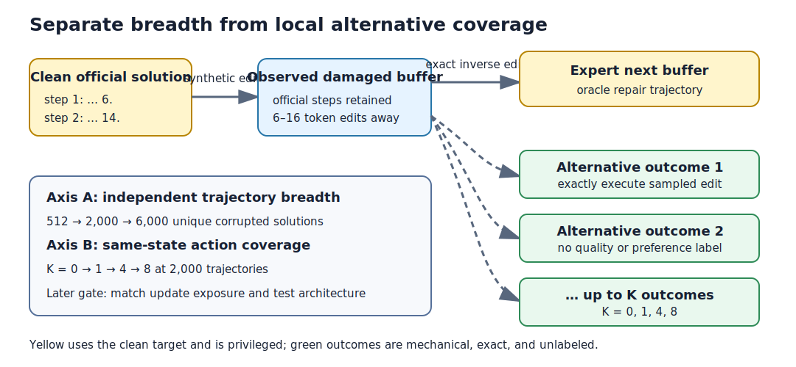
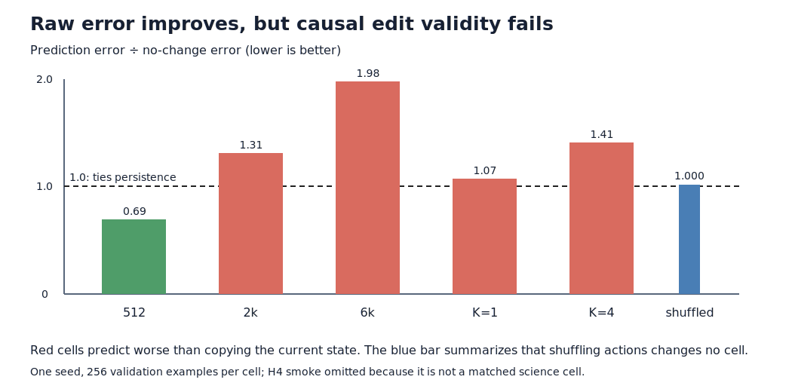

# How much edit experience should the model receive?

## The one-sentence answer

All six jobs completed, but none established action-conditioned dynamics:
shuffling the edit changed error by less than 0.015%, and the next experiment
must restore a locally visible edit signal before any data or hierarchy sweep.

## First, the idea in everyday language

Imagine teaching an editor by taking a correct worked solution, introducing a
handful of typos, and showing how to undo them. Seeing more independently
damaged solutions teaches breadth. At any damaged version, also asking “what
would this other edit produce?” teaches local action consequences. The open
question is whether breadth, alternatives, or both are needed before it makes
sense to test a more elaborate hierarchical editor.

The previous data loader accidentally glued a whole multi-step solution into
one enormous sentence. That made the first five jobs crash and, more
importantly, meant they were not testing the intended representation. The
loader now retains the official solution steps.

## Why this question matters

Hierarchy cannot rescue an editor that has too little varied experience or
cannot distinguish actions. Conversely, alternatives can waste memory or
teach an unrepresentative distribution. This pilot selects a defensible
primitive-data recipe before comparing flat, hierarchical, dense-rollout, and
action-decoding variants. It is a prerequisite, not evidence that the model
can autonomously edit or solve language problems.

## What we tested

The data audit used 128 official iGSM problems. Each problem supplies a prompt
and clean multi-step solution. A deterministic synthetic process inserts,
deletes, or replaces tokens, then records the exact reverse edit sequence.
The audit checked step preservation, exact recovery, edit composition, text
length, and distance from a minimum token-edit path. It also generated four
alternative edits per visited state to verify exact execution and count them.

The admitted one-seed GPU pilot has six independent cells:

| Cell | Unique train trajectories | Passes | Alternatives per state | Purpose |
|---|---:|---:|---:|---|
| H4 smoke | 128 | 1 | 0 | full-shape process check |
| flat-small | 512 | 3 | 0 | low-data anchor |
| flat-medium | 2,000 | 3 | 0 | shared comparison anchor |
| flat-base | 6,000 | 3 | 0 | initial data-curve endpoint |
| CF-1 | 2,000 | 3 | 1 | sparse alternative outcome |
| CF-4 | 2,000 | 3 | 4 | moderate alternative outcome |

## What a fair comparison means here

All counterfactual cells use the same uniform-local sampler, model, seed,
unique problem set, and counterfactual-loss weight. Alternatives are sampled
only from the observed current buffer and are mechanically executed. They do
not carry a preference, defect count, remaining distance, or target-relative
quality label. Thus K changes the number of exact outcomes, not the kind of
label.

The data-size cells intentionally measure the ordinary practical curve where
both unique examples and updates grow. They do not identify whether diversity
or repeated exposure caused a gain. Fixed-exposure configurations
(2,000×9, 6,000×3, 18,000×1) exist, but are gated on this screen to avoid an
unnecessary broad sweep. Later architecture comparisons will use the chosen
data/K point and information-matched flat controls.

The trajectory itself remains privileged: corruptions are made from the gold
solution's token pool and training follows the exact inverse corruption stack.
The terminal clean buffer is a prediction target. These facts prevent claims
of natural editing data or non-oracle planning.

## What happened

No valid trained-model comparison exists yet. The previous five jobs all
failed before their first optimizer step. The corrected data audit produced:

| Check | Observed result | Interpretation |
|---|---:|---|
| exact terminal recovery | 128/128 | every synthetic repair path reverses its corruption |
| multi-step collapse | 0/128 | official nested steps survive |
| official solution tokens | median 166.5; p95 251.95 | buffers are long, but steps are bounded |
| official steps | median 9; max 17 | the encoder sees a real step sequence |
| maximum step length | p95 43; max 62 | well below the 320-token safety cap |
| repairs per trajectory | mean 11.14; range 6–16 | planned horizons cover meaningful drift |
| path/minimum-edit ratio | mean 1.029; max 1.25 | paths are close to minimal, not padded arbitrarily |
| exact CF outcomes at K=4 | 5,704 across 1,426 states | four alternatives were available at every visited state |

Focused unit tests pass, all launch configurations compose, and a tiny CPU
K=2 optimization step had finite nonzero factual and counterfactual losses.
These are implementation gates only.

All six new jobs then completed successfully from the intended Git snapshot,
with finite losses and declared artifacts. Process validity passed. Scientific
validity did not:

| Training cell | One-step error | No-change error | Shuffled/matched error | Effective rank | Interpretation |
|---|---:|---:|---:|---:|---|
| 512 trajectories | 0.397 | 0.575 | 1.00014 | 102.7 | beats persistence, but ignores the action |
| 2,000 trajectories | 0.394 | 0.302 | 1.00000 | 105.6 | worse than persistence and action-blind |
| 6,000 trajectories | 0.224 | 0.113 | 1.00005 | 103.8 | lower raw error, but persistence improves more |
| K=1 at 2,000 | 0.287 | 0.268 | 1.00003 | 99.2 | nearly persistence; action-blind |
| K=4 at 2,000 | 0.175 | 0.123 | 1.00003 | 79.8 | lower raw error, worse persistence and lower rank |
| H4 process smoke | 0.751 | 0.830 | 1.00005 | 106.0 | execution passed; too small for a science claim |

Lower error is better. A shuffled/matched ratio above one would mean the model
needs the correct action. Every ratio is effectively one. K=4 lowers its own
internal error relative to K=0, but it violates the predeclared gates: it is
still worse than no change, has 24.5% lower effective rank, and does not use
the edit. Therefore no K and no data anchor is selected.

A targeted eight-example post-hoc diagnostic explains the failure. Exact K=4
global next-buffer targets differ by only 0.000228 normalized L1 because a
single token is diluted across roughly 167 solution tokens. The corresponding
changed-step targets differ by 0.634—about 2,775 times more. The old K=4 model
assigns changed-step outcomes at 24.7% accuracy, which is chance for four
alternatives. This diagnostic is candidate-privileged and mechanism-only.

## The intuitive picture

The figure separates two axes that are easy to confuse: more independently
corrupted solutions increase state diversity, while larger K increases local
action coverage at each state. The pilot varies one axis at a time around a
common 2,000-trajectory anchor.

The second figure shows what invalidates the apparent gains: increasing data
or K can reduce raw latent error while the predictor becomes no better than—or
worse than—copying the current state and remains insensitive to the action.

## The technical details

The buffer is a nested list of official solution steps. Literal edits use a
flattened token position, mapped back to the retained step and offset. The
online buffer encoder feeds a causal action-conditioned latent predictor; an
exponential-moving-average encoder supplies next-buffer targets. For each
alternative action, its exact copied outcome buffer is independently encoded
by the same target encoder. The counterfactual loss is the existing normalized
latent outcome-prediction objective; no preference loss is active.

Primary diagnostics are held-out factual one-step LN-L1, exact-counterfactual
one-step LN-L1, recursive LN-L1 at horizons 1/2/4/8, and the shuffled-action
causal falsifier. Persistence is the no-change baseline. Errors are stratified
by edit operation and trajectory depth. State feature standard deviation and
effective rank gate collapse. Terminal-goal geometry is reported only as a
privileged diagnostic and cannot establish deployment-time planning.

The K screen retains the smallest K within 2% of the best candidate only if it
improves held-out counterfactual or recursive error by at least 5% relative to
K=0, while factual error and effective rank worsen by no more than 2%. If none
passes, counterfactual outcome prediction is removed. One seed selects cells;
seeds 1 and 2 are reserved for a chosen conclusion. Raw outputs will live
under `runs/autonomy/sequence_edit/<round>/<run-name>/` with run summary, metrics,
stdout, and stderr artifacts.

The K=8 saturation cell is implemented but not in this round: the controller
rejected the seven-cell design at 18.92 projected GPU-hours because the
sequence-edit project allows 16 per round. The admitted six cells reserve
13.92 GPU-hours without using unrealistic timeout caps. K=8 runs only if K=4
improves without saturation and a later round is scientifically justified.

The follow-up adds an exact local outcome target. For each expert and
counterfactual edit, it identifies the official solution step changed by that
literal edit and encodes the post-edit step using the existing frozen anchor.
The same causal predictor must map each action to the corresponding local
outcome through the existing prediction head. This adds no preference,
remaining-distance, defect, or gold-quality label; it changes only target
granularity. Coefficients 0.25, 1, and 4 form a coarse method-appropriate
screen, with a 1e-4 learning-rate cross-check for coefficient 4 because the
tiny smoke showed materially larger gradients.

## What we can conclude

The old hierarchy result remains invalid rather than negative. The repaired
six-cell round is process-valid, but its scientific gate fails: apparent data
and K improvements do not represent action-conditioned edit dynamics. The
global state target makes one-token alternatives almost indistinguishable,
while the exact changed-step target retains a strong measurable signal.

## What we cannot conclude

We cannot say that more data helps, that any K helps, or that hierarchy is
useful. Raw latent errors across separately learned representations are not
enough to overturn the persistence and shuffled-action failures. The entire training task is synthetic,
candidate-privileged oracle denoising. One seed cannot support a final effect
claim. Exact one-step alternatives do not validate recursively imagined
off-support editing, autonomous proposal, closed-loop correction, or planning.

## What happens next

Run the three local-outcome coefficients and high-weight learning-rate
cross-check at the common K=4, 2,000-trajectory anchor. Continue only if the
correct action increases shuffled error by at least 5%, nearest-outcome
assignment exceeds 35%, and factual prediction is no worse than persistence,
without effective-rank loss greater than 10%. Otherwise stop the global-state
edit formulation and redesign the state representation. K=8, fixed-exposure
data, hierarchy, dense rollout, and LDAD ablations remain blocked.

## Words used in this report

- **Buffer:** The editable multi-step solution text at one moment.
- **Counterfactual:** The exactly computed outcome of a different edit from the same observed buffer.
- **Candidate-privileged:** Data construction uses information about the gold answer that a deployed editor would not naturally have.
- **K:** Number of alternative edits and exact outcomes attached to each visited state.
- **LN-L1:** Absolute prediction error after separately normalizing latent vectors.
- **Effective rank:** A measure of how many independent representation directions are being used.
- **Oracle denoising:** Training where a known clean target defines both the damage and its exact repair.

## Questions for you

- If local targets restore action sensitivity, should the next test integrate local and global state representations, or first confirm the local result across seeds?
- Is the main long-term goal a scientifically clean synthetic dynamics result, or should we prioritize replacing oracle inverse repairs with naturally proposed edits?
