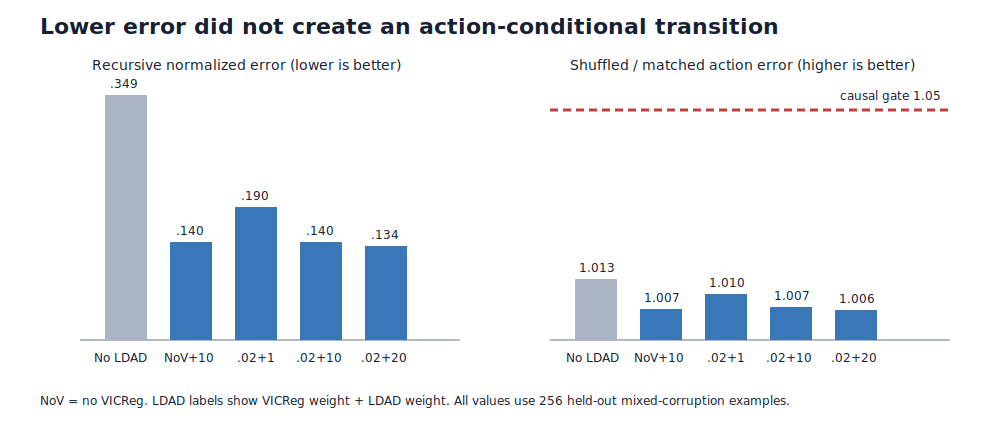

# Can action reconstruction make the token editor obey its edit?

## The one-sentence answer

Latent Difference Action Decoding greatly improved prediction error and representation rank in five completed runs, but none made the transition model depend strongly enough on the supplied edit, so the primitive causal-action gate still fails.

## First, the idea in everyday language

Imagine an apprentice editor who sees a draft before and after a correction. We ask the apprentice both to predict the corrected draft and to read the correction back from the change in its own memory. If it can say “insert this word here,” perhaps its memory must record what the edit did. But there is a trap: the apprentice may learn to recognize the correction after seeing both drafts while its forward prediction still mostly ignores the instruction. We therefore secretly swap edit instructions during evaluation. A genuinely obedient editor should become noticeably worse; an action-blind editor should barely notice.

## Why this question matters

The long-term project wants to plan edits at token, phrase, sentence, and paragraph scales. Planning is impossible if the learned transition model predicts roughly the same future for different actions. This screen asks whether Latent Difference Action Decoding (LDAD), adapted faithfully from action reconstruction in Delta-JEPA, repairs that primitive interface. It does not yet test hierarchy, search, generation, or autonomous reasoning.

## What we tested

All five models used the same token-aligned sequence editor, 2,000 oracle-denoising trajectories, seed 0, three curriculum epochs, batch size 8, zero dropout, and an exponential-moving-average target encoder kept in evaluation mode. Curriculum moved from masking to random replacement to mixed insert/delete/replace corruption. The decoder received only the online latent displacement between consecutive observed states and reconstructed the complete observed action phrase.

Three cells used Variance-Invariance-Covariance Regularization (VICReg) weight `0.02` and LDAD weights `1`, `10`, or `20`. Two controls used LDAD `10` with VICReg `0` or `0.1`. The earlier no-LDAD exponential-moving-average model is shown as context, but its loss scale and representation geometry differ enough that the within-round LDAD comparisons are the fairest ones.

## What a fair comparison means here

The five new jobs used the same commit, data, seed, optimizer, learning rate, evaluation set, and prediction losses. They ran on compatible Grünau GPUs and all completed with finite metrics. No transition or value head received the clean goal latent. The task remains candidate-privileged synthetic oracle denoising: gold solution text supplies the corruption and exact inverse repair path. The held-out evaluation contains 256 examples. This is a one-seed coefficient screen, so it can reject failed mechanisms and select controls, but it cannot establish a stable final recipe.

## What happened

“Shuffled-action ratio” is error after replacing the current action divided by ordinary matched-action error. A value of `1.05` was the predeclared minimum evidence that the predictor uses its action. “Peak gradient” is measured before clipping at norm `5`, so it diagnoses optimization pressure rather than the actual applied update.

| Condition | One-step error ↓ | Recursive error ↓ | Shuffled-action ratio ↑ | Effective rank ↑ | LDAD token accuracy ↑ | Peak gradient |
|---|---:|---:|---:|---:|---:|---:|
| No VICReg, LDAD 10 | 0.0781 | 0.1397 | 1.0067 | 137.6 | 81.7% | 129.5 |
| VICReg 0.02, LDAD 1 | 0.1059 | 0.1897 | 1.0096 | 131.2 | 81.4% | 18.0 |
| VICReg 0.02, LDAD 10 | 0.0777 | 0.1397 | 1.0069 | 137.5 | 81.7% | 122.8 |
| VICReg 0.02, LDAD 20 | **0.0756** | **0.1342** | 1.0064 | **137.9** | 81.6% | **241.7** |
| VICReg 0.1, LDAD 10 | 0.0893 | 0.1587 | **1.0106** | 136.8 | 81.6% | 159.7 |

Every cell beat its own persistence baseline. LDAD 20 produced the lowest one-step and recursive errors, and all LDAD-10/20 cells retained high effective rank. Yet swapping actions raised error by only 0.6–1.1%, and the largest ratio still missed the causal threshold by a wide margin. Action-token reconstruction accuracy was nearly identical across coefficients and therefore did not predict causal action use.

## The intuitive picture

The left panel shows why LDAD initially looks attractive: recursive error falls sharply relative to the earlier no-LDAD curriculum model. The right panel shows the decisive failure: every action-sensitivity bar remains below the red `1.05` gate. Better reconstruction is not yet an action-conditional world model.

## The technical details

The online bidirectional token encoder maps every current buffer token to a contextual latent. An edit is represented structurally as operation, a pointer into the current token sequence or gap, and an optional content token. The predictor first constructs the exact insertion, deletion, or replacement scaffold and then applies a zero-dropout bidirectional spatial Transformer. Across edit time, rollout is causal and recursively feeds predicted token states back into the same transition interface.

The exponential-moving-average encoder supplies stopped-gradient targets and remains in evaluation mode. The base objective combines normalized smooth-L1 pooled prediction at weight `0.25`, token-aligned one-step prediction at `1`, and token-aligned recursive prediction at `1`. LDAD uses a two-layer decoder and reconstructs up to 12 tokens of the externally observed edit phrase from `online_next_state - online_current_state`; it does not receive the learned action code or endpoint concatenation. Training used learning rate `3e-4`, warmup 100, weight decay `0.05`, and gradient clipping at `5`. The exact plan is `.researchctl/plans/2026-07-17-structured-edit-ldad-coarse-wave2.resolved.json`; manifests, configs, logs, checkpoints, and metrics are under `runs/autonomy/sequence_edit/2026-07-17-structured-edit-ldad-coarse-wave2/`.

## What we can conclude

Direct observation: all five runs are process-valid, finite, beat persistence, and decode observed action text at roughly 82% token accuracy. LDAD weights 10 and 20 greatly improve raw transition and rollout errors and raise effective rank relative to the earlier curriculum model. Direct observation also shows that all five fail the causal-action gate. The supported inference is that displacement reconstruction is a useful representation or optimization regularizer here, but it does not force the forward predictor to use the supplied edit.

## What we cannot conclude

We cannot conclude that LDAD is useless, that weight 20 is optimally trained, or that textual decoding is the best position target. Weight 20 strongly changes gradient scale, so a lower-learning-rate control is required. The curriculum evaluation is mixed while the earlier mask model was evaluated on mask corruption; preliminary cross-evaluation shows the mask model's apparent action sensitivity disappears on mixed edits. The configuration also claimed fresh corruptions every epoch while non-curriculum datasets previously repeated them. These confounds prevent a fair corruption-family winner. No hierarchy, Model Predictive Control, beam search, Counterfactual Experience Model data advantage, free-form language, or non-oracle reasoning claim follows.

## What happens next

The next decision asks whether apparent causal action use comes from the easy mask distribution, fresh trajectory exposure, or a genuinely transferable transition rule. The smallest matched round compares fixed versus fresh mixed corruption, fresh mask corruption, and curriculum under common cross-regime evaluation. A single LDAD-20 learning-rate `1e-4` control tests whether its large gradients hide action use. A condition advances only if it reaches shuffled/matched ratio `1.05` on mixed edits, beats persistence, retains rank, and has stable recursive error. Counterfactual-density, hierarchy, GAR planning, and structured textual-position alternatives remain gated behind that result.

## Words used in this report

- **Causal action use:** Changing only the edit instruction changes the predicted next state enough to worsen error measurably.
- **Effective rank:** An estimate of how many independent directions the learned representation uses.
- **LDAD:** Latent Difference Action Decoding, reconstructing an observed action from the latent change between two states.
- **Persistence baseline:** Predicting that nothing changes, by copying the current state.
- **VICReg:** A variance and covariance regularizer intended to prevent collapsed or redundant representations.

## Questions for you

- If no matched mixed-edit condition reaches the `1.05` causal gate, should we next redesign the transition objective or stop the oracle-denoising track?
- Should structured action-field decoding replace textual LDAD immediately after the data control, or only if the lower-learning-rate textual control remains action-blind?
