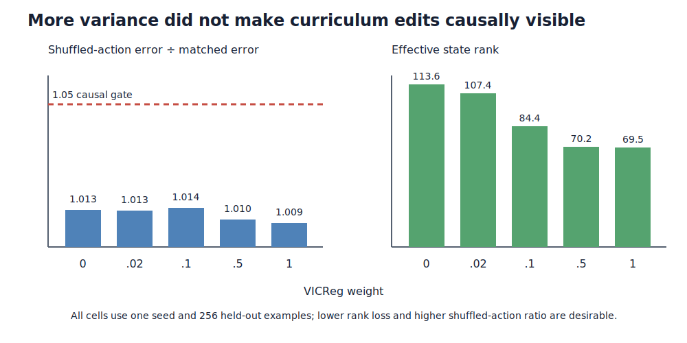

# How strongly should we spread the edit model's internal states?

## The one-sentence answer

All five matched runs completed, but no Variance-Invariance-Covariance Regularization setting made curriculum edits causally action-sensitive; weight `0.02` is the only nonzero setting that preserves rank well enough to carry into the Latent Difference Action Decoder test.

## First, the idea in everyday language

Imagine teaching an editor with two simultaneous instructions. The first says, “predict what this exact edit will do.” The second says, “keep your mental descriptions varied, so every document does not look the same.” The second instruction can prevent a useless collapsed memory, but shouting it too loudly can make the editor spread documents apart without learning the consequences of the edit. We therefore tried four volumes for that diversity instruction and compared them with no diversity instruction. Success requires more than low prediction error: if we secretly swap the edit instruction, the prediction must get worse.

## Why this question matters

The token-aligned model is the new foundation for later phrase, sentence, and paragraph hierarchy. A hierarchy would be uninterpretable if its primitive transition model ignored the chosen edit. This experiment decides whether ordinary representation-spreading regularization is enough, and which coefficient is safe to combine with action-displacement supervision next.

## What we tested

Each run used 2,000 synthetic oracle-denoising trajectories from official iGSM solutions, seed 0, three epochs, zero dropout, batch size 8, and the same token pointer predictor. Curriculum corruption mixes mask replacement, random replacement, insertion, and deletion over training. Every model used an exponential-moving-average target encoder. The only change was the overall VICReg weight: `0`, `0.02`, `0.1`, `0.5`, or `1.0`.

VICReg here means a variance hinge with standard-deviation target `1.0`, plus `0.04` times an off-diagonal covariance penalty and `0.1` times an action-variance hinge. The zero-weight run is the matched negative control.

## What a fair comparison means here

All five cells ran simultaneously on Grünau 12 L40 GPUs from commit `35892a4171176784f58a906f57456a295fab6464`. They used identical data, seed, optimizer, learning rate, evaluation examples, and prediction losses. No model saw the clean goal as an input. The data and inverse repair trace are still oracle-constructed, and the terminal goal geometry is explicitly candidate-privileged. Because this is a one-seed coefficient screen, it selects a follow-up condition rather than establishing a final effect.

## What happened

All jobs completed with finite losses and all declared artifacts. “Shuffled-action ratio” divides error after swapping actions across valid states by ordinary matched error; the predeclared causal gate is at least `1.05`. Effective rank measures how many independent representation directions remain; the rank-loss gate permits at most 10% loss relative to the healthiest control.

| VICReg weight | One-step error ↓ | No-change error ↓ | Depth-4 error ↓ | Shuffled-action ratio ↑ | Effective rank | Rank loss |
|---:|---:|---:|---:|---:|---:|---:|
| 0 | 0.149 | 0.256 | 0.301 | 1.013 | 113.6 | reference |
| 0.02 | 0.153 | 0.263 | 0.318 | 1.013 | 107.4 | 5.4% |
| 0.1 | 0.151 | 0.320 | 0.320 | 1.014 | 84.4 | 25.7% |
| 0.5 | 0.149 | 0.346 | 0.288 | 1.010 | 70.2 | 38.3% |
| 1.0 | 0.160 | 0.272 | 0.285 | 1.009 | 69.5 | 38.8% |

Every predictor beats copying the current state for one step, so optimization is not simply broken. However, shuffling the edit increases error by only 0.9–1.4%, far below the 5% causal threshold. Weight `0.02` is the only nonzero coefficient within the rank gate. The apparently better depth-4 errors at `0.5` and `1.0` do not rescue those cells because their representations lose nearly 40% of effective rank and remain action-insensitive.

## The intuitive picture

The left panel shows that none of the bars reaches the causal-use line. The right panel shows the cost of stronger regularization: state variance rises, but the number of independent directions falls sharply. More spread is therefore not the same as more useful information.

## The technical details

The online bidirectional token encoder produces contextual token latents for each buffer state. A structured causal predictor receives the current token sequence and an action containing operation, local token-or-gap pointer, and optional content token. Insert, delete, and replace build the exact next latent scaffold; recursive training feeds predicted token states back through the same zero-dropout predictor through depth four. The exponential-moving-average teacher stays in evaluation mode and moves from momentum `0.99` to `0.999` over training.

The objective contains normalized smooth-L1 pooled prediction at weight `0.25`, token-aligned one-step prediction at `1.0`, and token-aligned recursive prediction at `1.0`. The reported VICReg scalar multiplies its whole normalized variance/covariance/action-variance objective. Evaluation uses 256 held-out examples and mechanically deranges current actions while excluding duplicate action codes. Privileged terminal-distance correlation is not used to select a condition. Manifests and metrics are under `runs/autonomy/sequence_edit/2026-07-17-structured-edit-vicreg-coarse-wave1/`.

## What we can conclude

Direct observation: all coefficients are process-valid, all beat persistence at one step, and none passes causal action use. Strong VICReg increases marginal state standard deviation but damages effective rank. Supported decision: do not retain `0.1`, `0.5`, or `1.0` as the default stabilizer; use `0.02` only as a low-cost combination anchor while directly testing whether action reconstruction from latent displacement repairs action sensitivity.

## What we cannot conclude

This does not show that VICReg is universally harmful, that curriculum corruption is inferior to masking, or that the model cannot become action-sensitive. Mask-only EMA previously reached a provisional shuffled-action ratio of `1.163`, while the curriculum control reaches only `1.013`; that difference is confounded by corruption regime and earlier backend. One seed cannot quantify uncertainty. No planning, hierarchy, free-form generation, or non-oracle reasoning claim follows from this screen.

## What happens next

The smallest next test keeps curriculum data fixed and adds faithful text Latent Difference Action Decoding (LDAD), which reconstructs the complete observed edit phrase only from the online displacement between consecutive states. Test LDAD weights `{1, 10, 20}` on VICReg `0.02`, include LDAD `10` without VICReg as the mechanism control, and LDAD `10` with VICReg `0.1` as an interaction check. Continue only a cell that reaches shuffled-action ratio `1.05`, beats persistence, retains rank, and improves recursive error—not one that merely decodes action tokens.

## Words used in this report

- **Causal action use:** Prediction becomes measurably worse when the correct edit is replaced by another edit.
- **Effective rank:** A summary of how many independent directions the learned representation actually uses.
- **Exponential-moving-average target:** A slowly updated copy of the encoder that supplies stable prediction targets.
- **LDAD:** Latent Difference Action Decoder, which reconstructs an observed action from the change between two latent states.
- **VICReg:** Variance-Invariance-Covariance Regularization, a loss intended to prevent collapsed or redundant representations.

## Questions for you

- If LDAD restores action sensitivity but slightly worsens one-step error, should causal action use or raw error receive priority for the next confirmation?
- After the LDAD screen, should compute first confirm the best cell over three seeds or compare mask-only against curriculum on one matched backend?
