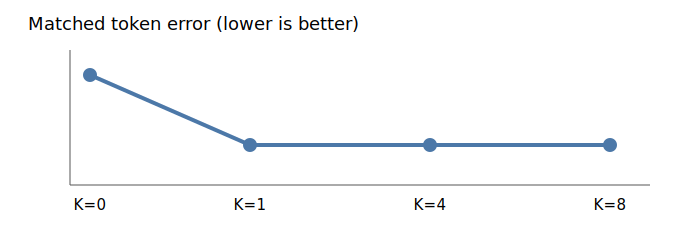

# One alternative edit is enough in the first structured pilot

## The one-sentence answer

Adding one exact alternative transition per state improves one-step edit prediction and causal action separation, while K=4 and K=8 add no measurable benefit and recursive error slightly worsens.

## First, the idea in everyday language

An editor normally sees one correction for each draft. Counterfactual training also shows what would happen if it made a different valid edit from exactly the same draft. One alternative is like asking, “What if you changed this other word instead?” In this pilot, that single extra consequence teaches everything that four or eight alternatives teach. More alternatives repeat the same lesson at much greater computational cost.

## Why this question matters

Counterfactual buffers multiply data construction, encoding, prediction, and memory cost. The project needs the smallest K that teaches a transition model how actions differ. This experiment directly answers how much alternative-outcome data is useful before scaling.

## What we tested

Five seed-zero cells use 2,000 official iGSM expert states for one epoch, batch size two, and therefore 1,000 optimizer steps. K is 0, 1, 4, or 8 exact mechanical alternatives per observed state. Every alternative is executed on the current buffer and supervised against its EMA token encoding. K=4 also uses counterfactual loss weight 0.25 instead of 1.0.

## What a fair comparison means here

Expert states, clean reasoning problems, batch size, epochs, optimizer steps, seed, architecture, and learning rate match. The alternative loss averages over valid candidates, so K does not automatically multiply its scalar weight. No alternative has a goal-distance, quality, preference, remaining-edits, or symbolic reasoning label. More K necessarily costs more compute but does not expose privileged ranking information.

## What happened

| K / weight | Matched token error | Shuffled/matched | Recursive token error |
|---|---:|---:|---:|
| 0 / 0 | 0.195 | 3.108 | 0.322 |
| 1 / 1 | 0.177 | 3.365 | 0.330 |
| 4 / 0.25 | 0.189 | 3.192 | 0.324 |
| 4 / 1 | 0.177 | 3.365 | 0.330 |
| 8 / 1 | 0.177 | 3.365 | 0.330 |

K=1, K=4, and K=8 at weight one agree to roughly four decimal places. Weight 0.25 lies between no counterfactual loss and weight one. This is a saturation result, not a monotonic K benefit.

## The intuitive picture

The flat part is the decision: additional alternatives cost compute without changing the measured model.

## The technical details

The dataset samples distinct local operation, current-buffer pointer, and content tuples, mechanically executes each tuple, and stores the complete resulting buffer. The token-aligned predictor applies that same structured tuple to online current-token latents. A dropout-free bidirectional predictor produces contextual next-token latents, which are matched to independently encoded EMA alternative outcomes. The loss is mean smooth-L1 over valid predicted/target alternative tokens and candidates. It contains no value or goal term. Standard evaluation and the component-local frozen audit use 256 held-out mixed-corruption trajectories. Raw artifacts are under `runs/autonomy/sequence_edit/2026-07-18-structured-edit-counterfactual-breadth-wave8/` and `runs/autonomy/sequence_edit/2026-07-18-structured-edit-counterfactual-component-wave9/`.

All alternatives at a state share the identical observed prompt and buffer; only the structured action changes. Candidate tuples are distinct within that state and deterministic under the dataset seed. Invalid padded candidates and tokens are masked from the loss. The EMA encoder remains in evaluation mode, neither encoder nor predictor uses dropout, and alternative targets are stop-gradient. Thus K changes observed transition coverage and compute, not privileged information or target dynamics.

## What we can conclude

K=1 is sufficient to obtain the available teacher-forced and causal-ratio gain at this scale. Component-local operation and pointer ratios improve from 2.61/2.53 to 2.68/2.65. Content matched error improves from 0.298 to 0.291, while its ratio changes from 1.364 to 1.350. K=4 and K=8 remain identical to K=1 component by component. K>1 is not justified; the coefficient has a graded effect.

## What we cannot conclude

We cannot yet claim better long-horizon planning: recursive error worsens 2.6%. One seed and 2,000 states do not prove universal saturation. A larger-exposure confirmation remains necessary.

## What happens next

Confirm K=0 versus K=1 at a larger exposure anchor. Use K=1, never K>1, for later GAR and hierarchy work only if the one-step gain remains and recursive degradation stays bounded.

## Words used in this report

- **Counterfactual:** A mechanically executed alternative action from the same observed state.
- **K:** Number of alternative next-state outcomes supplied per observed state.
- **Saturation:** More data of the tested type no longer changes the result.

## Questions for you

- Should the larger confirmation optimize recursive error or causal separation as the primary selection metric?
- For later planner-matched alternatives, should sampling remain uniform-local or follow beam/CEM proposal frequencies?
