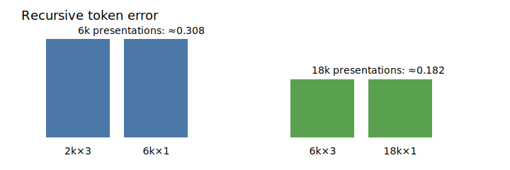

# More training examples help; more unique problems do not yet

## The one-sentence answer

Primitive edit prediction improves sharply with total training-example exposure, but 6,000 versus 18,000 unique clean reasoning problems is indistinguishable when exposure is matched.

## First, the idea in everyday language

Suppose an editor practices 18,000 corrections. We can give it 18,000 different documents once, or 6,000 documents three times. The resulting edit model performs almost identically. At this scale, doing more correction practice matters; document variety has not yet become the bottleneck.

The distinction is like learning piano from many songs versus repeating a smaller songbook. Both can provide the same number of keystrokes. Here the number of practiced corrections predicts progress better than the size of the songbook. That does not mean variety is useless forever; it means the current model has not exhausted what repetition teaches it.

## Why this question matters

The project needs to know what the actual training data buys us before generating expensive counterfactual trajectories. If unique reasoning problems matter, data generation should broaden. If exposure matters, optimization length and action coverage should receive priority.

## What we tested

All cells use official iGSM prompts and clean reasoning steps, then synthesize reversible mixed token corruptions. The prior baseline has 2,000 fixed clean problems for three epochs: 6,000 example presentations. New cells use 6,000 problems for one or three epochs, 18,000 for one epoch, a 512-dimensional model on 6,000 for one epoch, and LDAD-20 on 6,000 for one epoch. Every cell uses seed zero and 256 held-out mixed-corruption trajectories.

## What a fair comparison means here

The 2k-by-3 versus 6k-by-1 pair matches presentations at 6,000. The 6k-by-3 versus 18k-by-1 pair matches presentations at 18,000. Architecture and optimizer match within those comparisons. The 512-dimensional cell uses batch four instead of eight, so it doubles optimizer steps and is not an isolated capacity result. LDAD changes gradient scale and needs exposure-matched interpretation.

## What happened

| Training condition | Presentations | Matched token error | Shuffled/matched | Recursive token error |
|---|---:|---:|---:|---:|
| 2k × 3, d256 baseline | 6k | 0.184 | 3.30 | 0.308 |
| 6k × 1, d256 | 6k | 0.185 | 3.28 | 0.309 |
| 6k × 3, d256 | 18k | 0.095 | 5.22 | 0.182 |
| 18k × 1, d256 | 18k | 0.095 | 5.24 | 0.181 |
| 6k × 1, d512, batch 4 | 6k | 0.109 | 4.89 | 0.202 |
| 6k × 1, LDAD 20 | 6k | 0.401 | 1.66 | 0.493 |

The exposure-matched pairs agree to within 0.001 on the headline errors. Tripling presentations nearly halves matched token error and recursive error. LDAD is under-optimized at one epoch and reverses its earlier advantage.

The frozen component audit preserves the exposure conclusion. The 6k×3 and 18k×1 cells again match: operation 2.92, pointer 3.24, content 1.28, and recursive token error 0.182. The d512 cell reaches 3.33/3.45/1.48 with recursive error 0.202, the strongest balanced causal ratios in this round, but its doubled optimizer-step count remains a confound. The one-epoch LDAD cell is weak at 1.53/1.52/1.20 and recursive error 0.493.

## The intuitive picture

The important comparison is horizontal within each exposure pair: variety does not move the bar, while more total practice does.

## The technical details

The selected model is the dropout-free token-aligned EMA JEPA with a 256-dimensional token state and 16-dimensional structured action code. It predicts EMA next-token targets and receives deep recursive supervision to depth four. The main error is layer-normalized L1 over valid predicted and target tokens. Causal action use is checked by deranging the observed structured action while holding the current buffer fixed. All reported runs completed with finite metrics and exact Git snapshots. The d512 cell changes state width, memory use, batch size, and optimizer-step count; it is retained as a positive scale diagnostic, not a causal capacity estimate. Raw results live under `runs/autonomy/sequence_edit/2026-07-17-structured-edit-data-capacity-wave6/`.

## What we can conclude

Total example presentations drive the observed improvement from 6k to 18k. Within this range, tripling unique clean problems provides no detectable benefit at matched exposure.

## What we cannot conclude

The lower-error exposure cells preserve each action component locally, but content-ratio improvement is not monotonic. We cannot isolate width from optimizer steps, extrapolate beyond 18k, or conclude that diversity never matters. Structured counterfactual alternatives were not part of these runs.

## What happens next

Run a batch- and optimizer-step-matched width comparison. Exact structured alternative transitions are now implemented and process-tested; next ablate K={0,1,4,8} at a common batch, state count, epoch count, and objective coefficient before extending scale.

## Words used in this report

- **Presentation:** One training example processed once, including repeats.
- **Unique problem:** A distinct clean iGSM prompt and reasoning solution.
- **Exposure-matched:** Conditions process the same total number of examples.

## Questions for you

- If width and longer training both help, should the next scale budget prioritize lower latency or lowest rollout error?
- Should structured counterfactuals sample all operations uniformly or match the planner's future proposal distribution first?
