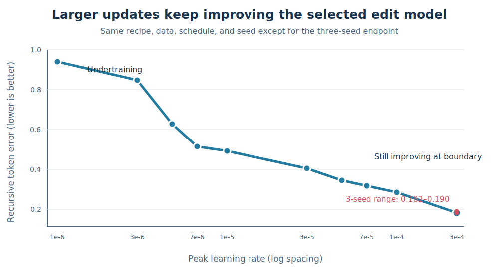

# Learning rate is a major systematic variable, not random noise

## The one-sentence answer

The selected sequence-edit recipe improves smoothly throughout the requested learning-rate range, with effects far larger than its measured seed variation, so future methods need their own small learning-rate controls and the optimum must still be sought above `3e-4`.

## First, the idea in everyday language

Imagine teaching the same editor with steps of different sizes. Steps that are too tiny are safe, but after the same amount of practice the editor has barely moved toward a useful solution. Larger steps let it learn much more within the available training time. In this experiment, performance improved steadily as the step size increased; it did not jump unpredictably between neighboring settings.

That distinction matters. A random fluctuation is like getting a slightly easier examination paper. Learning-rate sensitivity is a reproducible consequence of how we train the model. Both can distort comparisons, but they require different remedies: repeat seeds to measure randomness, and tune or cross-check the learning rate to measure optimization sensitivity.

## Why this question matters

If one architecture happens to prefer a different learning rate, comparing every architecture at one fixed setting can make the architecture look better or worse for the wrong reason. This is particularly relevant for counterfactual losses, LDAD, GAR heads, increased width, and hierarchy because they change gradient scale or optimization geometry. Establishing the primitive model's response curve tells us how large an apparent mechanism gain must be before it is convincing and how future comparisons should be tuned.

## What we tested

We held the current best measured rollout recipe fixed: mixed token corruption, token-aligned EMA targets, no counterfactual alternatives (`K=0`), no dropout, a 256-dimensional state, batch eight, 6,000 unique iGSM problems repeated for three epochs, and recursive supervision through four edits. Seed zero was trained at `1e-6`, `3e-6`, `5e-6`, `7e-6`, `1e-5`, `3e-5`, `5e-5`, `7e-5`, and `1e-4`. The already completed three-seed `3e-4` anchor was reused. Each checkpoint was evaluated on 256 held-out mixed-corruption examples.

## What a fair comparison means here

All new cells use the same code snapshot, data count, seed, batch, schedule shape, architecture, objective, and evaluation. Only the peak learning rate changes. Reusing `3e-4` is valid because its three runs use the same K=0 training path and include seed zero. This isolates the learning-rate curve, but only the endpoint has repeated seeds; therefore the curve establishes large systematic sensitivity, not precise uncertainty at every rate.

The comparison is oracle denoising: clean iGSM solutions generate corruptions and exact inverse edits. It supplies no planning success claim. Pooled action metrics are retained as diagnostics but not used to judge causal action use, because earlier audits showed that pooling dilutes a local token edit.

## What happened

| Peak learning rate | Matched token error ↓ | Action-shuffle ratio ↑ | Recursive token error ↓ | Effective rank |
|---:|---:|---:|---:|---:|
| `1e-6` | 0.916 | 1.04 | 0.941 | 152.4 |
| `3e-6` | 0.720 | 1.19 | 0.847 | 154.6 |
| `5e-6` | 0.514 | 1.47 | 0.627 | 151.4 |
| `7e-6` | 0.432 | 1.69 | 0.515 | 144.9 |
| `1e-5` | 0.411 | 1.76 | 0.492 | 142.6 |
| `3e-5` | 0.276 | 2.32 | 0.404 | 119.2 |
| `5e-5` | 0.223 | 2.72 | 0.346 | 112.7 |
| `7e-5` | 0.196 | 2.98 | 0.319 | 108.8 |
| `1e-4` | 0.169 | 3.31 | 0.285 | 105.5 |
| `3e-4`, seed 0 | 0.095 | 5.22 | 0.182 | 108.3 |
| `3e-4`, seeds 1/2 | 0.100 / 0.096 | 5.02 / 5.22 | 0.190 / 0.185 | 107.5 / 108.8 |

All nine new runs completed with finite metrics. Peak pre-clipping gradient norms remain benign, approximately 0.65–0.69, so the low-rate failures are undertraining rather than exploding gradients. Recursive error falls by about 81% from `1e-6` to `3e-4`, and by about 36% from `1e-4` to `3e-4`. At `3e-4`, the three-seed recursive range is only 0.182–0.190, about 4.3% from minimum to maximum. Matched-error seed spread is about 5.3%.

The pooled predictor also fails to beat persistence below `3e-4`; at seed zero, `3e-4` reaches pooled error 0.047 versus persistence 0.068. The token-local action ratio nevertheless rises smoothly from 1.04 to 5.22, showing increasingly strong use of the edit action.

## The intuitive picture

The large downward slope is learning-rate sensitivity. The short vertical band at `3e-4` is observed random-seed variation. What matters is that the former is an order of magnitude larger and follows a smooth direction.

## The technical details

The model encodes an ordered token buffer and predicts the EMA encoding after a structured operation, current-buffer pointer, and optional content token. Training uses layer-normalized token prediction with deep recursive supervision to depth four, a cosine schedule, no dropout, and an EMA teacher held in evaluation mode. The primary errors are layer-normalized L1 distances over matched valid tokens. The action-shuffle ratio divides error after deranging actions across examples by matched-action error; values above one show that the predictor uses the action. State standard deviation remains 0.083–0.180 and effective rank remains 105–155, giving no collapse signature. The exact artifacts are in `runs/autonomy/sequence_edit/2026-07-18-structured-edit-lr-low-wave12/`, `2026-07-18-structured-edit-lr-mid-wave13b/`, and `2026-07-18-structured-edit-lr-edge-wave13a/`. The `3e-4` anchors are indexed by the preceding confirmation round.

Several attempted above-range controller rounds admitted no jobs and are excluded as process-invalid submissions. They contribute no model evidence. No raw metric was selected post hoc: recursive token error, matched token error, token action sensitivity, persistence, rank, variance, and gradient health were declared before submission.

## What we can conclude

Directly observed: the requested curve is smooth and nearly monotonic; `3e-4` is the best tested value and is still the upper boundary; low learning rates underfit within 18,000 presentations; and seed variation at `3e-4` is only a few percent.

Supported inference: an untuned common learning rate is not a fair final comparison for methods that change capacity, loss scale, or gradient paths. The earlier exposure gain (roughly 41% in recursive error) and width gain (roughly 26% in the matched batch-eight comparison) exceed measured seed noise and remain credible. However, width may prefer a different rate. The K=1 recursive degradation (roughly 3–4%) is the same scale as seed variation and is especially vulnerable to a method-by-learning-rate interaction.

## What we cannot conclude

We have not located the optimum because the best result lies at the largest requested learning rate. We do not know seed variance away from `3e-4`, whether still larger rates turn over or become unstable, or the optimal rate for d512, K=1, LDAD, GAR, or hierarchy. Smooth learning-rate sensitivity is not evidence that earlier differences were random; it is evidence that optimization must be controlled separately from randomness.

## What happens next

First, bracket the primitive optimum with a minimal upward sweep: reuse `3e-4` and test `2e-4`, `5e-4`, `7e-4`, and `1e-3`, stopping expansion once recursive error turns upward, collapse appears, or gradients become unhealthy. Confirm the selected rate with at least three seeds.

Second, use method-appropriate three-point controls rather than one universal rate. For d512, test approximately half, one, and twice the selected primitive rate, then combine d512 with 18,000 presentations. For K=1, cross learning rate with small counterfactual weights such as 0.25 and 1.0 and require both its one-step gain and non-inferior recursive rollout. LDAD needs its own range because it changes loss scale.

Third, add GAR H1/H4 only to the tuned primitive, with a separate learning-rate cross-check and candidate-ranking evaluation. Compare hierarchy only after that, against an information-matched flat model with equal per-method tuning. MPC, beam search, and CEM become meaningful only when multi-step transition error and GAR ranking pass their gates.

## Words used in this report

- **Learning rate:** The size of each parameter update during training.
- **Seed variation:** Changes caused by randomized initialization and data order.
- **Method-by-learning-rate interaction:** A method's apparent benefit changing because it prefers a different optimization setting.
- **Persistence:** Predicting that the state does not change after an edit.
- **Boundary optimum:** The best result occurring at the edge of the tested range, so the true optimum is not yet bracketed.

## Questions for you

- Should the immediate budget prioritize bracketing the primitive optimum above `3e-4`, or simultaneously begin the d512-specific three-point cross-check?
- For future comparisons, do you prefer selecting each method by its best validated learning rate, or comparing complete response curves when compute permits?
