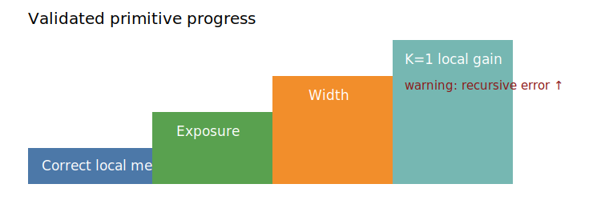

# The structured token editor is now a valid primitive world model

## The one-sentence answer

Token-aligned EMA editing reliably uses operation, current-sequence pointer, and content; exposure and width improve it, while one counterfactual helps one-step prediction but slightly harms recursive rollout.

## First, the idea in everyday language

We trained an editor that represents every word in a draft and predicts what the draft becomes after “delete here,” “insert this here,” or “replace this with that.” Earlier measurements blurred one edited word into a whole-document average and falsely suggested the editor ignored instructions. Direct local checks now show that it follows all three parts of an instruction. More practice and a larger internal representation help. Showing one alternative correction also helps locally, but makes repeated imagined corrections slightly less accurate.

## Why this question matters

Hierarchical planning, GAR value learning, MPC, beam search, and CEM all assume a trustworthy primitive transition. This cycle establishes that primitive and identifies which data and capacity investments are justified before adding those planning layers.

## What we tested

Across seven new controller rounds, 35 jobs completed. We audited five stabilizer/corruption checkpoints, separated operation/pointer/content effects, compared 2k–18k unique clean iGSM problems and 6k–18k example presentations, tested d256 versus d512, implemented exact structured counterfactual outcomes, swept K={0,1,4,8}, added two confirmation seeds, and re-audited every selected checkpoint locally. All models use dropout zero and EMA teachers in evaluation mode.

## What a fair comparison means here

Exposure comparisons match total processed examples. Uniqueness comparisons change clean problems while holding exposure fixed. Width comparisons now match batch size and optimizer steps. K comparisons match expert states, batch, epochs, optimizer steps, and use mean-normalized candidate loss. Counterfactuals contain exact mechanical outcomes but no goal distance, preference, quality, symbolic reasoning, or future information.

## What happened

| Question | Result | Decision |
|---|---|---|
| Does the action matter? | Mixed token shuffled/matched 3.1–5.2 | Primitive causal gate passes |
| Fresh versus fixed corruption? | Numerically tied | Use fixed mixed data |
| Unique data or exposure? | Exposure-matched pairs tied; 18k beats 6k | Scale presentations first |
| Seed stability at 18k? | Recursive error 0.182/0.190/0.185 | Effect replicates |
| Width? | d512 beats d256 at batch 4 and batch 8 | Width genuinely helps |
| Counterfactual breadth? | K=1 helps one-step; K=4/8 identical | Never use K>1 |
| Counterfactual rollout? | Recursive error worsens about 2.6–3.5% | K=1 is not default yet |

Final local ratios remain healthy. The d512 batch-eight model gives operation/pointer/content ratios 3.21/3.15/1.54 with recursive error 0.230, versus d256 batch-eight 2.68/2.62/1.39 and 0.309. At 18k exposures, seed-one and seed-two ratios are 2.85/3.15/1.26 and 2.92/3.23/1.26.

## The intuitive picture

The staircase shows validated progress; the warning marks the remaining counterfactual tradeoff rather than hiding it.

## The technical details

The primitive state is an ordered sequence of sentence-contextualized token latents. A structured action contains operation, a pointer into the current sequence, and a content-token embedding. The predictor first constructs the exact local latent scaffold, adds relative-to-pointer and prompt conditioning, then applies a dropout-free bidirectional Transformer. One-step and depth-four recursive predictions target stop-gradient EMA token encodings. Causal audits independently derange action components and score both all valid tokens and radius-two local windows. The selected 18k-exposure d256 condition has three seeds. Structured alternatives are independently executed and EMA-encoded; their smooth-L1 loss averages over valid tokens and K. Raw rounds are indexed in `research/EXPERIMENT_INDEX.md`.

## What we can conclude

The position design is appropriate: it is a pointer into the current token sequence, not a brittle permanent number. The primitive world model uses operation, pointer, and content. Total exposure and width are validated levers. One alternative is the counterfactual saturation point.

## What we cannot conclude

No learned planner has yet solved held-out reasoning by MPC, beam, or CEM. D512 plus 18k exposure is untested. K=1 does not improve recursive prediction. GAR, hierarchy, macro bottlenecks, multi-level encoders, and planning success remain research questions rather than established results.

## What happens next

First combine d512 with 18k presentations and confirm across seeds. Second tune K=1 weights below one or add branch-consistent recursive supervision, advancing only if one-step gains no longer cost rollout accuracy. Third add GAR H1/H4 on the selected primitive and test whether predicted advantage ranks mechanically executed candidate actions. Only then compare flat versus multi-level token/span/sentence hierarchy and finally MPC/beam/CEM planning.

## Words used in this report

- **Primitive:** The lowest-level one-edit transition model.
- **Pointer:** A location relative to the current token sequence.
- **Exposure:** One processed training example, including repetitions.
- **GAR:** A learned action advantage derived from privileged training-time goal geometry.

## Questions for you

- Should the next cycle prioritize d512-plus-exposure scale or repairing K=1 recursive rollout?
- For planning, should the first success metric be exact denoising completion or improvement per fixed compute budget?
