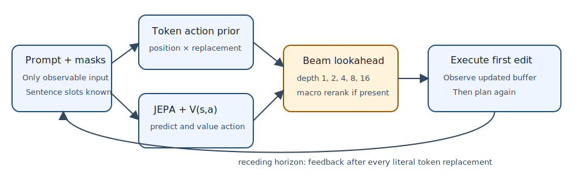

# From predicting edits to generating an iGSM solution

## The one-sentence answer

We now have a tested, target-hidden receding-horizon generator for the multiscale edit models, but whether it produces correct or coherent solutions remains unknown until newly trained prior-and-value checkpoints finish.

## First, the idea in everyday language

Imagine filling a worksheet whose answer lines are blank. At each moment, a helper proposes a few words and places where one word could be written. A second system estimates whether each choice moves the worksheet closer to a finished solution. Instead of committing to the locally best word, the system can imagine several future edits, choose the best-looking short plan, execute only its first edit, inspect the new worksheet, and plan again. The implementation now does exactly this with token replacements. It never peeks at the completed worksheet while choosing, although the worksheet's number of lines and blank slots is currently supplied.

## Why this question matters

Previous sequence-edit results measured whether a model predicted latent representations after a known edit. That is necessary but does not show that the model can choose edits and emit text. Executable generation is the missing end-to-end test. A positive result would justify deeper hierarchical planning work; a negative result would localize failure to proposals, values, scale, or the representation hierarchy rather than letting latent prediction error stand in for language ability.

## What we tested

This cycle implemented and CPU-tested four ingredients: a token-position and replacement-token prior; a target-hidden action value `V(s,a)`; a normalized state distance-to-goal value; and beam model-predictive control that executes one literal edit and replans. For hierarchical checkpoints, every macro code is built from an executable sequence of primitive token edits. The implementation smoke used one tiny randomly initialized/trained model and is not a scientific result. The proposed GPU round compares four architectures and three prior modes at approximately 10 million trainable parameters.

## What a fair comparison means here

Every planner receives the same prompt, masked token buffer, sentence boundaries, candidate width, and search depth. The clean solution is available only to create training labels and calculate evaluation metrics. It cannot be passed to the planner's public method. “No prior” uses deterministic uniform proposals from prompt and current-buffer tokens; detached and attached priors share the same architecture and supervision, differing only in whether the prior loss sends gradients into the representation. Macro-prior comparisons must also disable macro-prior scoring in the no-prior condition. The known output length and sentence segmentation are privileged structure and must be reported, not mistaken for free-length generation.

## What happened

Only implementation evidence exists so far.

| Check | Evidence now | Interpretation |
|---|---:|---|
| Focused unit and data tests | 51 passed | Masks, detach gradients, executable macro spans, and target-hidden API behave as intended |
| Tiny end-to-end train/checkpoint smoke | completed | Losses, checkpoint loading, and generation execute without a runtime failure |
| Tiny exact sequence recovery | 0% | Expected from an intentionally tiny undertrained smoke; not a model conclusion |
| 10M architecture/prior comparison | awaiting jobs | No architecture or prior winner exists yet |
| Depth and ID/OOD generation | awaiting valid checkpoints | No claim that deeper search helps yet |

## The intuitive picture

The important feature is the feedback arrow: depth means looking ahead before one edit, not blindly executing an entire imagined plan. The orange box may additionally score complete executable token spans in the macro representation.

## The technical details

The base prior factorizes `p(position | state,prompt)` and `p(token | position,state,prompt)`. The action-value head receives only the pooled online state and a pointer-relative primitive action embedding. Its labels are exact changes in boundary-preserving token Levenshtein distance for the expert action and 32 target-independent counterfactual proposals. The state-value head regresses distance divided by the starting distance, keeping its target in `[0,1]`. During beam search, literal replacement mechanics update hypothetical buffers exactly. The JEPA predicts the latent consequence, and its predicted state value plus `V(s,a)` and prior log probability score the branch. At each macro boundary, the ordered primitive action embeddings are concatenated through the learned bottleneck; the macro prior and predicted macro-subgoal value rerank that executable branch. Model-predictive control returns only the first action and re-encodes the observed new buffer. Planned evaluation reports exact full sequence, exact answer sentence, rendered-answer presence, token accuracy, edit distance, operation-count regime, and qualitative decoded examples at depths `{1,2,4,8,16}` on training-support and strictly longer official iGSM problems.

## What we can conclude

The repository no longer lacks an executable sequence-generation path for this model family. Target isolation is structural in the planner interface, detached versus attached priors are genuine gradient ablations, and hierarchical search cannot invent a latent macro with no primitive realization.

## What we cannot conclude

We cannot yet conclude that generated text is coherent, that answers are correct, that search depth helps, or that hierarchy contributes. The current task supplies the target number of sentence and token slots. The proposed one-epoch screen may undertrain 10M models. The prior and values learn from synthetic corruption trajectories and terminal-privileged labels, so success would establish structure-known denoising generation, not unrestricted language reasoning. Deep beam evaluation is expensive and must follow checkpoint validity gates.

## What happens next

Run the four-architecture, three-prior-mode screen. Reject non-finite, collapsed, action-insensitive, proposal-inaccurate, or value-sign-invalid checkpoints. Then run full generation for survivors across ID, medium OOD, and long OOD operation ranges at depths 1, 2, 4, 8, and 16, including uniform-proposal and no-macro-prior controls. Continue hierarchy only if it beats the matched flat controller and improves with depth.

## Words used in this report

- **JEPA:** A joint-embedding predictive architecture that predicts representations rather than directly decoding words.
- **Model-predictive control:** Repeatedly look ahead, execute only the first action, observe the new state, and plan again.
- **Action prior:** A learned distribution proposing likely token positions and replacement tokens.
- **Detached:** A loss trains its own head but cannot alter the shared representation encoder.
- **ID/OOD:** Evaluation inside the training complexity range or outside it at longer lengths.

## Questions for you

- After the validity screen, should scarce deep-search compute prioritize more examples at depths up to 8, or fewer examples that include depth 16?
- Should the next generation milestone remain structure-known exact reconstruction, or should we immediately add a separate learned length-and-boundary model?

