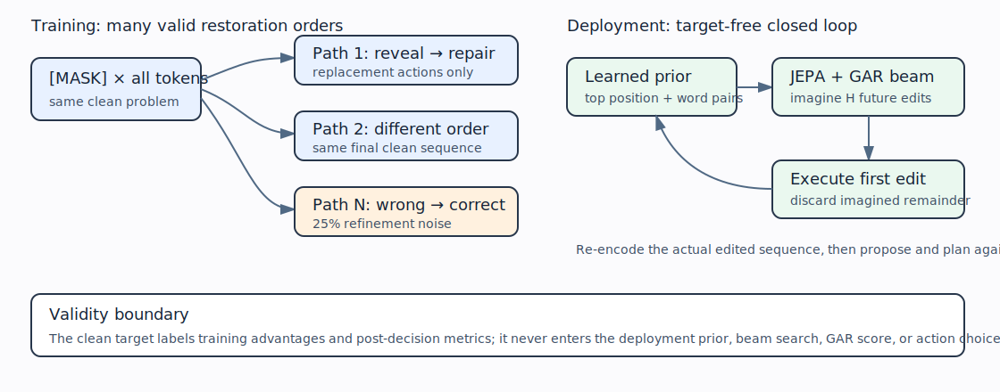

# Iterative replacement training is viable, but planning is still unmeasured

## The one-sentence answer

Training one editor on many replacement-only refinement paths works and learns a usable action prior, but wrong-token corrections are necessary for healthy geometry and the decisive target-free planning comparison is ready rather than completed.

## First, the idea in everyday language

Imagine restoring a sentence written on covered cards. At first every card is hidden. A learner may reveal a correct word, write a plausible but wrong word, or later repair a wrong word. There need not be one sacred restoration order. We trained the same editor on several independently ordered restorations of each problem, then taught a small “suggestion” module to name promising card positions and words. At deployment, those suggestions will define a shortlist; the Joint-Embedding Predictive Architecture (JEPA) and its learned Goal-Advantage Ranking (GAR) score will imagine and rerank short futures.

## Why this question matters

The earlier editor depended on small candidate pools whose correct next action appeared only about one time in ten. A full-vocabulary learned prior is needed to propose actions without seeing the answer. Replacement-only refinement also removes unnecessary operation-type complexity while still allowing iterative correction. This cycle asks whether that training recipe is stable enough to justify a real closed-loop planning test.

## What we tested

Each clean small-scale iGSM reasoning sequence began fully masked. Every action replaced exactly one current token. With probability 0.25, a trajectory deliberately revealed a wrong token that a later action had to repair. We compared 1, 4, 8, and 16 independently ordered trajectories per clean problem while holding total trajectory presentations at 2,048 per epoch. We also compared wrong-token probabilities 0, 0.25, and 0.50 at eight trajectories. All models had no dropout, used an exponential-moving-average target encoder in evaluation mode, and used exact gradient accumulation so the effective grouped batch contained all trajectories from each sampled base problem.

One initial six-run wave exceeded the 46 GB L40 memory limit and is retained as an infrastructure failure. The repaired six-run wave completed. Four additional coefficient/learning-rate cells completed; the no-prior Alex control remains pending and is not interpreted.

## What a fair comparison means here

Trajectory-count comparisons hold total presentations and optimizer updates fixed, so increasing the number of paths reduces the number of distinct base problems. Corruption comparisons hold trajectory count and exposure fixed. The clean target is used to construct supervised training advantages and post-decision evaluation only. It is not available to the action prior, GAR head, or deployment planner. The current results have one seed, so they select a planning pilot rather than establish a robust recipe.

## What happened

Lower prediction error is better; higher effective rank and GAR accuracy are healthier. “Prior position/token” are training-epoch top-one accuracies for the two factors of the learned proposal distribution.

| Training condition | One-step error | Recursive error | Effective rank | GAR pairwise | GAR top-one | Prior position/token |
|---|---:|---:|---:|---:|---:|---:|
| 1 path, 25% wrong-token refinement | 0.103 | 0.351 | 41.1 | 63.6% | 38.6% | 16.6% / 27.2% |
| 4 paths, 25% wrong-token refinement | 0.093 | **0.289** | 32.1 | 63.2% | 38.0% | 15.8% / 25.5% |
| 8 paths, 25% wrong-token refinement | **0.087** | 0.375 | 28.0 | **65.3%** | **40.3%** | 15.6% / 25.2% |
| 16 paths, 25% wrong-token refinement | 0.101 | 0.382 | 23.1 | 64.6% | 39.0% | 14.9% / 24.3% |
| 8 paths, no wrong-token refinement | 0.071 | 0.112 | **9.2** | 53.8% | 27.1% | 7.2% / 31.9% |
| 8 paths, 50% wrong-token refinement | 0.097 | 0.360 | 29.9 | 59.7% | 31.8% | 14.3% / 21.1% |

Four paths give the best healthy recursive dynamics. Eight paths give the best one-step transition and GAR ranking. Sixteen paths trade away both distinct base problems and state rank without improving deployment-relevant diagnostics. The no-wrong-token model has very low errors but compresses state rank to 9.2 and makes GAR nearly chance-level; its low errors therefore fail the representation-health gate. A 50% wrong-token rate is too aggressive. The selected rate is 25%.

The original prompt/current-token proposal pool contains an improving action on only 10.1% of valid states. This is direct evidence that a learned full-vocabulary prior is necessary. Across the completed prior-weight screen, position accuracy stays near 15% and token accuracy near 25%; changing its coefficient mainly changes shared representation geometry. Prior weight 0.3 with learning rate 0.002 gives the highest GAR top-one accuracy (45.7%) and effective rank (71.6), whereas prior weight 0.1 with learning rate 0.004 gives the best healthy recursive error (0.254). Planning, not training loss, must choose between them.

## The intuitive picture

The left side shows why several paths teach that there is no single correct order. The right side shows deployment-feasible receding-horizon control: propose without the target, imagine a horizon, execute one action, observe the new state, and plan again.

## The technical details

The primitive state consists of token-aligned contextual embeddings. The only operation is `replace(position, token)`, so a mask reveal and a correction share the same dynamics. The factorized proposal prior first predicts a distribution over current token positions, then predicts a full-vocabulary token distribution conditioned on the chosen position, current state, and prompt. GAR predicts the improvement associated with an action; the clean goal is used only to provide its supervised advantage label during training.

The planned evaluator performs beam search at horizons 1, 2, and 4. It combines prior log-probability with GAR, uses JEPA recursively for imagined transitions, executes only the first replacement, re-encodes the actual edited sequence, and repeats. Its search function has no target argument, and a CPU end-to-end checkpoint smoke test passed. Six matched GPU evaluations (four-path and eight-path checkpoints at all three horizons) were validated and finalized, but the controller refused submission because nine older reports remain unread against a configured limit of one. The exact ready plan is `research/NEXT_PLAN.json`.

Raw evidence is under `runs/autonomy/sequence_edit/2026-07-20-token-refinement-trajectory-diversity-recovery-wave59/`, `runs/autonomy/sequence_edit/2026-07-20-token-refinement-prior-scale-remainder-wave60/`, and `runs/autonomy/sequence_edit/2026-07-20-token-refinement-prior-scale-slurm-wave60/`.

## What we can conclude

Direct observations: grouped multi-trajectory replacement training completes without collapse at a 25% wrong-token rate; the learned prior predicts position and content substantially above an untrained uniform distribution; and four-to-eight paths are the useful region at fixed exposure. Pure unmasking produces unhealthy compressed geometry and poor GAR ranking.

Supported inference: iterative wrong-token repair teaches a materially richer action/value problem than monotonic unmasking, and a learned prior is required because handcrafted candidate support is inadequate.

## What we cannot conclude

We do not yet know whether deeper search improves the posterior or final sequence, whether GAR adds value beyond the prior, whether the prior adds value beyond GAR on its support, or whether the best training diagnostic selects the best planner. Exact recovery is unmeasured for this new recipe. All completed training comparisons use one seed and a small synthetic iGSM scale. The pending no-prior cell and failed memory wave provide no scientific comparison.

## What happens next

First run the finalized horizon 1/2/4 receding-MPC comparison on four-path and eight-path checkpoints. If depth helps, run prior-only, GAR-only-on-prior-support, and combined-scoring controls, plus a fixed-compute breadth-versus-depth control. Then evaluate the two strongest prior coefficient/learning-rate checkpoints. Replicate the winning setting across seeds only after it yields positive normalized edit-distance improvement. After a flat token-level planner passes, add span/phrase/sentence latent levels with separately encoded spaces and bottlenecked macro actions; hierarchy should not be used to conceal a non-working primitive planner.

## Words used in this report

- **Beam search:** Keeping several promising imagined futures instead of only the current best one.
- **Effective rank:** A measure of how many independent directions a representation uses; very low values warn of compression or collapse.
- **GAR:** Goal-Advantage Ranking, a learned score for how much an action improves progress toward the training goal.
- **iGSM:** A synthetic dataset of multi-step arithmetic word problems.
- **JEPA:** Joint-Embedding Predictive Architecture, which predicts representations rather than directly reconstructing every input token.
- **MPC:** Model Predictive Control, repeatedly planning ahead but executing only the first action before replanning.
- **Prior:** A learned distribution that proposes likely position-token actions before JEPA/GAR reranking.

## Questions for you

- Should the controller’s nine existing sequence-edit reports be marked reviewed so the already-finalized six-job planning round can be admitted?
- After the depth gate, should the fixed-compute control prioritize equal model calls or equal wall-clock time?
