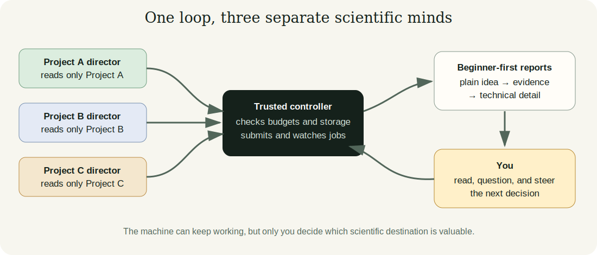

# How the autonomous TextJEPA research system works

## The one-sentence answer

Codex can keep the research moving without waiting for you, while a separate controller limits what it may run and regular reports let you correct its scientific direction.

## First, the idea in everyday language

Imagine that you employ three enthusiastic junior researchers. Each researcher
works on a different question. One studies whether a computer can understand
explicit descriptions of an intended reasoning step. Another studies whether
useful larger steps can be discovered directly from ordinary text. The third
studies your remaining TextJEPA direction. They share a laboratory, but they do
not share notebooks, because reading every note from every project would make
each person confused about which evidence belongs to which question.

Codex plays the role of these junior researchers. A neural network, in the
simplest terms, is a computer program that adjusts many numerical knobs until
examples are mapped to useful answers. A language model is a neural network
trained on text so that it becomes good at predicting and manipulating
language. TextJEPA asks whether such a system can learn by predicting useful
hidden descriptions of what comes next, rather than always recreating every
next word directly. The hope is that it might learn larger meaningful steps,
somewhat like a person thinking “write the conclusion” rather than separately
thinking about every keystroke.

The researchers cannot simply take every graphics card and try thousands of
ideas. They first write down one question whose answer would change a decision.
A conventional controller—ordinary deterministic software, not a language
model—checks their experiment plan, available computers, time budget, disk
space, and duplicate names. It then starts approved jobs and watches them even
after the Codex conversation ends. When the jobs finish, a fresh Codex process
reads only that project’s concise notebook and results. It explains what was
learned, chooses the smallest valuable next question, and proposes another
round.

Your role is not to watch terminals all day. Your role is closer to the head of
the laboratory. You periodically open a reading dashboard, start with the
oldest unread report, and decide whether the researchers are pursuing the
right scientific goal. You can say, for example, “I care more about proving
that the hierarchy is real than gaining two percentage points,” or “this
comparison does not seem fair.” That note enters the relevant project’s inbox
and must be read before its next decision.

## Why this question matters

Automation is only useful if it saves attention without silently changing the
research objective. Training jobs can run for hours or days, remote schedulers
can queue them, and results can outlive a single Codex context. Conversely, a
single endlessly resumed conversation accumulates old assumptions and details
from unrelated projects. The system therefore needs both persistence and
forgetting: persistent files and job state, but fresh, project-specific
reasoning contexts.

This design decides where autonomy should live. Codex receives autonomy over
small scientific decisions and implementation. The controller receives
authority over scheduling and limits. You retain authority over the research
destination, budgets, claims, and major scale increases. If these roles are
blurred, the system could be operationally busy while scientifically lost.

## What we tested

This report describes an infrastructure bring-up rather than a claim that a
new language-learning method works. We checked whether the controller could
contact Grünau, Alex, Lise, and Grete; see their schedulers and storage; parse a
bounded experiment plan; produce an immutable copy of a specific Git revision;
and create compact result files. We also exercised its report and runner logic
with local tests.

No training experiment was submitted for this report. No result here measures
language understanding or hierarchy quality. The “systems” being compared are
possible ways of organizing autonomous research, not competing neural-network
architectures.

## What a fair comparison means here

A fair operational comparison asks whether each design preserves the same
scientific evidence while differing in how reliably it survives time and
separates projects. It would be misleading to call a system autonomous merely
because one Codex terminal remained open, or to call it safe merely because no
failure happened during a short demonstration.

The important controls are explicit failure tests: duplicate round names must
be rejected; low-storage conditions must prevent new work; a failed job must
remain visible; a protected policy change must not be committed; and one
project must not consume the entire shared budget while others have valuable
work waiting. Those live failure drills remain part of the bring-up gate.

## What happened

The following table distinguishes implemented behavior from work that still
requires a live, deliberately reviewed test.

| Capability | Current observation | What it means in ordinary language |
|---|---|---|
| Cluster visibility | All four backends answered read-only probes | The controller can see where work might run |
| Storage protection | Local and remote free-space checks work | New work stops before a configured disk threshold |
| Reproducible code | A Git snapshot test passed | A job can use the exact code version named in its plan |
| Scientific report quality | A structural validator is installed | Codex cannot finish a cycle with only a cryptic summary |
| Live job lifecycle | Not yet tested under the new controller | We have not proved submit, poll, failure, and retrieval end to end |
| Fully automatic next round | Disabled | You can inspect the first rounds before granting this authority |

The repository test suite passed after the initial controller implementation.
That supports software consistency, but it does not replace the deliberately
failed job, storage-threshold, and per-cluster smoke tests.

## The intuitive picture

The arrows form a loop, but notice that the three project boxes never merge
into one giant research box. The controller combines resource scheduling, not
scientific contexts. Reports flow to you, and your steering flows back toward
the next decision. This is the essential difference between autonomous motion
and uncontrolled motion.

## The technical details

Each scientific project should have a stable slug, its own state, evidence
ledger, backlog, experiment index, cycle directory, and next-plan file. A fresh
non-interactive Codex process begins with the shared repository rules and
research charter, then loads only the selected project’s compact files and the
newly completed run summaries. Cross-project results are visible only through
short, deliberately promoted evidence entries. Raw sibling logs are excluded
from the initial context.

Plans are JSON documents rather than scheduler scripts. A plan identifies the
project, round, exact source revision, scientific decision, and jobs. Each job
contains an argument list, resource requirements, time limit, purpose, and
expected artifacts. The controller validates identifiers, launch entry points,
GPU count, per-round GPU-hours, rolling GPU-hours, active jobs, storage, and
duplicate state before mutation. Grünau placement requires both low allocated
memory and low utilization. Alex, Lise, and Grete delegate physical placement
to Slurm because a scheduler reservation is more authoritative than observing
an apparently idle device.

External jobs receive a streamed `git archive` under a directory named by the
full commit hash. They use a cluster-specific shared Python environment and set
the project source directory on `PYTHONPATH`. Temporary multiprocessing data
uses a job-specific directory. Result retrieval includes summaries, metrics,
tables, logs, and figures with a size ceiling; checkpoints remain remote unless
explicitly requested.

The report bundle contains `report.json`, `REPORT.md`, and local figures. The
validator requires a plain-language explanation, motivation, design, fairness
discussion, result table, intuitive figure, technical protocol, supported and
unsupported conclusions, next decision, glossary, and human steering
questions. It also applies minimum lengths so a heading followed by one vague
sentence cannot satisfy the contract. The local dashboard synchronizes only
these compact bundles and controller state over `rsync`. Browser local storage
records a report hash as read, so a changed report becomes unread again.

When you send steering, the dashboard writes a timestamped Markdown note under
the controller’s steering inbox for that project. Oversight prompts must read
unhandled steering before choosing the next decision and record how the note
changed—or did not change—the plan. Automatic submission remains a separate
human-controlled configuration switch.

## What we can conclude

The architecture now has a clear separation between scientific reasoning,
durable execution, explanation, and human direction. The dashboard and report
contract directly address the failure mode in which Codex performs substantial
work but reports it as unexplained filenames, metric fragments, or specialist
shorthand. The controller can discover the configured infrastructure without
launching work, and its plan validation can prevent several classes of
accidental overuse.

We can also conclude that separate project contexts are compatible with one
shared resource controller. Scientific memory does not need to be mixed merely
because GPUs and servers are shared.

## What we cannot conclude

We cannot yet claim that the full autonomous loop is operationally reliable.
The new controller has not submitted and retrieved a real job on every backend.
We have not exercised scheduler outages, SSH interruptions, a nearly full
quota, or simultaneous plans from all three projects. We also have not observed
whether future Codex reports meet the spirit of beginner-first explanation
rather than only the validator’s structure.

Most importantly, none of this evidence says that JEPA works for language,
that a hierarchy has been learned, or that autonomous experiment selection
will discover a good method. The infrastructure creates a more trustworthy way
to investigate those questions; it does not answer them.

## What happens next

First, choose and name the third active subproject so all three receive
separate memory and budgets. Next, review this reporting format and say whether
the everyday-language layer is sufficiently basic. Then perform a seconds-scale
Grünau job, a deliberate failure, and one smoke test per Slurm site while
automatic next-round submission remains disabled.

After several reports are understandable and the job lifecycle works, enable
one autonomous project at a time. Enable all three only after fair-share
allocation and project-qualified state are implemented. Paper-scale campaigns,
new datasets, and large budget changes should remain explicit human decisions.

## Words used in this report

- **Neural network:** A computer program with many adjustable numerical knobs that learns patterns from examples.
- **Language model:** A neural network trained to predict or otherwise work with sequences of text.
- **JEPA:** A system trained to predict useful hidden descriptions of missing or future information instead of necessarily recreating every raw detail.
- **Hierarchy:** An organization with small steps at a lower level and larger, more abstract steps at higher levels.
- **Controller:** Conventional software that enforces rules and manages jobs without making open-ended scientific judgments.
- **Slurm:** A queueing system that decides when and where requested computing jobs run on a cluster.
- **Git commit:** A named, immutable version of the source code used to reproduce exactly what a job executed.
- **Context:** The instructions and evidence visible to one Codex reasoning process.
- **Validity gate:** A condition that must pass before a result is trusted or scaled up.

## Questions for you

- Should the third active project be the archived edit track, or is there another current subproject that is not yet represented in `research/README.md`?
- When compute is scarce, should all three projects receive equal baseline GPU budgets, or should one receive a larger share because it is more important for the paper?
- Is this everyday-language explanation basic enough, or should future reports explain even terms such as “prediction,” “training example,” and “percentage uncertainty” with concrete stories?
- How often do you want the autonomous system to require an explicit steering checkpoint: after every decision round, daily, or only before crossing a compute/scale gate?
