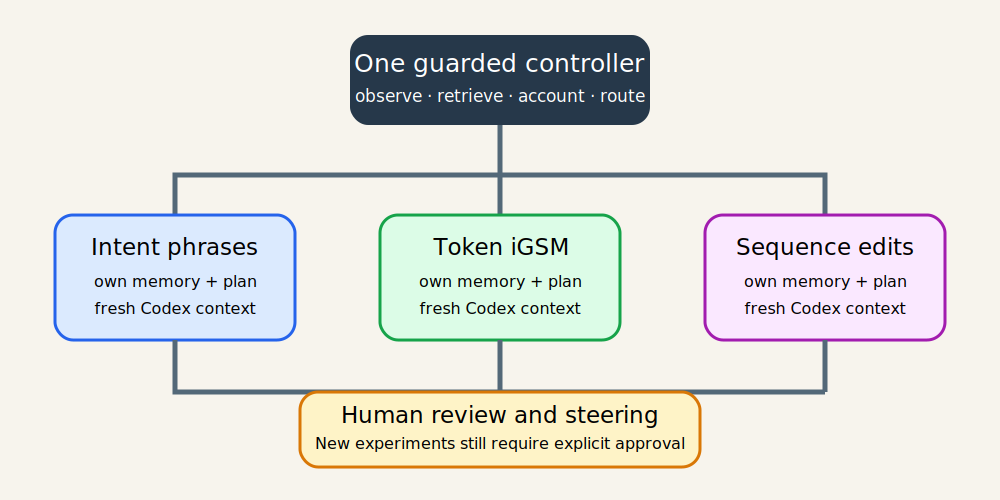

# TextJEPA now has three guarded research lanes

## The one-sentence answer

TextJEPA now uses one safety-conscious controller to watch existing work, while three isolated research directors can analyze results and draft plans; no new experiment is submitted until you review and approve it.

## First, the idea in everyday language

Imagine that one busy laboratory originally kept three rather different investigations on the same large desk. There was one notebook, one pile of incoming measurements, and one person trying to remember which conclusion belonged to which investigation. The laboratory could still produce useful work, but confusion was easy: a result about one apparatus might accidentally influence the next test of another apparatus, and whoever arrived for the next shift had to reconstruct the entire desk.

The migrated system resembles a railway station with three clearly marked platforms. A single station controller watches the tracks, knows which trains are already moving, and records where every train is going. The controller does not stop or reroute a train that has already departed. Instead, it directs each arriving result to the correct platform. Each platform has its own notebook, timetable, spending allowance, and fresh specialist. The specialist on one platform does not begin by reading the private notebook of another platform.

You remain the person who authorizes departures. A specialist may study a completed journey, write a careful explanation, and prepare a proposed timetable. That is the useful autonomous part. But the barrier stays closed before a new scientific experiment: automatic submission is disabled. You read the report, send steering to the relevant platform, mark the report as read, and explicitly approve any plan worth running.

This arrangement also avoids wasting available equipment. Each active project is promised a small fair opportunity when suitable graphics processors are available. If the other projects have nothing useful waiting, one project may temporarily borrow unused capacity. Nothing already running is interrupted to make the accounting look tidy. The rule changes only which future work may enter.

## Why this question matters

The repository contains three scientifically distinct questions. Mixing their memory can create subtle scientific leakage: an oracle diagnostic from one setting can be remembered as deployable evidence in another, or an experiment name can hide a different information advantage. Operationally, several clusters and direct Grünau processes were already active. A careless reorganization could duplicate expensive work, lose retrieval paths, or detach a scheduler job from its recorded commit.

The migration therefore had two equally important goals. The first was scientific separation: each project needs an honest evidence ledger and a context that starts from only relevant material. The second was operational continuity: every accepted job must remain exactly the same process associated with exactly the same immutable code and run directory. A clean-looking directory tree would not be a success if it disturbed live work.

## What we tested

We first froze only new admissions by pausing the controller and creating `research/STOP`. We did not cancel or signal any process. We captured Git state, controller status, cluster inventory, storage, controller JSON, active processes, systemd timers, cron, worktrees, and backend identifiers in a read-only snapshot.

We then exercised a version-one controller fixture containing a running Grünau process; pending, running, completed, and failed Slurm jobs; a partial submission; retrieved and unretrieved results; and an ambiguous round. The migration was run as a dry run, executed, and executed a second time to test idempotence. On the live state, 48 jobs across 11 rounds were compared field by field before and after metadata migration.

We also tested plan validation, unsafe launch rejection, duplicate job identifiers, per-round GPU-hour limits, per-project GPU caps, compact run records, report indexing, read receipts, and project steering. The remaining validation section in the operator document records compilation, repository tests, report validation, configuration parsing, shell checks, systemd checks, UI checks, and observation-only watcher behavior.

## What a fair comparison means here

This is an infrastructure transition, not a model-accuracy contest. Fairness means comparing the exact same registered jobs before and after migration. The migration was not allowed to replace an old path with a nicer one and call it equivalent. For every job, the round ID, job ID, backend ID, exact Git commit, process state, local directory, and remote directory had to remain unchanged.

The classification itself is deliberately conservative. Recognizable edit rounds are assigned to sequence edit; hard-token and hierarchy rounds to token iGSM; causal and intent-policy rounds to intent phrase; smoke tests to shared infrastructure. A name without enough evidence stays `legacy/unclassified`. This avoids manufacturing certainty from naming conventions.

No new training data, tuning opportunity, GPU budget, credential, or scheduler setting was added. Automatic experiment submission remains off. The system may poll and retrieve accepted jobs, but the migration does not count that observation as a new scientific experiment. Failed jobs that never trained remain process failures rather than negative model evidence.

## What happened

| Property | Before | After | Interpretation |
|---|---|---|---|
| Scientific contexts | One mixed oversight context | Three fresh project-specific contexts | Conclusions and backlogs begin isolated. |
| Controller | One legacy state schema | One backward-compatible version-two schema | Old rounds remain readable; new plans require a project. |
| Registered live/terminal jobs checked | 48 | 48 | No job identity disappeared or duplicated. |
| Existing run paths | Legacy paths | The same legacy paths | Retrieval compatibility is preserved. |
| New run layout | `runs/autonomy/<round>/<job>` | `runs/autonomy/<project>/<round>/<job>` | Only future artifacts receive project qualification. |
| Experiment admission | Manual guarded submission | Manual guarded submission | No scientific job became automatically authorized. |
| Oversight | Disabled/mixed bring-up | Project-routed analysis and plan drafting | Analysis is assisted; submission remains human-controlled. |

The most important observation is preservation, not a new feature count. The live comparison found exactly the same 48 job keys and exactly the same protected fields after the migration. The active intent-phrase work and pending/running Slurm jobs therefore continued under their original commits and directories.

The allocation view also exposed why future fairness matters. At migration time, intent phrase already occupied most active capacity, while the other projects had no active GPUs. The new policy does not preempt those jobs. It counts them when evaluating the next admission, so a single project cannot continue monopolizing future slots while another useful reviewed plan waits.

## The intuitive picture

What to notice: the upper controller is shared because polling, storage checks, locks, budgets, and scheduler compatibility should have one source of truth. The three middle boxes are separate because scientific memory and decisions should not silently blend. The lower human gate applies to every lane. Why it matters: the system can continue useful analysis without turning a research assistant into an uncontrolled experiment launcher.

## The technical details

New plans use schema version 2 and require one of three stable slugs: `intent_phrase`, `token_igsm`, or `sequence_edit`. Each TOML project manifest declares the title, research-memory root, report root, current-cycle pointer, plan path, branch and worktree, ownership patterns, Codex prompt, scientific activity, autonomous-submission flag, and project budgets. Existing historical roots and all run directories remain in place.

The state migration acquires the non-blocking controller lock, reads the original bytes, computes a SHA-256 checksum, annotates rounds, writes a timestamped read-only backup, and atomically replaces `state.json`. It never calls a scheduler submission or cancellation path. Running it twice is a no-op on the second invocation. Rollback accepts only a migration backup and first verifies that the set of round/job/backend/path identities is unchanged.

Future run directories include the project. Legacy rounds are handled by a helper that derives a conservative project for accounting and routing. Refresh uses the existing backend ID: Grünau reads the original state marker, while Slurm queries the original scheduler job and retrieves compact artifacts to the original local directory. A watcher tick performs refresh before checking pause or STOP, so observation continues while admission is frozen.

Fair admission combines global policy with project manifests. Each project receives a one-GPU guarantee where hardware permits, a maximum active-GPU count, a pending Slurm cap, and round and weekly GPU-hour limits. Existing legacy active jobs count. When another project has an unadmitted resolved plan waiting, the proposed project is held to approximately forty percent of visible/global slots. Capacity can be borrowed when nobody else waits, and no active job is preempted.

Each project uses a clean Git worktree and branch. A fresh real `codex` executable is invoked ephemerally with search, `workspace-write`, approval policy `never`, model `gpt-5.6-sol`, and medium reasoning. Its prompt names only shared charter/evidence, that project's compact memory and current cycle, project steering, relevant terminal summaries, and allocation. Protected paths and tests are checked before a project commit. Shared-code changes require deliberate integration rather than concurrent overwrites.

Reports remain self-contained bundles with JSON metadata, Markdown, and figures. A content hash connects the displayed report to its read receipt. If a report changes, the old receipt no longer counts. Steering goes to a project-specific inbox. The unread-report limit stops further oversight/admission from outrunning human attention. The controller never creates a receipt on your behalf.

## What we can conclude

We can conclude that the repository now has the structural and controller mechanisms required for assisted autonomy: stable project identities, compact separated memory, project-qualified plans, fair future admission, isolated worktrees and prompts, project-routed oversight, and a durable observation mechanism. We can also conclude that the migration algorithm preserved the registered identity and paths of the 48 jobs present in its before snapshot.

We can conclude that automatic scientific submission is not enabled. Analysis, report creation, code preparation, plan validation, polling, and retrieval can be automated within guards. A human still approves a plan with `--execute`, raises budgets, authorizes paper-scale work, transfers data, changes credentials, publishes, or cancels work.

## What we cannot conclude

This migration says nothing about whether any JEPA architecture is scientifically correct or whether a pending experiment will succeed. Project classification based on names is metadata routing, not scientific validation. Ambiguous history remains explicitly ambiguous.

We also cannot promise perfectly equal instantaneous GPU use. Scheduler queues, hardware compatibility, already-running jobs, and the absence of valuable plans can all create unequal snapshots. The policy is intentionally work-conserving and non-preemptive. Finally, a fresh Codex process is still software operating under repository and account permissions; protected paths, reports, tests, budgets, manual admission, and human review remain necessary controls.

## What happens next

During a normal check-in, open the Research Reader, choose the oldest unread report, read the everyday explanation and fairness section, inspect limitations, and send project-specific steering. Mark the report read only after reading it; that receipt releases the review guard. Then inspect `researchctl allocation` and the project plan. If the plan is valuable and bounded, validate, finalize, and submit it explicitly with `--execute`.

The scientific next decisions remain separate. Intent phrase must analyze its causal action-selection results. Token iGSM must determine whether hierarchy produces useful abstraction and executable planning. Sequence edit must obtain valid training evidence after its pre-training configuration failure. None of those plans is automatically admitted by this migration.

## Words used in this report

- **Controller:** The deterministic program that records jobs, checks limits, polls backends, retrieves results, and enforces admission policy.
- **Watcher:** A small recurring systemd task that asks the controller to observe progress and, when allowed, start the correct analysis context.
- **Worktree:** A separate clean checkout of the same Git repository attached to its own branch.
- **Backend ID:** The scheduler job number or Grünau process identifier used to find an accepted job again.
- **Immutable snapshot:** An archived copy of one exact Git commit used by a job even if the main checkout later changes.
- **Admission:** Permission for a new experiment to enter a cluster queue or start on a GPU.
- **Read receipt:** A content-hash record proving that the human marked one exact version of a report as read.
- **Idempotent:** Safe to repeat without creating another job or changing an already migrated state again.

## Questions for you

- After reading this report, are the one-GPU guarantee, approximately forty-percent waiting-plan cap, and borrowing behavior the right default balance, or should a future policy proposal change them without raising total budgets?
- Which project's first post-migration report should receive your attention first: intent-phrase action selection, token-level hierarchy, or the corrected sequence-edit training pilot?
- Before ever enabling automatic submission, how many successfully reviewed analysis-and-retrieval cycles would you personally want to observe?
