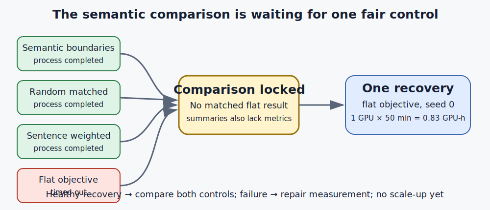

# One missing control blocks the semantic-boundary claim

## The one-sentence answer

The completed jobs show that hierarchy changes representations, but the semantic-boundary comparison is not yet trustworthy because its matched flat control timed out and every terminal summary lacks scientific metrics.

## First, the idea in everyday language

Imagine teaching three students to summarize a worked arithmetic story. The first student reads one symbol at a time. The second also groups symbols wherever the written language naturally suggests a phrase, such as around “is” or “equals.” The third makes groups of the same sizes, but places the boundaries randomly. We want to know whether meaningful grouping helps the second student understand where the solution is going, rather than merely helping because that student received extra machinery or an easier test.

A fair classroom test needs a fourth reference: a student with exactly the same desk, books, and number of adjustable parts as the grouping students, but whose grouping lessons are switched off. That is the “flat-objective control.” It tells us whether any apparent improvement comes from learning across phrases and sentences, or simply from having the larger model that could have learned something useful even without those lessons.

In this research round, the meaningful-boundary student, the random-boundary student, and a sentence-emphasized student all finished training. The flat-control student ran out of allotted time. Worse, the compact completion cards for all jobs say only whether the program ended; their metric boxes are empty and their scientific-validity boxes say “not assessed.” This is like receiving attendance slips rather than exam papers. We can count who showed up, but cannot honestly rank their understanding from those slips.

The sensible next move is therefore small: give only the missing flat control enough time to finish under the same conditions. If its measurements are healthy, we can compare the four students. If it fails again or still produces no measurements, the measurement pipeline—not the scientific hypothesis—becomes the next repair target. This report does not claim that semantic grouping works, and it does not claim that it fails. It identifies the exact missing evidence required to decide.

## Why this question matters

TextJEPA aims to learn predictive states for language at several time scales: tokens, phrases, and sentences. If boundaries derived only from rendered text improve information about future progress or the final answer, that would support studying hierarchy without symbolic solution labels. If random boundaries or a flat objective do just as well, semantic grouping has not earned more compute. This pilot is far smaller than a language-generation demonstration; it is a mechanism test that decides whether the boundary idea deserves replication.

## What we tested

The data are synthetic multi-step arithmetic stories in the iGSM benchmark. A model sees the prompt and the causal token prefix available at each position. It never receives future tokens. The fixed-span study used the same `[4, 16, 64]` hierarchy architecture across flat and hierarchical objectives. A companion pilot used variable phrase and sentence boundaries derived from visible markers such as “is,” “=,” and sentence ends. The random control used the same number of segments but moved phrase boundaries randomly.

The named terminal set contains 12 fixed-span training/evaluation jobs, 12 oracle-terminal planning diagnostics, and four semantic-boundary pilot jobs. All used exploratory rather than paper-grade seed budgets. Twenty-seven processes completed with exit code zero. The semantic flat-objective seed-0 process timed out with exit code 124. No run was silently removed.

## What a fair comparison means here

The semantic, random-matched, and flat conditions must use the same model capacity, training examples, trajectory lengths, optimizer, seed, evaluation examples, and wall-clock opportunity. The flat condition retains the hierarchy modules but assigns zero weight to both higher-level losses, preventing parameter count from explaining a difference. Random boundaries preserve the number of segments, testing whether any chunking is enough.

The evaluation must also keep information matched. Rendered punctuation or words may define a boundary, but no symbolic feasibility, hidden graph state, oracle final state, or candidate-specific information may enter the abstraction claim. Oracle-terminal cross-entropy-method planning is therefore reported separately as a privileged diagnostic. A probe that recovers token identity or segment length can expose shortcuts, but cannot by itself demonstrate useful abstraction.

## What happened

The terminal summaries support the following process table. “No metrics” means the compact summary's metric object is empty; it does not mean that the underlying model scored zero.

| Experiment family | Completed | Timed out | Compact scientific metrics | What it can establish |
|---|---:|---:|---|---|
| Fixed-span hierarchy and matched controls | 12 | 0 | None | Process completion; interim cycle analysis remains separate |
| Oracle-terminal planning diagnostics | 12 | 0 | None | Process completion only; still privileged |
| Semantic/random/sentence-weighted pilot | 3 | 0 | None | Process completion only |
| Semantic flat-objective control | 0 | 1 | None | Missing matched control |

The earlier same-position interim analysis in the current cycle found linear centered-kernel alignment of 0.676–0.729 between flat and hierarchical token states, showing that training objectives changed the representation. Remaining-work linear R2 was 0.573 for flat, 0.687 for level 1, 0.676 for equal-weight level 2, 0.619 and 0.601 for the two other level-2 weightings, 0.697 for equal-weight level 3, and 0.497 for duration-weighted level 3. Token identity remained perfectly decodable in every listed cell. These exploratory values suggest change, sometimes with more progress information, but not lexical abstraction.

The current cycle also records zero solved episodes and zero valid sentences in the first six eight-episode oracle-planning cells. Conditional support modestly improved latent goal distance, while one-token execution drift remained about 0.61–0.69. The new compact summaries say the remaining planning processes terminated, but contain no measurements with which to extend that observation.

## The intuitive picture

*The comparison remains locked until the information-matched flat control finishes and emits healthy measurements. Only that one recovery is admitted; seed expansion waits behind the validity gate.*

## The technical details

The variable-boundary model is a causal token encoder with phrase- and sentence-level hierarchy modules. Its configuration uses a 256-dimensional model state, four encoder layers, two predictor layers, eight attention heads, 64-dimensional primitive action features, and hierarchy dimensions 32 and 16. Training uses 6,000 fresh training examples per epoch, 1,000 validation examples, three epochs, 6–12-step traces, Adam-style optimization at a configured learning rate of 3e-4, 200 warmup steps, and an exponential-moving-average target encoder. The recovery keeps this protocol fixed and sets `objective.high_level_weights=[0.0,0.0]`.

The primary post-recovery evidence is the same held-out representation-probe suite already specified for the pilot. “Final-answer accuracy” asks whether a linear classifier can recover the arithmetic answer from a frozen representation. “Remaining-fraction R2” measures how much variance in normalized work remaining is explained by a linear regression. These are evaluated at token, phrase, and sentence levels with episode-grouped splits. Endpoint-token accuracy, endpoint-type accuracy, segment-length R2, macro first/last-token accuracy, feature standard deviation, and effective rank diagnose lexical shortcuts or collapse. Gradient diagnostics measure each objective's encoder-gradient norm and pairwise cosine, so a nominally active loss that sends no signal to the shared encoder is visible.

The decision rule is directional rather than a claim of statistical significance from one seed. Semantic boundaries must improve a future/progress or answer probe relative to both random-matched boundaries and the recovered flat objective, without unhealthy variance/rank or invalid gradients. Otherwise the pilot does not justify replication. The comparison must use common evaluation positions and examples; the earlier cycle already rejected within-model endpoint comparisons where fixed-span endpoints differed systematically from all-token positions.

The terminal-summary audit is deliberately limited. Each of the 28 named `run_summary.json` files was classified by process status, exit code, metric presence, artifact declarations, exclusion reason, and stated scientific validity. Raw logs and sibling project records were not opened. Because all metric objects and artifact lists were empty and validity was unassessed, no new numerical result was inferred from completion. The recovery is budgeted at one GPU for 50 minutes, or 0.83 GPU-hours, below the supplied global 0.9 GPU-hour remainder. Automatic submission is disabled.

## What we can conclude

Direct observation: 27 of 28 named processes completed, while the semantic flat-objective control timed out. Every compact terminal summary lacks metrics and a scientific-validity assessment. The pre-existing same-position analysis shows that hierarchy changes token-state geometry and can change progress decodability.

Supported inference: the semantic-boundary pilot is blocked by an absent matched control, and terminal completion cannot substitute for measurement. The highest-value use of the tiny remaining global allocation is recovering that control rather than adding seeds or another planning variant.

## What we cannot conclude

We cannot conclude that semantic boundaries beat random boundaries, that hierarchy removes lexical detail, or that a probe improvement would cause better generation. We cannot infer the final reachability-crossed planning outcomes from empty summaries. Oracle-terminal planning cannot support a deployable claim because it uses privileged goal information. One seed provides no reliable uncertainty estimate. The present evidence does not pass the charter's scale gate, does not justify a 50M/100M model, and does not demonstrate executable hierarchical generation.

## What happens next

Run one recovery cell for the capacity-matched semantic flat objective. If it completes with finite losses, non-collapsed representations, valid gradients, and all expected metric files, compare it with the already terminal semantic and random-matched cells. Continue only if semantic boundaries improve a future/progress or answer measure over both controls. A tie or loss redirects boundary construction; another timeout or missing metrics redirects engineering toward the evaluation/summary pipeline. Replication remains a later human-review decision because the global weekly budget is nearly exhausted.

No steering note changed this decision: the supplied token_igsm inbox path does not exist, so there were no unhandled notes. The allocation snapshot did constrain the plan to one 50-minute job.

## Words used in this report

- **Causal:** Restricted to information available at the current or earlier token position.
- **Control:** A comparison condition designed to remove an alternative explanation.
- **Effective rank:** A measure of how many representation directions carry meaningful variation.
- **Flat objective:** Training with the same architecture but zero weight on higher-level prediction losses.
- **iGSM:** A synthetic benchmark containing multi-step arithmetic stories and answers.
- **Oracle:** Information supplied from the true solution that would not be available in deployment.
- **Probe:** A simple model trained after representation learning to test what information is linearly accessible.
- **R2:** The fraction of variation in a numerical target explained by a regression model.
- **Semantic boundary:** A phrase or sentence endpoint derived from visible rendered text markers.
- **TextJEPA:** A joint-embedding predictive architecture that predicts future representations rather than only future token identities.

## Questions for you

- If the recovered comparison is positive at one seed, should the next scarce compute replicate the semantic-versus-random contrast, or first test whether the probe gain improves executable token prediction?
- If the semantic and random boundaries tie, should we stop this boundary definition immediately, or permit one redesigned inference-available boundary rule?
- Should future controller summaries be required to embed core scientific metrics and artifact paths before a run can be considered analysis-ready?
