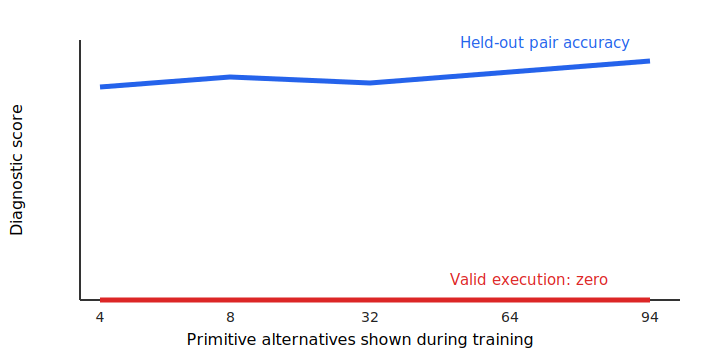

# More candidate actions improved ranking, but not planning

## The one-sentence answer

Showing the value learner more alternative tokens improved pair ordering, but did not improve token selection or produce a valid solved trace in this single-seed screen.

## First, the idea in everyday language

Imagine teaching someone to choose a turn in a maze. You can show two turns or nearly every turn. More comparisons should sharpen judgment. Here, each “turn” is a possible next token, and a geometric advantage ranker (GAR) estimates which token moves an encoded state toward an encoded goal. Success requires more than comparisons: chosen tokens must form a valid, solved sequence.

## Why this question matters

If merely adding alternatives fixes GAR, the project can improve planning cheaply. If ranking improves but execution does not, candidate count is not the main bottleneck and further count sweeps waste compute.

## What we tested

Five matched rank-plus-calibration models saw 4, 8, 32, 64, or 94 prior-supported primitive alternatives; a sixth used calibration-only at 94. All used seed 0, macro K=16, deterministic targets, full-vocabulary nonsymbolic tokens, and the same two-episode constrained planner audit.

## What a fair comparison means here

Only primitive candidate count changed in the five main cells. No symbolic feasibility rule or auxiliary language model was available. The calibration-only cell is an objective control, not part of the count trend. Every completed run remains visible. Because there is one seed and two planning episodes, differences are descriptive, not uncertainty-qualified population estimates.

## What happened

Pair accuracy means choosing the better member of a held-out pair; reference top-1 means placing the dataset token first. Valid sentences and solved episodes measure execution.

| Primitive alternatives | Terminal pair accuracy | Reference top-1 | Valid sentences/episode | Solved episodes |
|---:|---:|---:|---:|---:|
| 4 | 0.818 | 0.266 | 0 | 0/2 |
| 8 | 0.860 | 0.281 | 0 | 0/2 |
| 32 | 0.836 | 0.281 | 0 | 0/2 |
| 64 | 0.878 | 0.281 | 0 | 0/2 |
| 94 | 0.902 | 0.281 | 0 | 0/2 |
| 94, calibration only | 0.781 | 0.266 | 0 | 0/2 |

## The intuitive picture

The blue line generally rises as more alternatives are shown, while the red line remains at zero: better comparison skill did not cross the execution gap.

## The technical details

The hierarchy uses distinct causal state spaces and an exponential-moving-average (EMA) target encoder kept deterministic in evaluation mode. GAR combines pairwise ranking with mean-squared-error calibration of the change in normalized latent goal distance. Primitive alternatives come from the detached token prior; macro alternatives remain fixed at K=16. The key held-out audit has 64 terminal cases, while token-selection summaries have 128 positions. Planning uses prior-top-20 categorical cross-entropy method search for two 64-token episodes. Token effective rank stayed high (about 106–134), so simple representation collapse is not evident. However, top-20 planning reference recall was non-monotonic (0.148, 0.141, 0.070, 0.102, 0.188), and every generated sentence was invalid. Compact run summaries omitted metrics and validity labels; values here come from each run’s expected compact metrics and planner audit, not raw logs.

## What we can conclude

Observed: more alternatives can improve pair ordering. Supported inference: primitive counterfactual count alone is not sufficient for executable planning, so the count sweep should stop.

## What we cannot conclude

We cannot claim hierarchy is useless, compare population performance, or identify whether proposal coverage, target quality, calibration, or search causes the remaining failure. Oracle goal encodings make planning diagnostic rather than deployable.

## What happens next

At fixed K=32, compare prior-only, half-prior/half-random, and random proposals. Mixed coverage must improve reference recall without pair accuracy below 0.80, unhealthy drift, collapse, or symbolic information. Otherwise stop proposal tuning.

## Words used in this report

- **GAR:** A learner that ranks actions by predicted progress toward a goal.
- **Counterfactual:** An alternative token that was available but not observed.
- **Calibration:** Agreement between a predicted score and the numerical target.
- **Effective rank:** A rough count of representation dimensions carrying variation.

## Questions for you

- If proposal coverage also fails, should we prioritize continuation-target quality or pause GAR in favor of a different planning interface?
- Is preserving the 7.5 GPU-hour diagnostic cap more important than adding a second seed now?
